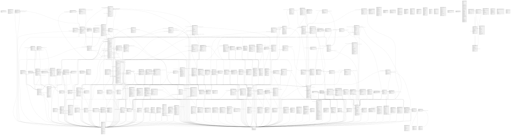

# postresWaroLabs

## Tables

| Name | Columns | Comment | Type |
| ---- | ------- | ------- | ---- |
| [public.achievements](public.achievements.md) | 10 |  | BASE TABLE |
| [public.profile](public.profile.md) | 24 |  | BASE TABLE |
| [public.sessions](public.sessions.md) | 11 |  | BASE TABLE |
| [public.tenant_member_role_data](public.tenant_member_role_data.md) | 10 |  | BASE TABLE |
| [public.active_tenant_member_role_data](public.active_tenant_member_role_data.md) | 10 |  | VIEW |
| [public.addresses](public.addresses.md) | 12 |  | BASE TABLE |
| [public.api_tokens](public.api_tokens.md) | 11 | API tokens para acceso programático por desarrolladores | BASE TABLE |
| [public.area_promotions_backup](public.area_promotions_backup.md) | 16 |  | BASE TABLE |
| [public.area_sale_stages_backup](public.area_sale_stages_backup.md) | 13 |  | BASE TABLE |
| [public.areas](public.areas.md) | 14 |  | BASE TABLE |
| [public.articles](public.articles.md) | 23 |  | BASE TABLE |
| [public.base_recipe_templates](public.base_recipe_templates.md) | 10 | Recetas base/plantillas para cada tipo de producto (ingredientes y cantidades estándar) | BASE TABLE |
| [public.campaign](public.campaign.md) | 12 |  | BASE TABLE |
| [public.campaign_history](public.campaign_history.md) | 7 |  | BASE TABLE |
| [public.campaign_leads](public.campaign_leads.md) | 4 |  | BASE TABLE |
| [public.campaign_template_versions](public.campaign_template_versions.md) | 4 |  | BASE TABLE |
| [public.cancellations](public.cancellations.md) | 5 |  | BASE TABLE |
| [public.categories](public.categories.md) | 7 |  | BASE TABLE |
| [public.cluster_images](public.cluster_images.md) | 5 |  | BASE TABLE |
| [public.clusters](public.clusters.md) | 18 |  | BASE TABLE |
| [public.combo_items](public.combo_items.md) | 12 | Composición de combos (qué productos incluye cada combo y en qué cantidad) | BASE TABLE |
| [public.commentable_items](public.commentable_items.md) | 5 |  | BASE TABLE |
| [public.comments](public.comments.md) | 8 |  | BASE TABLE |
| [public.daily_metrics](public.daily_metrics.md) | 12 |  | BASE TABLE |
| [public.email_clicks](public.email_clicks.md) | 8 |  | BASE TABLE |
| [public.email_opens](public.email_opens.md) | 7 |  | BASE TABLE |
| [public.email_sends](public.email_sends.md) | 13 |  | BASE TABLE |
| [public.employee_salaries](public.employee_salaries.md) | 17 |  | BASE TABLE |
| [public.evaluation_criteria](public.evaluation_criteria.md) | 11 |  | BASE TABLE |
| [public.evaluation_results](public.evaluation_results.md) | 14 |  | BASE TABLE |
| [public.expense_categories](public.expense_categories.md) | 6 |  | BASE TABLE |
| [public.gamification_activities](public.gamification_activities.md) | 13 |  | BASE TABLE |
| [public.gamification_config](public.gamification_config.md) | 12 |  | BASE TABLE |
| [public.gamification_modules](public.gamification_modules.md) | 10 |  | BASE TABLE |
| [public.images](public.images.md) | 8 |  | BASE TABLE |
| [public.ingredient_purchase_units](public.ingredient_purchase_units.md) | 11 | Defines purchase unit configurations for ingredients. Allows multiple purchase options (e.g., package, box, dozen) with automatic conversion to base units. | BASE TABLE |
| [public.ingredients](public.ingredients.md) | 21 |  | BASE TABLE |
| [public.inventory_transactions](public.inventory_transactions.md) | 10 |  | BASE TABLE |
| [public.lead_group_members](public.lead_group_members.md) | 4 |  | BASE TABLE |
| [public.lead_groups](public.lead_groups.md) | 7 |  | BASE TABLE |
| [public.lead_interactions](public.lead_interactions.md) | 16 |  | BASE TABLE |
| [public.leaderboards](public.leaderboards.md) | 9 |  | BASE TABLE |
| [public.leads](public.leads.md) | 22 |  | BASE TABLE |
| [public.legal_info](public.legal_info.md) | 12 |  | BASE TABLE |
| [public.magic_tokens](public.magic_tokens.md) | 9 |  | BASE TABLE |
| [public.magic_tokens_analytics](public.magic_tokens_analytics.md) | 5 | Daily analytics for magic token generation and usage | VIEW |
| [public.marketplace_items](public.marketplace_items.md) | 12 |  | BASE TABLE |
| [public.marketplace_purchases](public.marketplace_purchases.md) | 10 |  | BASE TABLE |
| [public.minimum_wage_reference](public.minimum_wage_reference.md) | 6 |  | BASE TABLE |
| [public.modifier_change_history](public.modifier_change_history.md) | 14 | Historial de cambios en grupos de modificadores y modificadores individuales | BASE TABLE |
| [public.modifier_groups](public.modifier_groups.md) | 10 | Grupos/categorías de modificadores (ej: "Tamaño", "Extras", "Tipo de carne") | BASE TABLE |
| [public.modifier_recipes](public.modifier_recipes.md) | 6 | Recetas de modificadores (qué ingredientes consume cada modificador). Solo si el modificador afecta inventario. | BASE TABLE |
| [public.modifiers](public.modifiers.md) | 13 | Opciones específicas dentro de grupos (ej: "Queso extra", "Sin cebolla", "Término medio") | BASE TABLE |
| [public.module_tools](public.module_tools.md) | 4 |  | BASE TABLE |
| [public.modules](public.modules.md) | 7 |  | BASE TABLE |
| [public.order_combo_items](public.order_combo_items.md) | 8 | Detalle de productos incluidos en combos vendidos (histórico inmutable). Permite saber exactamente qué incluía cada combo vendido. | BASE TABLE |
| [public.order_item_costs](public.order_item_costs.md) | 14 | Snapshot inmutable de costos y rentabilidad al momento de cada venta. Los costos NO cambian aunque suban precios de ingredientes después. | BASE TABLE |
| [public.order_item_ingredients](public.order_item_ingredients.md) | 11 | Detalle inmutable de ingredientes consumidos en cada venta. Permite trazabilidad completa y análisis de consumo. | BASE TABLE |
| [public.order_item_modifiers](public.order_item_modifiers.md) | 7 | Modificadores seleccionados por el cliente en cada venta (histórico inmutable) | BASE TABLE |
| [public.order_items](public.order_items.md) | 16 |  | BASE TABLE |
| [public.order_status_history](public.order_status_history.md) | 8 |  | BASE TABLE |
| [public.orders](public.orders.md) | 41 |  | BASE TABLE |
| [public.payments](public.payments.md) | 23 |  | BASE TABLE |
| [public.pdf_documents](public.pdf_documents.md) | 13 |  | BASE TABLE |
| [public.pos_cart_item_modifiers](public.pos_cart_item_modifiers.md) | 6 |  | BASE TABLE |
| [public.pos_cart_items](public.pos_cart_items.md) | 9 |  | BASE TABLE |
| [public.pos_carts](public.pos_carts.md) | 10 |  | BASE TABLE |
| [public.product](public.product.md) | 25 |  | BASE TABLE |
| [public.product_base_recipes](public.product_base_recipes.md) | 6 | Junction table linking products to multiple recipe bases | BASE TABLE |
| [public.product_base_types](public.product_base_types.md) | 7 | Tipos base de productos para sistema de recetas modulares (ej: BURGER, HOTDOG) | BASE TABLE |
| [public.product_change_history](public.product_change_history.md) | 12 | Historial de cambios en productos para trazabilidad y análisis de impacto | BASE TABLE |
| [public.product_drop](public.product_drop.md) | 8 |  | BASE TABLE |
| [public.product_images](public.product_images.md) | 5 |  | BASE TABLE |
| [public.product_modifier_groups](public.product_modifier_groups.md) | 5 |  | BASE TABLE |
| [public.product_recipe_modifications](public.product_recipe_modifications.md) | 11 | Modificaciones específicas a la receta base para productos individuales | BASE TABLE |
| [public.product_recipes](public.product_recipes.md) | 9 |  | BASE TABLE |
| [public.product_variants](public.product_variants.md) | 9 |  | BASE TABLE |
| [public.profile_images](public.profile_images.md) | 5 |  | BASE TABLE |
| [public.purchase_attachments](public.purchase_attachments.md) | 19 | Stores file attachments (invoices, receipts, contracts, etc.) for purchase orders | BASE TABLE |
| [public.purchase_payments](public.purchase_payments.md) | 14 | Tracking de pagos individuales para órdenes de compra (permite pagos parciales) | BASE TABLE |
| [public.purchase_status_history](public.purchase_status_history.md) | 10 | Tracks all status changes for purchase orders with full audit trail | BASE TABLE |
| [public.recipe_base_change_history](public.recipe_base_change_history.md) | 12 | Historial de cambios en recetas base para trazabilidad | BASE TABLE |
| [public.reservation_unit_qr_images](public.reservation_unit_qr_images.md) | 4 |  | BASE TABLE |
| [public.reservation_units](public.reservation_units.md) | 13 |  | BASE TABLE |
| [public.reservations](public.reservations.md) | 9 |  | BASE TABLE |
| [public.sessions_analytics](public.sessions_analytics.md) | 9 | Daily analytics for user sessions and activity | VIEW |
| [public.site_role_mappings](public.site_role_mappings.md) | 7 |  | BASE TABLE |
| [public.supplier_payment_agreements](public.supplier_payment_agreements.md) | 18 | Acuerdos de pago automáticos configurados por proveedor | BASE TABLE |
| [public.template_version_history](public.template_version_history.md) | 9 |  | BASE TABLE |
| [public.template_versions](public.template_versions.md) | 5 |  | BASE TABLE |
| [public.templates](public.templates.md) | 14 |  | BASE TABLE |
| [public.tenant_expenses](public.tenant_expenses.md) | 16 |  | BASE TABLE |
| [public.tenant_fixed_costs](public.tenant_fixed_costs.md) | 13 |  | BASE TABLE |
| [public.tenant_ingredient_movements](public.tenant_ingredient_movements.md) | 15 | Histórico completo de movimientos de inventario por ingrediente | BASE TABLE |
| [public.tenant_inventory](public.tenant_inventory.md) | 10 | Inventario actual por tenant e ingrediente | BASE TABLE |
| [public.tenant_investments](public.tenant_investments.md) | 16 |  | BASE TABLE |
| [public.tenant_invitations](public.tenant_invitations.md) | 10 |  | BASE TABLE |
| [public.tenant_member_roles](public.tenant_member_roles.md) | 8 |  | BASE TABLE |
| [public.tenant_members](public.tenant_members.md) | 6 |  | BASE TABLE |
| [public.tenant_modules](public.tenant_modules.md) | 6 |  | BASE TABLE |
| [public.tenant_purchase_items](public.tenant_purchase_items.md) | 23 | Items individuales de cada compra - fuente de costos reales | BASE TABLE |
| [public.tenant_purchases](public.tenant_purchases.md) | 46 | Compras de ingredientes - crea trazabilidad de costos reales | BASE TABLE |
| [public.tenant_sites](public.tenant_sites.md) | 7 |  | BASE TABLE |
| [public.tenant_supplier_prices](public.tenant_supplier_prices.md) | 12 | Precios de referencia actuales por proveedor e ingrediente | BASE TABLE |
| [public.tenant_suppliers](public.tenant_suppliers.md) | 14 | Proveedores por tenant - reemplaza el campo supplier en ingredients | BASE TABLE |
| [public.tenants](public.tenants.md) | 7 |  | BASE TABLE |
| [public.tools](public.tools.md) | 7 |  | BASE TABLE |
| [public.unit_transfer_log](public.unit_transfer_log.md) | 6 |  | BASE TABLE |
| [public.units](public.units.md) | 9 |  | BASE TABLE |
| [public.universal_roles](public.universal_roles.md) | 9 |  | BASE TABLE |
| [public.user_achievements](public.user_achievements.md) | 7 |  | BASE TABLE |
| [public.v_financial_tir_metrics](public.v_financial_tir_metrics.md) | 11 |  | VIEW |
| [public.v_improvement_plans](public.v_improvement_plans.md) | 9 |  | VIEW |
| [public.v_product_analysis](public.v_product_analysis.md) | 15 |  | VIEW |
| [public.waros_transactions](public.waros_transactions.md) | 12 |  | BASE TABLE |
| [public.waros_wallets](public.waros_wallets.md) | 19 |  | BASE TABLE |
| [cron.job](cron.job.md) | 9 |  | BASE TABLE |
| [cron.job_run_details](cron.job_run_details.md) | 10 |  | BASE TABLE |
| [public.reservation_unit_status_history](public.reservation_unit_status_history.md) | 10 |  | BASE TABLE |
| [public.reservation_status_history](public.reservation_status_history.md) | 9 |  | BASE TABLE |
| [public.sale_stages](public.sale_stages.md) | 14 |  | BASE TABLE |
| [public.sale_stage_areas](public.sale_stage_areas.md) | 5 |  | BASE TABLE |
| [public.promotions](public.promotions.md) | 16 |  | BASE TABLE |
| [public.promotions_backup_v1](public.promotions_backup_v1.md) | 17 |  | BASE TABLE |
| [public.promotion_areas_backup_v1](public.promotion_areas_backup_v1.md) | 4 |  | BASE TABLE |
| [public.promotion_items](public.promotion_items.md) | 5 |  | BASE TABLE |
| [public.ticket_carts](public.ticket_carts.md) | 10 | Carritos de compra para boletas de eventos | BASE TABLE |
| [public.ticket_cart_items](public.ticket_cart_items.md) | 7 | Items dentro de un carrito de boletas | BASE TABLE |
| [public.event_images](public.event_images.md) | 10 |  | BASE TABLE |
| [public.salary_payments](public.salary_payments.md) | 17 |  | BASE TABLE |
| [public.salary_attachments](public.salary_attachments.md) | 11 |  | BASE TABLE |
| [public.expense_change_history](public.expense_change_history.md) | 12 | Audit log for tracking all changes to expenses | BASE TABLE |
| [public.recurring_expense_instances](public.recurring_expense_instances.md) | 14 | Individual payment instances for recurring expenses | BASE TABLE |
| [public.salary_payment_change_history](public.salary_payment_change_history.md) | 12 | Audit log for tracking all changes to salary payments | BASE TABLE |
| [public.salary_config_change_history](public.salary_config_change_history.md) | 12 | Audit log for tracking changes to employee salary configuration | BASE TABLE |
| [public.tenant_public_profiles](public.tenant_public_profiles.md) | 39 | Perfiles públicos de restaurantes para mostrar menú y información | BASE TABLE |
| [public.promoter_codes](public.promoter_codes.md) | 8 |  | BASE TABLE |
| [public.commission_configs](public.commission_configs.md) | 8 |  | BASE TABLE |
| [public.order_commissions](public.order_commissions.md) | 20 |  | BASE TABLE |
| [public.promoter_event_configs](public.promoter_event_configs.md) | 8 |  | BASE TABLE |
| [public.addresses_profile](public.addresses_profile.md) | 20 |  | BASE TABLE |
| [public.online_carts](public.online_carts.md) | 17 |  | BASE TABLE |
| [public.online_cart_items](public.online_cart_items.md) | 9 |  | BASE TABLE |
| [public.online_cart_item_modifiers](public.online_cart_item_modifiers.md) | 6 |  | BASE TABLE |
| [public.otp_verifications](public.otp_verifications.md) | 10 |  | BASE TABLE |
| [public.order_failures](public.order_failures.md) | 7 |  | BASE TABLE |
| [public.customer_blacklist](public.customer_blacklist.md) | 9 |  | BASE TABLE |
| [public.notifications](public.notifications.md) | 7 |  | BASE TABLE |
| [public.pg_stat_statements_info](public.pg_stat_statements_info.md) | 2 |  | VIEW |
| [public.pg_stat_statements](public.pg_stat_statements.md) | 43 |  | VIEW |
| [public.data_quality_alerts](public.data_quality_alerts.md) | 19 |  | BASE TABLE |
| [public.waro_earning_rules](public.waro_earning_rules.md) | 8 |  | BASE TABLE |
| [public.waro_manual_assignments](public.waro_manual_assignments.md) | 7 |  | BASE TABLE |
| [public.subscription_plans](public.subscription_plans.md) | 11 |  | BASE TABLE |
| [public.tenant_subscriptions](public.tenant_subscriptions.md) | 11 |  | BASE TABLE |
| [public.scan_usage](public.scan_usage.md) | 10 |  | BASE TABLE |
| [public.billing_events](public.billing_events.md) | 8 |  | BASE TABLE |
| [public.scan_monthly_log](public.scan_monthly_log.md) | 6 |  | BASE TABLE |
| [public.ingredient_global_hierarchy](public.ingredient_global_hierarchy.md) | 4 |  | BASE TABLE |
| [public.tables](public.tables.md) | 10 |  | BASE TABLE |
| [public.table_sessions](public.table_sessions.md) | 8 |  | BASE TABLE |
| [public.credit_payments](public.credit_payments.md) | 10 |  | BASE TABLE |
| [public.accounting_period](public.accounting_period.md) | 8 |  | BASE TABLE |
| [public.closing_summary](public.closing_summary.md) | 16 |  | BASE TABLE |
| [public.payment_method_groups](public.payment_method_groups.md) | 9 |  | BASE TABLE |
| [public.payment_methods](public.payment_methods.md) | 8 |  | BASE TABLE |
| [public.cierre_payment_breakdown](public.cierre_payment_breakdown.md) | 6 |  | BASE TABLE |
| [public.order_payments](public.order_payments.md) | 11 |  | BASE TABLE |
| [public.tenant_monthly_periods](public.tenant_monthly_periods.md) | 9 |  | BASE TABLE |
| [public.account_templates](public.account_templates.md) | 12 | System-level PUC colombiano account reference. Shared across all tenants. Never scoped by tenant_id. | BASE TABLE |
| [public.tenant_accounts](public.tenant_accounts.md) | 14 | Per-tenant chart of accounts. Seeded from account_templates on company creation. Tenants may customize names and add auxiliary sub-accounts. | BASE TABLE |
| [public.tenant_journal_entries](public.tenant_journal_entries.md) | 17 | Double-entry journal. sum(total_debit) must equal sum(total_credit) for posted entries. Enforced at service layer. | BASE TABLE |
| [public.tenant_journal_lines](public.tenant_journal_lines.md) | 8 | Individual debit/credit lines of a journal entry. A line cannot have both debit > 0 and credit > 0. | BASE TABLE |
| [public.expense_category_gl_mappings](public.expense_category_gl_mappings.md) | 7 |  | BASE TABLE |
| [public.tenant_tax_config](public.tenant_tax_config.md) | 15 |  | BASE TABLE |
| [public.dian_resolutions](public.dian_resolutions.md) | 13 |  | BASE TABLE |
| [public.electronic_invoices](public.electronic_invoices.md) | 17 |  | BASE TABLE |
| [public.salary_provisions](public.salary_provisions.md) | 18 |  | BASE TABLE |
| [public.prima_payments](public.prima_payments.md) | 11 |  | BASE TABLE |
| [public.cesantias_payments](public.cesantias_payments.md) | 12 |  | BASE TABLE |
| [public.int_cesantias_payments](public.int_cesantias_payments.md) | 10 |  | BASE TABLE |
| [public.vacaciones_payments](public.vacaciones_payments.md) | 11 |  | BASE TABLE |
| [public.salary_dotacion_payments](public.salary_dotacion_payments.md) | 12 |  | BASE TABLE |
| [public.pila_payments](public.pila_payments.md) | 11 |  | BASE TABLE |
| [public.kitchen_stations](public.kitchen_stations.md) | 11 |  | BASE TABLE |
| [public.tenant_category_stations](public.tenant_category_stations.md) | 3 |  | BASE TABLE |
| [public.comandas](public.comandas.md) | 16 |  | BASE TABLE |
| [public.comanda_items](public.comanda_items.md) | 11 |  | BASE TABLE |
| [public.salary_overtime_payments](public.salary_overtime_payments.md) | 15 |  | BASE TABLE |
| [public.salary_liquidaciones](public.salary_liquidaciones.md) | 19 |  | BASE TABLE |
| [public.tenant_fiscal_data](public.tenant_fiscal_data.md) | 14 |  | BASE TABLE |
| [public.kds_tokens](public.kds_tokens.md) | 6 |  | BASE TABLE |
| [public.tenant_role_module_overrides](public.tenant_role_module_overrides.md) | 6 | Per-tenant deltas on top of DEFAULT_ROLE_MODULES (app/core/permissions.py). Empty rows => defaults apply. granted=true adds, granted=false removes. Merge happens in the Python resolver. | BASE TABLE |
| [public.tenant_role_module_overrides_audit](public.tenant_role_module_overrides_audit.md) | 10 | Append-only history of changes to tenant_role_module_overrides. Written application-side from the admin endpoint that mutates the override table (Epic 4 / #E4.x). | BASE TABLE |
| [public.table_member_assignments](public.table_member_assignments.md) | 10 | Append-only history of default waiter assignments per table (warocol.com#573). Period model: each row spans one continuous assignment, with snapshots that survive member deletion. | BASE TABLE |
| [public.dian_sequence_gaps](public.dian_sequence_gaps.md) | 9 | Audit trail of DIAN invoice numbers that were allocated but never accepted by Matias/DIAN. Each row represents a number permanently retired from the sequence — DIAN forbids reuse so this table is the legal justification for any gap an auditor finds. See warocol.com#592. | BASE TABLE |
| [public.public_cities](public.public_cities.md) | 7 | Curated catalog of cities WARO operates in (warocol.com#615). Used to populate the city selector on /negocio, the discovery section on /, and the reserved-words check in tenants_service._generate_slug. Adding a city here makes warocol.com/{city_slug} reachable; removing it requires reassigning any tenants that reference it. | BASE TABLE |

## Stored procedures and functions

| Name | ReturnType | Arguments | Type |
| ---- | ------- | ------- | ---- |
| public.uuid_nil | uuid |  | FUNCTION |
| public.uuid_ns_dns | uuid |  | FUNCTION |
| public.uuid_ns_url | uuid |  | FUNCTION |
| public.uuid_ns_oid | uuid |  | FUNCTION |
| public.uuid_ns_x500 | uuid |  | FUNCTION |
| public.uuid_generate_v1 | uuid |  | FUNCTION |
| public.uuid_generate_v1mc | uuid |  | FUNCTION |
| public.uuid_generate_v3 | uuid | namespace uuid, name text | FUNCTION |
| public.uuid_generate_v4 | uuid |  | FUNCTION |
| public.uuid_generate_v5 | uuid | namespace uuid, name text | FUNCTION |
| public.add_reservation_and_profile | record | p_name character varying, p_email character varying, p_phone_number character varying, p_nationality_id integer, p_card_information jsonb | FUNCTION |
| public.add_reservation_and_profile | record | p_name character varying, p_email character varying, p_phone_number character varying, p_nationality_id integer, p_card_information jsonb, extra_atribute_reservation_unit character varying | FUNCTION |
| public.add_reservation_and_profile_gift | record | p_name character varying, p_email character varying, p_phone_number character varying, p_nationality_id integer, p_area_id integer | FUNCTION |
| public.add_reservation_big_area_gift | record | p_name character varying, p_email character varying, p_phone_number character varying, p_nationality_id integer, id_area integer, unit_id integer | FUNCTION |
| public.add_tenant_member_role | record | p_tenant_member_id uuid, p_site site_enum, p_role_name character varying | FUNCTION |
| public.add_tenant_member_role_data | uuid | p_tenant_member_role_id uuid, p_field_name character varying, p_field_value text, p_field_type field_type_enum DEFAULT 'text'::field_type_enum, p_is_required boolean DEFAULT false, p_is_public boolean DEFAULT true | FUNCTION |
| public.create_campaign_from_pair | json | p_user_id uuid, p_campaign_name text, p_pair_id uuid, p_slug text DEFAULT NULL::text | FUNCTION |
| public.create_campaign_from_pair | json | p_profile_id uuid, p_campaign_name character varying, p_pair_id uuid, p_slug character varying DEFAULT NULL::character varying | FUNCTION |
| public.create_campaign_from_pair | json | p_profile_id uuid, p_campaign_name character varying, p_pair_id uuid, p_slug character varying DEFAULT NULL::character varying, p_tenant_id uuid DEFAULT NULL::uuid | FUNCTION |
| public.create_campaign_with_templates | record | p_profile_id uuid, p_campaign_name character varying, p_campaign_slug character varying, p_email_template_name text, p_landing_template_name text, p_subject_template text, p_sender_email character varying, p_email_content text, p_landing_content text | FUNCTION |
| public.create_cluster_and_related_entities | record | p_profile_id uuid, p_cluster_data jsonb, p_areas_data jsonb, p_legal_info_data jsonb DEFAULT NULL::jsonb, p_images_data jsonb DEFAULT NULL::jsonb | FUNCTION |
| public.create_complete_event | jsonb | p_profile_id uuid, p_tenant_site text, p_event_data jsonb, p_areas_data jsonb, p_legal_info_data jsonb, p_images_data jsonb DEFAULT NULL::jsonb | FUNCTION |
| public.create_or_get_campaign | record | p_campaign_name character varying, p_campaign_start_date timestamp with time zone, p_campaign_end_date timestamp with time zone, p_campaign_status character varying, p_campaign_profile_id uuid | FUNCTION |
| public.create_template_pair | json | p_template_name text, p_description text, p_sender_email character varying, p_subject_template text, p_email_content text, p_landing_title text, p_landing_description text, p_landing_image_url text | FUNCTION |
| public.create_template_pair | record | p_template_name text, p_description text, p_sender_email text, p_subject_template text, p_email_content text, p_landing_title text, p_landing_description text, p_landing_image_url text, p_profile_id uuid DEFAULT NULL::uuid | FUNCTION |
| public.create_template_pair | record | p_template_name text, p_description text, p_sender_email text, p_subject_template text, p_email_content text, p_landing_title text, p_landing_description text, p_landing_image_url text, p_profile_id uuid DEFAULT NULL::uuid, p_tenant_id uuid DEFAULT NULL::uuid | FUNCTION |
| public.create_units | void | p_area_id integer, p_capacity_units integer, p_extra_attributes jsonb DEFAULT '{}'::jsonb, p_nomenclature_letter_area character varying DEFAULT 'A'::character varying, p_nomenclature_number_area integer DEFAULT 1 | FUNCTION |
| public.delete_profile | text | p_profile_id uuid | FUNCTION |
| public.ensure_single_default_purchase_unit | trigger |  | FUNCTION |
| public.expand_complete_event | jsonb | p_event_id integer, p_tenant_site text, p_areas_expansion jsonb, p_images_data jsonb DEFAULT NULL::jsonb | FUNCTION |
| public.get_all_user_functions | record |  | FUNCTION |
| public.get_cluster_details | record | p_cluster_id integer | FUNCTION |
| public.get_clusters_list | record | p_limit integer DEFAULT 10, p_offset integer DEFAULT 0, p_filters jsonb DEFAULT '{}'::jsonb | FUNCTION |
| public.get_database_ddl_with_rls_and_functions | text |  | FUNCTION |
| public.get_financial_obstacles | record | p_tenant_id uuid DEFAULT NULL::uuid | FUNCTION |
| public.get_tenant_member_all_sites | record | p_tenant_member_id uuid | FUNCTION |
| public.get_tenant_member_profile_for_site | json | p_tenant_member_id uuid, p_site site_enum | FUNCTION |
| public.insert_images_and_relations | bool | json_array_input jsonb | FUNCTION |
| public.log_purchase_status_change | trigger |  | FUNCTION |
| public.manage_lead_and_campaign_association | record | p_campaign_id uuid, p_lead_email character varying, p_lead_source character varying DEFAULT NULL::character varying, p_profile_name character varying DEFAULT NULL::character varying, p_profile_phone_number character varying DEFAULT NULL::character varying, p_profile_nationality_id integer DEFAULT NULL::integer, p_verification_token text DEFAULT NULL::text | FUNCTION |
| public.manage_lead_and_campaign_association | record | p_campaign_id uuid, p_lead_email character varying, p_lead_source character varying DEFAULT NULL::character varying, p_profile_name character varying DEFAULT NULL::character varying, p_profile_phone_number character varying DEFAULT NULL::character varying, p_profile_phone_country_code character varying DEFAULT NULL::character varying, p_profile_nationality_id integer DEFAULT NULL::integer, p_verification_token text DEFAULT NULL::text | FUNCTION |
| public.prevent_negative_stock | trigger |  | FUNCTION |
| public.register_tenant_for_site | uuid | p_tenant_id uuid, p_site site_enum | FUNCTION |
| public.search_tenant_members_by_site_role | record | p_site site_enum, p_tenant_id uuid DEFAULT NULL::uuid, p_role_type character varying DEFAULT NULL::character varying, p_search_term character varying DEFAULT NULL::character varying, p_limit integer DEFAULT 20, p_offset integer DEFAULT 0 | FUNCTION |
| public.soft_delete_cluster | record | p_cluster_id integer | FUNCTION |
| public.test_product_drop_status_column_visibility | text |  | FUNCTION |
| public.update_campaign_templates | record | p_campaign_id uuid, p_email_content text, p_landing_content text, p_subject_template text, p_email_template_name text, p_landing_template_name text | FUNCTION |
| public.update_cluster_data | record | p_cluster_id integer, p_updates jsonb | FUNCTION |
| public.update_ingredient_purchase_units_updated_at | trigger |  | FUNCTION |
| public.update_payment_agreements_updated_at | trigger |  | FUNCTION |
| public.update_payment_and_reservation_status | jsonb | p_reservation_id uuid, p_status character varying, p_payment_date timestamp with time zone, p_payment_method character varying, p_amount numeric, p_currency character varying | FUNCTION |
| public.update_pos_cart_updated_at | trigger |  | FUNCTION |
| public.update_product_cost | trigger |  | FUNCTION |
| public.update_reservation_status | void |  | FUNCTION |
| public.update_template_pairs | record | p_pair_id uuid, p_email_content text, p_landing_content text, p_subject_template text, p_email_name character varying, p_landing_name character varying | FUNCTION |
| public.update_updated_at_column | trigger |  | FUNCTION |
| public.update_wompi_payment_status | jsonb | p_wompi_data jsonb | FUNCTION |
| public.vector_in | vector | cstring, oid, integer | FUNCTION |
| public.vector_out | cstring | vector | FUNCTION |
| public.vector_typmod_in | int4 | cstring[] | FUNCTION |
| public.vector_recv | vector | internal, oid, integer | FUNCTION |
| public.vector_send | bytea | vector | FUNCTION |
| public.l2_distance | float8 | vector, vector | FUNCTION |
| public.inner_product | float8 | vector, vector | FUNCTION |
| public.cosine_distance | float8 | vector, vector | FUNCTION |
| public.l1_distance | float8 | vector, vector | FUNCTION |
| public.vector_dims | int4 | vector | FUNCTION |
| public.vector_norm | float8 | vector | FUNCTION |
| public.l2_normalize | vector | vector | FUNCTION |
| public.binary_quantize | bit | vector | FUNCTION |
| public.subvector | vector | vector, integer, integer | FUNCTION |
| public.vector_add | vector | vector, vector | FUNCTION |
| public.vector_sub | vector | vector, vector | FUNCTION |
| public.vector_mul | vector | vector, vector | FUNCTION |
| public.vector_concat | vector | vector, vector | FUNCTION |
| public.vector_lt | bool | vector, vector | FUNCTION |
| public.vector_le | bool | vector, vector | FUNCTION |
| public.vector_eq | bool | vector, vector | FUNCTION |
| public.vector_ne | bool | vector, vector | FUNCTION |
| public.vector_ge | bool | vector, vector | FUNCTION |
| public.vector_gt | bool | vector, vector | FUNCTION |
| public.vector_cmp | int4 | vector, vector | FUNCTION |
| public.vector_l2_squared_distance | float8 | vector, vector | FUNCTION |
| public.vector_negative_inner_product | float8 | vector, vector | FUNCTION |
| public.vector_spherical_distance | float8 | vector, vector | FUNCTION |
| public.vector_accum | _float8 | double precision[], vector | FUNCTION |
| public.vector_avg | vector | double precision[] | FUNCTION |
| public.vector_combine | _float8 | double precision[], double precision[] | FUNCTION |
| public.avg | vector | vector | a |
| public.sum | vector | vector | a |
| public.vector | vector | vector, integer, boolean | FUNCTION |
| public.array_to_vector | vector | integer[], integer, boolean | FUNCTION |
| public.array_to_vector | vector | real[], integer, boolean | FUNCTION |
| public.array_to_vector | vector | double precision[], integer, boolean | FUNCTION |
| public.array_to_vector | vector | numeric[], integer, boolean | FUNCTION |
| public.vector_to_float4 | _float4 | vector, integer, boolean | FUNCTION |
| public.ivfflathandler | index_am_handler | internal | FUNCTION |
| public.hnswhandler | index_am_handler | internal | FUNCTION |
| public.ivfflat_halfvec_support | internal | internal | FUNCTION |
| public.ivfflat_bit_support | internal | internal | FUNCTION |
| public.hnsw_halfvec_support | internal | internal | FUNCTION |
| public.hnsw_bit_support | internal | internal | FUNCTION |
| public.hnsw_sparsevec_support | internal | internal | FUNCTION |
| public.halfvec_in | halfvec | cstring, oid, integer | FUNCTION |
| public.halfvec_out | cstring | halfvec | FUNCTION |
| public.halfvec_typmod_in | int4 | cstring[] | FUNCTION |
| public.halfvec_recv | halfvec | internal, oid, integer | FUNCTION |
| public.halfvec_send | bytea | halfvec | FUNCTION |
| public.l2_distance | float8 | halfvec, halfvec | FUNCTION |
| public.inner_product | float8 | halfvec, halfvec | FUNCTION |
| public.cosine_distance | float8 | halfvec, halfvec | FUNCTION |
| public.l1_distance | float8 | halfvec, halfvec | FUNCTION |
| public.vector_dims | int4 | halfvec | FUNCTION |
| public.l2_norm | float8 | halfvec | FUNCTION |
| public.l2_normalize | halfvec | halfvec | FUNCTION |
| public.binary_quantize | bit | halfvec | FUNCTION |
| public.subvector | halfvec | halfvec, integer, integer | FUNCTION |
| public.halfvec_add | halfvec | halfvec, halfvec | FUNCTION |
| public.halfvec_sub | halfvec | halfvec, halfvec | FUNCTION |
| public.halfvec_mul | halfvec | halfvec, halfvec | FUNCTION |
| public.halfvec_concat | halfvec | halfvec, halfvec | FUNCTION |
| public.halfvec_lt | bool | halfvec, halfvec | FUNCTION |
| public.halfvec_le | bool | halfvec, halfvec | FUNCTION |
| public.halfvec_eq | bool | halfvec, halfvec | FUNCTION |
| public.halfvec_ne | bool | halfvec, halfvec | FUNCTION |
| public.halfvec_ge | bool | halfvec, halfvec | FUNCTION |
| public.halfvec_gt | bool | halfvec, halfvec | FUNCTION |
| public.halfvec_cmp | int4 | halfvec, halfvec | FUNCTION |
| public.halfvec_l2_squared_distance | float8 | halfvec, halfvec | FUNCTION |
| public.halfvec_negative_inner_product | float8 | halfvec, halfvec | FUNCTION |
| public.halfvec_spherical_distance | float8 | halfvec, halfvec | FUNCTION |
| public.halfvec_accum | _float8 | double precision[], halfvec | FUNCTION |
| public.halfvec_avg | halfvec | double precision[] | FUNCTION |
| public.halfvec_combine | _float8 | double precision[], double precision[] | FUNCTION |
| public.avg | halfvec | halfvec | a |
| public.sum | halfvec | halfvec | a |
| public.halfvec | halfvec | halfvec, integer, boolean | FUNCTION |
| public.halfvec_to_vector | vector | halfvec, integer, boolean | FUNCTION |
| public.vector_to_halfvec | halfvec | vector, integer, boolean | FUNCTION |
| public.array_to_halfvec | halfvec | integer[], integer, boolean | FUNCTION |
| public.array_to_halfvec | halfvec | real[], integer, boolean | FUNCTION |
| public.array_to_halfvec | halfvec | double precision[], integer, boolean | FUNCTION |
| public.array_to_halfvec | halfvec | numeric[], integer, boolean | FUNCTION |
| public.halfvec_to_float4 | _float4 | halfvec, integer, boolean | FUNCTION |
| public.hamming_distance | float8 | bit, bit | FUNCTION |
| public.jaccard_distance | float8 | bit, bit | FUNCTION |
| public.sparsevec_in | sparsevec | cstring, oid, integer | FUNCTION |
| public.sparsevec_out | cstring | sparsevec | FUNCTION |
| public.sparsevec_typmod_in | int4 | cstring[] | FUNCTION |
| public.sparsevec_recv | sparsevec | internal, oid, integer | FUNCTION |
| public.sparsevec_send | bytea | sparsevec | FUNCTION |
| public.l2_distance | float8 | sparsevec, sparsevec | FUNCTION |
| public.inner_product | float8 | sparsevec, sparsevec | FUNCTION |
| public.cosine_distance | float8 | sparsevec, sparsevec | FUNCTION |
| public.l1_distance | float8 | sparsevec, sparsevec | FUNCTION |
| public.l2_norm | float8 | sparsevec | FUNCTION |
| public.l2_normalize | sparsevec | sparsevec | FUNCTION |
| public.sparsevec_lt | bool | sparsevec, sparsevec | FUNCTION |
| public.sparsevec_le | bool | sparsevec, sparsevec | FUNCTION |
| public.sparsevec_eq | bool | sparsevec, sparsevec | FUNCTION |
| public.sparsevec_ne | bool | sparsevec, sparsevec | FUNCTION |
| public.sparsevec_ge | bool | sparsevec, sparsevec | FUNCTION |
| public.sparsevec_gt | bool | sparsevec, sparsevec | FUNCTION |
| public.sparsevec_cmp | int4 | sparsevec, sparsevec | FUNCTION |
| public.sparsevec_l2_squared_distance | float8 | sparsevec, sparsevec | FUNCTION |
| public.sparsevec_negative_inner_product | float8 | sparsevec, sparsevec | FUNCTION |
| public.sparsevec | sparsevec | sparsevec, integer, boolean | FUNCTION |
| public.vector_to_sparsevec | sparsevec | vector, integer, boolean | FUNCTION |
| public.sparsevec_to_vector | vector | sparsevec, integer, boolean | FUNCTION |
| public.halfvec_to_sparsevec | sparsevec | halfvec, integer, boolean | FUNCTION |
| public.sparsevec_to_halfvec | halfvec | sparsevec, integer, boolean | FUNCTION |
| public.array_to_sparsevec | sparsevec | integer[], integer, boolean | FUNCTION |
| public.array_to_sparsevec | sparsevec | real[], integer, boolean | FUNCTION |
| public.array_to_sparsevec | sparsevec | double precision[], integer, boolean | FUNCTION |
| public.array_to_sparsevec | sparsevec | numeric[], integer, boolean | FUNCTION |
| public.hybrid_search | record | search_text text, query_embedding vector DEFAULT NULL::vector, similarity_threshold double precision DEFAULT 0.5, max_results integer DEFAULT 10 | FUNCTION |
| public.search_similar_documents | record | query_embedding vector, similarity_threshold double precision DEFAULT 0.7, max_results integer DEFAULT 10 | FUNCTION |
| cron.schedule | int8 | schedule text, command text | FUNCTION |
| cron.unschedule | bool | job_id bigint | FUNCTION |
| cron.job_cache_invalidate | trigger |  | FUNCTION |
| cron.schedule | int8 | job_name text, schedule text, command text | FUNCTION |
| cron.alter_job | void | job_id bigint, schedule text DEFAULT NULL::text, command text DEFAULT NULL::text, database text DEFAULT NULL::text, username text DEFAULT NULL::text, active boolean DEFAULT NULL::boolean | FUNCTION |
| cron.schedule_in_database | int8 | job_name text, schedule text, command text, database text, username text DEFAULT NULL::text, active boolean DEFAULT true | FUNCTION |
| cron.unschedule | bool | job_name text | FUNCTION |
| public.update_event_images_updated_at | trigger |  | FUNCTION |
| public.pg_stat_statements_reset | void | userid oid DEFAULT 0, dbid oid DEFAULT 0, queryid bigint DEFAULT 0 | FUNCTION |
| public.pg_stat_statements_info | record | OUT dealloc bigint, OUT stats_reset timestamp with time zone | FUNCTION |
| public.pg_stat_statements | record | showtext boolean, OUT userid oid, OUT dbid oid, OUT toplevel boolean, OUT queryid bigint, OUT query text, OUT plans bigint, OUT total_plan_time double precision, OUT min_plan_time double precision, OUT max_plan_time double precision, OUT mean_plan_time double precision, OUT stddev_plan_time double precision, OUT calls bigint, OUT total_exec_time double precision, OUT min_exec_time double precision, OUT max_exec_time double precision, OUT mean_exec_time double precision, OUT stddev_exec_time double precision, OUT rows bigint, OUT shared_blks_hit bigint, OUT shared_blks_read bigint, OUT shared_blks_dirtied bigint, OUT shared_blks_written bigint, OUT local_blks_hit bigint, OUT local_blks_read bigint, OUT local_blks_dirtied bigint, OUT local_blks_written bigint, OUT temp_blks_read bigint, OUT temp_blks_written bigint, OUT blk_read_time double precision, OUT blk_write_time double precision, OUT temp_blk_read_time double precision, OUT temp_blk_write_time double precision, OUT wal_records bigint, OUT wal_fpi bigint, OUT wal_bytes numeric, OUT jit_functions bigint, OUT jit_generation_time double precision, OUT jit_inlining_count bigint, OUT jit_inlining_time double precision, OUT jit_optimization_count bigint, OUT jit_optimization_time double precision, OUT jit_emission_count bigint, OUT jit_emission_time double precision | FUNCTION |
| public.set_limit | float4 | real | FUNCTION |
| public.show_limit | float4 |  | FUNCTION |
| public.show_trgm | _text | text | FUNCTION |
| public.similarity | float4 | text, text | FUNCTION |
| public.similarity_op | bool | text, text | FUNCTION |
| public.word_similarity | float4 | text, text | FUNCTION |
| public.word_similarity_op | bool | text, text | FUNCTION |
| public.word_similarity_commutator_op | bool | text, text | FUNCTION |
| public.similarity_dist | float4 | text, text | FUNCTION |
| public.word_similarity_dist_op | float4 | text, text | FUNCTION |
| public.word_similarity_dist_commutator_op | float4 | text, text | FUNCTION |
| public.gtrgm_in | gtrgm | cstring | FUNCTION |
| public.gtrgm_out | cstring | gtrgm | FUNCTION |
| public.gtrgm_consistent | bool | internal, text, smallint, oid, internal | FUNCTION |
| public.gtrgm_distance | float8 | internal, text, smallint, oid, internal | FUNCTION |
| public.gtrgm_compress | internal | internal | FUNCTION |
| public.gtrgm_decompress | internal | internal | FUNCTION |
| public.gtrgm_penalty | internal | internal, internal, internal | FUNCTION |
| public.gtrgm_picksplit | internal | internal, internal | FUNCTION |
| public.gtrgm_union | gtrgm | internal, internal | FUNCTION |
| public.gtrgm_same | internal | gtrgm, gtrgm, internal | FUNCTION |
| public.gin_extract_value_trgm | internal | text, internal | FUNCTION |
| public.gin_extract_query_trgm | internal | text, internal, smallint, internal, internal, internal, internal | FUNCTION |
| public.gin_trgm_consistent | bool | internal, smallint, text, integer, internal, internal, internal, internal | FUNCTION |
| public.gin_trgm_triconsistent | char | internal, smallint, text, integer, internal, internal, internal | FUNCTION |
| public.strict_word_similarity | float4 | text, text | FUNCTION |
| public.strict_word_similarity_op | bool | text, text | FUNCTION |
| public.strict_word_similarity_commutator_op | bool | text, text | FUNCTION |
| public.strict_word_similarity_dist_op | float4 | text, text | FUNCTION |
| public.strict_word_similarity_dist_commutator_op | float4 | text, text | FUNCTION |
| public.gtrgm_options | void | internal | FUNCTION |
| public.seed_tenant_accounts | void | p_tenant_id uuid | FUNCTION |
| public.enforce_tenant_owner_minimum | trigger |  | FUNCTION |
| public.dian_resolutions_no_rewind | trigger |  | FUNCTION |
| public.unaccent | text | regdictionary, text | FUNCTION |
| public.unaccent | text | text | FUNCTION |
| public.unaccent_init | internal | internal | FUNCTION |
| public.unaccent_lexize | internal | internal, internal, internal, internal | FUNCTION |

## Enums

| Name | Values |
| ---- | ------- |
| public.field_type_enum | boolean, date, email, json, number, text, url |
| public.role_category_enum | admin, business, creator, user |
| public.site_enum | dev.warotickets.com, localhost:3000, localhost:8001, sksoluciones.com, warocol.com, warolabs.com, warotickets.com |

## Relations

---

> Generated by [tbls](https://github.com/k1LoW/tbls)
