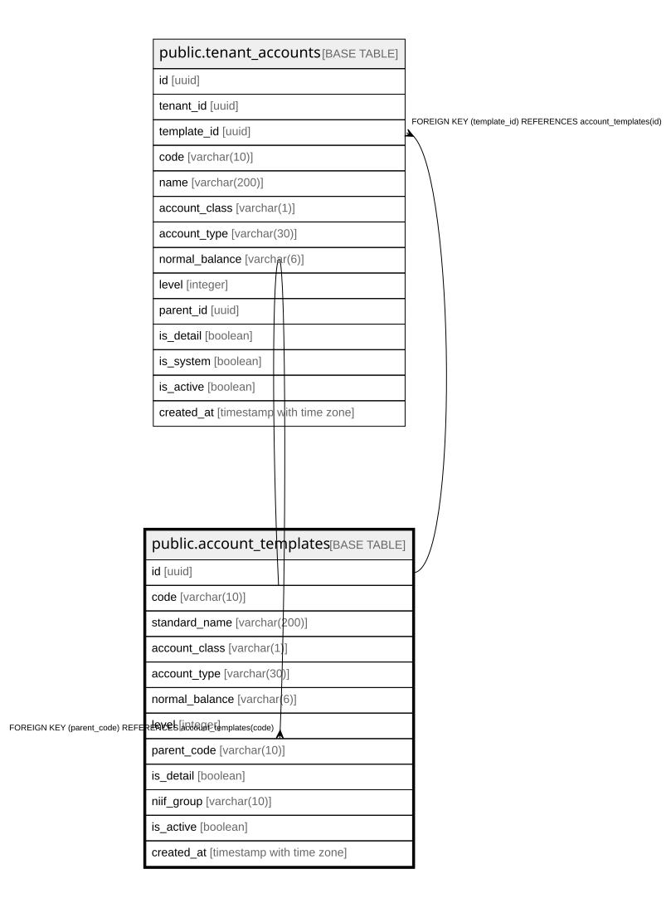

# public.account_templates

## Description

System-level PUC colombiano account reference. Shared across all tenants. Never scoped by tenant_id.

## Columns

| Name | Type | Default | Nullable | Children | Parents | Comment |
| ---- | ---- | ------- | -------- | -------- | ------- | ------- |
| id | uuid | gen_random_uuid() | false | [public.tenant_accounts](public.tenant_accounts.md) |  |  |
| code | varchar(10) |  | false | [public.account_templates](public.account_templates.md) |  | PUC account code: 1=class, 11=group, 1105=account, 110505=sub-account |
| standard_name | varchar(200) |  | false |  |  |  |
| account_class | varchar(1) |  | false |  |  |  |
| account_type | varchar(30) |  | false |  |  |  |
| normal_balance | varchar(6) |  | false |  |  |  |
| level | integer |  | false |  |  | 1=class(1digit), 2=group(2digits), 4=account(4digits), 6=subaccount(6digits), 8=auxiliary(8digits) |
| parent_code | varchar(10) |  | true |  | [public.account_templates](public.account_templates.md) |  |
| is_detail | boolean | false | false |  |  | true = journal lines can be posted directly to this account |
| niif_group | varchar(10) |  | true |  |  | grupo1, grupo2, grupo3 or NULL (applies to all) |
| is_active | boolean | true | false |  |  |  |
| created_at | timestamp with time zone | now() | false |  |  |  |

## Constraints

| Name | Type | Definition |
| ---- | ---- | ---------- |
| account_templates_account_class_check | CHECK | CHECK (((account_class)::text = ANY ((ARRAY['1'::character varying, '2'::character varying, '3'::character varying, '4'::character varying, '5'::character varying, '6'::character varying, '7'::character varying, '8'::character varying, '9'::character varying])::text[]))) |
| account_templates_account_type_check | CHECK | CHECK (((account_type)::text = ANY ((ARRAY['asset'::character varying, 'liability'::character varying, 'equity'::character varying, 'income'::character varying, 'expense'::character varying, 'cogs'::character varying, 'other'::character varying])::text[]))) |
| account_templates_level_check | CHECK | CHECK ((level = ANY (ARRAY[1, 2, 4, 6, 8]))) |
| account_templates_normal_balance_check | CHECK | CHECK (((normal_balance)::text = ANY ((ARRAY['debit'::character varying, 'credit'::character varying])::text[]))) |
| account_templates_pkey | PRIMARY KEY | PRIMARY KEY (id) |
| account_templates_code_key | UNIQUE | UNIQUE (code) |
| account_templates_parent_code_fkey | FOREIGN KEY | FOREIGN KEY (parent_code) REFERENCES account_templates(code) |

## Indexes

| Name | Definition |
| ---- | ---------- |
| account_templates_pkey | CREATE UNIQUE INDEX account_templates_pkey ON public.account_templates USING btree (id) |
| account_templates_code_key | CREATE UNIQUE INDEX account_templates_code_key ON public.account_templates USING btree (code) |
| idx_account_templates_parent | CREATE INDEX idx_account_templates_parent ON public.account_templates USING btree (parent_code) |
| idx_account_templates_class | CREATE INDEX idx_account_templates_class ON public.account_templates USING btree (account_class) |
| idx_account_templates_active | CREATE INDEX idx_account_templates_active ON public.account_templates USING btree (is_active) WHERE (is_active = true) |

## Relations

---

> Generated by [tbls](https://github.com/k1LoW/tbls)
