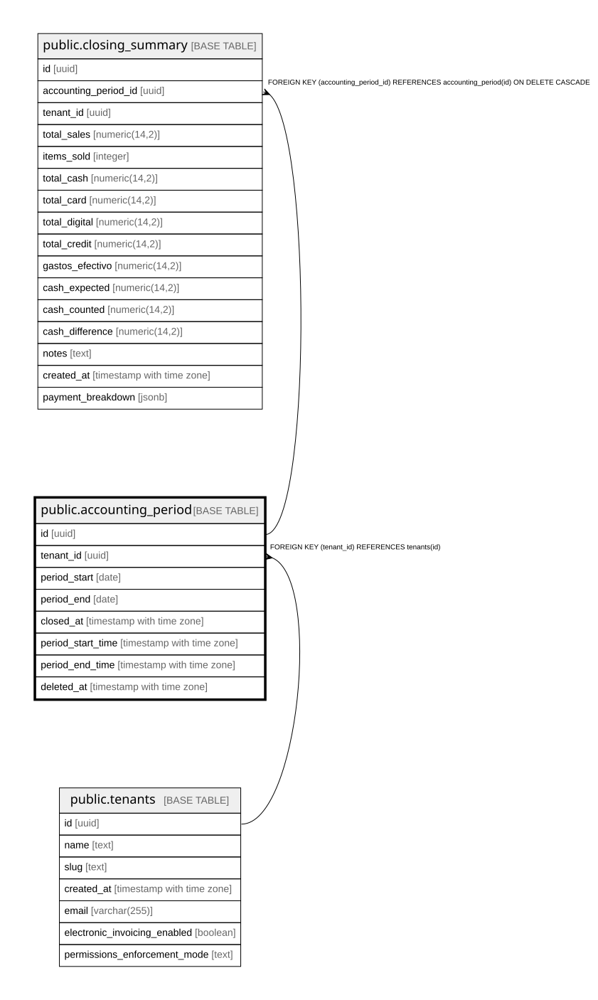

# public.accounting_period

## Columns

| Name | Type | Default | Nullable | Children | Parents | Comment |
| ---- | ---- | ------- | -------- | -------- | ------- | ------- |
| id | uuid | gen_random_uuid() | false | [public.closing_summary](public.closing_summary.md) |  |  |
| tenant_id | uuid |  | false |  | [public.tenants](public.tenants.md) |  |
| period_start | date |  | false |  |  |  |
| period_end | date |  | false |  |  |  |
| closed_at | timestamp with time zone | now() | false |  |  |  |
| period_start_time | timestamp with time zone |  | true |  |  | Exact start timestamp for the period (optional). When set, order filtering uses this instead of period_start::date. |
| period_end_time | timestamp with time zone |  | true |  |  | Exact end timestamp for the period (optional). When set, order filtering uses this instead of period_end::date. |
| deleted_at | timestamp with time zone |  | true |  |  | Soft delete timestamp. NULL = active, non-NULL = deleted. |

## Constraints

| Name | Type | Definition |
| ---- | ---- | ---------- |
| accounting_period_tenant_id_fkey | FOREIGN KEY | FOREIGN KEY (tenant_id) REFERENCES tenants(id) |
| accounting_period_pkey | PRIMARY KEY | PRIMARY KEY (id) |

## Indexes

| Name | Definition |
| ---- | ---------- |
| accounting_period_pkey | CREATE UNIQUE INDEX accounting_period_pkey ON public.accounting_period USING btree (id) |
| idx_accounting_period_tenant | CREATE INDEX idx_accounting_period_tenant ON public.accounting_period USING btree (tenant_id, period_start DESC) |
| uq_period_tenant_active | CREATE UNIQUE INDEX uq_period_tenant_active ON public.accounting_period USING btree (tenant_id, period_start, period_end) WHERE (deleted_at IS NULL) |

## Relations

---

> Generated by [tbls](https://github.com/k1LoW/tbls)
