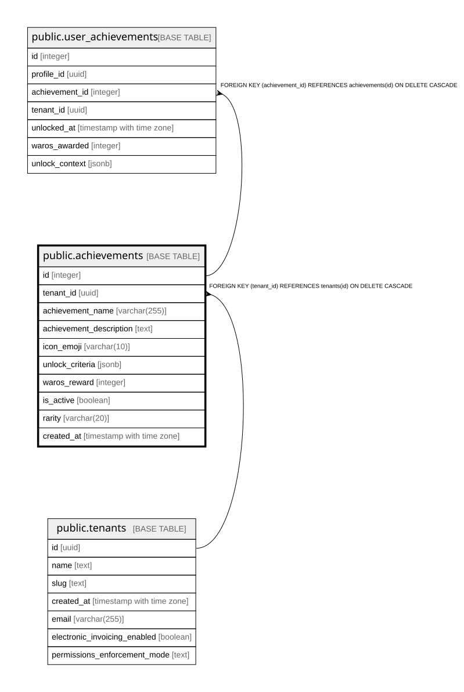

# public.achievements

## Columns

| Name | Type | Default | Nullable | Children | Parents | Comment |
| ---- | ---- | ------- | -------- | -------- | ------- | ------- |
| id | integer | nextval('achievements_id_seq'::regclass) | false | [public.user_achievements](public.user_achievements.md) |  |  |
| tenant_id | uuid |  | false |  | [public.tenants](public.tenants.md) |  |
| achievement_name | varchar(255) |  | false |  |  |  |
| achievement_description | text |  | true |  |  |  |
| icon_emoji | varchar(10) | '🏆'::character varying | true |  |  |  |
| unlock_criteria | jsonb |  | false |  |  |  |
| waros_reward | integer | 0 | true |  |  |  |
| is_active | boolean | true | true |  |  |  |
| rarity | varchar(20) | 'common'::character varying | true |  |  |  |
| created_at | timestamp with time zone | now() | true |  |  |  |

## Constraints

| Name | Type | Definition |
| ---- | ---- | ---------- |
| achievements_pkey | PRIMARY KEY | PRIMARY KEY (id) |
| achievements_tenant_id_name_unique | UNIQUE | UNIQUE (tenant_id, achievement_name) |
| achievements_tenant_id_fkey | FOREIGN KEY | FOREIGN KEY (tenant_id) REFERENCES tenants(id) ON DELETE CASCADE |

## Indexes

| Name | Definition |
| ---- | ---------- |
| achievements_pkey | CREATE UNIQUE INDEX achievements_pkey ON public.achievements USING btree (id) |
| achievements_tenant_id_name_unique | CREATE UNIQUE INDEX achievements_tenant_id_name_unique ON public.achievements USING btree (tenant_id, achievement_name) |

## Relations

---

> Generated by [tbls](https://github.com/k1LoW/tbls)
