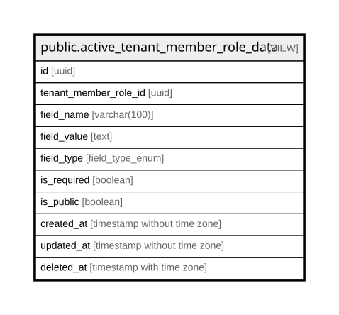

# public.active_tenant_member_role_data

## Description

<details>
<summary><strong>Table Definition</strong></summary>

```sql
CREATE VIEW active_tenant_member_role_data AS (
 SELECT id,
    tenant_member_role_id,
    field_name,
    field_value,
    field_type,
    is_required,
    is_public,
    created_at,
    updated_at,
    deleted_at
   FROM tenant_member_role_data
  WHERE (deleted_at IS NULL)
)
```

</details>

## Columns

| Name | Type | Default | Nullable | Children | Parents | Comment |
| ---- | ---- | ------- | -------- | -------- | ------- | ------- |
| id | uuid |  | true |  |  |  |
| tenant_member_role_id | uuid |  | true |  |  |  |
| field_name | varchar(100) |  | true |  |  |  |
| field_value | text |  | true |  |  |  |
| field_type | field_type_enum |  | true |  |  |  |
| is_required | boolean |  | true |  |  |  |
| is_public | boolean |  | true |  |  |  |
| created_at | timestamp without time zone |  | true |  |  |  |
| updated_at | timestamp without time zone |  | true |  |  |  |
| deleted_at | timestamp with time zone |  | true |  |  |  |

## Referenced Tables

| Name | Columns | Comment | Type |
| ---- | ------- | ------- | ---- |
| [public.tenant_member_role_data](public.tenant_member_role_data.md) | 10 |  | BASE TABLE |

## Relations



---

> Generated by [tbls](https://github.com/k1LoW/tbls)
