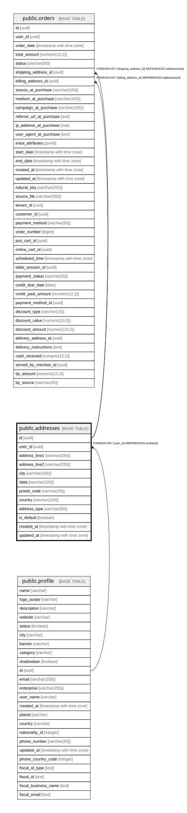

# public.addresses

## Columns

| Name | Type | Default | Nullable | Children | Parents | Comment |
| ---- | ---- | ------- | -------- | -------- | ------- | ------- |
| id | uuid | gen_random_uuid() | false | [public.orders](public.orders.md) |  |  |
| user_id | uuid |  | false |  | [public.profile](public.profile.md) |  |
| address_line1 | varchar(255) |  | false |  |  |  |
| address_line2 | varchar(255) |  | true |  |  |  |
| city | varchar(100) |  | false |  |  |  |
| state | varchar(100) |  | true |  |  |  |
| postal_code | varchar(20) |  | true |  |  |  |
| country | varchar(100) |  | false |  |  |  |
| address_type | varchar(50) |  | false |  |  |  |
| is_default | boolean | false | false |  |  |  |
| created_at | timestamp with time zone | now() | false |  |  |  |
| updated_at | timestamp with time zone | now() | false |  |  |  |

## Constraints

| Name | Type | Definition |
| ---- | ---- | ---------- |
| addresses_pkey | PRIMARY KEY | PRIMARY KEY (id) |
| addresses_user_id_fkey | FOREIGN KEY | FOREIGN KEY (user_id) REFERENCES profile(id) |

## Indexes

| Name | Definition |
| ---- | ---------- |
| addresses_pkey | CREATE UNIQUE INDEX addresses_pkey ON public.addresses USING btree (id) |
| idx_addresses_address_type | CREATE INDEX idx_addresses_address_type ON public.addresses USING btree (address_type) |
| idx_addresses_user_id | CREATE INDEX idx_addresses_user_id ON public.addresses USING btree (user_id) |

## Relations

---

> Generated by [tbls](https://github.com/k1LoW/tbls)
