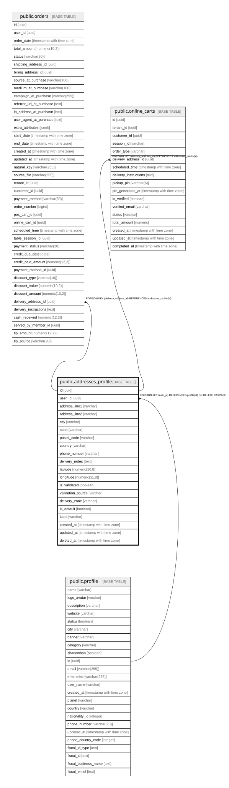

# public.addresses_profile

## Columns

| Name | Type | Default | Nullable | Children | Parents | Comment |
| ---- | ---- | ------- | -------- | -------- | ------- | ------- |
| id | uuid | gen_random_uuid() | false | [public.orders](public.orders.md) [public.online_carts](public.online_carts.md) |  |  |
| user_id | uuid |  | false |  | [public.profile](public.profile.md) |  |
| address_line1 | varchar |  | false |  |  |  |
| address_line2 | varchar |  | true |  |  |  |
| city | varchar |  | false |  |  |  |
| state | varchar |  | true |  |  |  |
| postal_code | varchar |  | true |  |  |  |
| country | varchar | 'Colombia'::character varying | false |  |  |  |
| phone_number | varchar |  | true |  |  |  |
| delivery_notes | text |  | true |  |  |  |
| latitude | numeric(10,8) |  | true |  |  |  |
| longitude | numeric(11,8) |  | true |  |  |  |
| is_validated | boolean | false | true |  |  |  |
| validation_source | varchar |  | true |  |  |  |
| delivery_zone | varchar |  | true |  |  |  |
| is_default | boolean | false | true |  |  |  |
| label | varchar |  | true |  |  |  |
| created_at | timestamp with time zone | now() | true |  |  |  |
| updated_at | timestamp with time zone | now() | true |  |  |  |
| deleted_at | timestamp with time zone |  | true |  |  |  |

## Constraints

| Name | Type | Definition |
| ---- | ---- | ---------- |
| addresses_profile_user_id_fkey | FOREIGN KEY | FOREIGN KEY (user_id) REFERENCES profile(id) ON DELETE CASCADE |
| addresses_profile_pkey | PRIMARY KEY | PRIMARY KEY (id) |

## Indexes

| Name | Definition |
| ---- | ---------- |
| addresses_profile_pkey | CREATE UNIQUE INDEX addresses_profile_pkey ON public.addresses_profile USING btree (id) |
| idx_addresses_profile_user | CREATE INDEX idx_addresses_profile_user ON public.addresses_profile USING btree (user_id) |
| idx_addresses_profile_default | CREATE INDEX idx_addresses_profile_default ON public.addresses_profile USING btree (is_default) |
| idx_addresses_profile_zone | CREATE INDEX idx_addresses_profile_zone ON public.addresses_profile USING btree (delivery_zone) |
| idx_addresses_profile_user_default | CREATE UNIQUE INDEX idx_addresses_profile_user_default ON public.addresses_profile USING btree (user_id) WHERE (is_default = true) |

## Relations

---

> Generated by [tbls](https://github.com/k1LoW/tbls)
