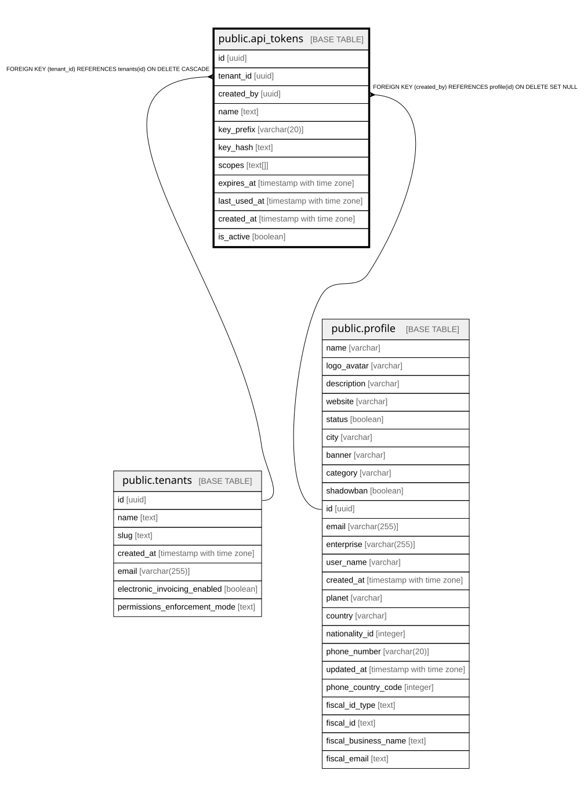

# public.api_tokens

## Description

API tokens para acceso programático por desarrolladores

## Columns

| Name | Type | Default | Nullable | Children | Parents | Comment |
| ---- | ---- | ------- | -------- | -------- | ------- | ------- |
| id | uuid | gen_random_uuid() | false |  |  |  |
| tenant_id | uuid |  | false |  | [public.tenants](public.tenants.md) |  |
| created_by | uuid |  | false |  | [public.profile](public.profile.md) |  |
| name | text |  | false |  |  |  |
| key_prefix | varchar(20) |  | false |  |  | Primeros 8-12 caracteres del token para identificación (ej: waro_abc123) |
| key_hash | text |  | false |  |  | SHA-256 hash del token completo - nunca guardamos el token en texto plano |
| scopes | text[] | ARRAY['read'::text] | true |  |  | Permisos del token: read, write, orders:read, products:write, etc |
| expires_at | timestamp with time zone |  | true |  |  | Fecha de expiración (NULL = no expira) |
| last_used_at | timestamp with time zone |  | true |  |  |  |
| created_at | timestamp with time zone | now() | false |  |  |  |
| is_active | boolean | true | false |  |  |  |

## Constraints

| Name | Type | Definition |
| ---- | ---- | ---------- |
| api_tokens_pkey | PRIMARY KEY | PRIMARY KEY (id) |
| api_tokens_created_by_fkey | FOREIGN KEY | FOREIGN KEY (created_by) REFERENCES profile(id) ON DELETE SET NULL |
| api_tokens_tenant_id_fkey | FOREIGN KEY | FOREIGN KEY (tenant_id) REFERENCES tenants(id) ON DELETE CASCADE |
| unique_key_hash | UNIQUE | UNIQUE (key_hash) |
| unique_key_prefix_per_tenant | UNIQUE | UNIQUE (tenant_id, key_prefix) |

## Indexes

| Name | Definition |
| ---- | ---------- |
| api_tokens_pkey | CREATE UNIQUE INDEX api_tokens_pkey ON public.api_tokens USING btree (id) |
| unique_key_hash | CREATE UNIQUE INDEX unique_key_hash ON public.api_tokens USING btree (key_hash) |
| unique_key_prefix_per_tenant | CREATE UNIQUE INDEX unique_key_prefix_per_tenant ON public.api_tokens USING btree (tenant_id, key_prefix) |
| idx_api_tokens_expires_at | CREATE INDEX idx_api_tokens_expires_at ON public.api_tokens USING btree (expires_at) WHERE (expires_at IS NOT NULL) |
| idx_api_tokens_is_active | CREATE INDEX idx_api_tokens_is_active ON public.api_tokens USING btree (is_active) WHERE (is_active = true) |
| idx_api_tokens_key_hash | CREATE INDEX idx_api_tokens_key_hash ON public.api_tokens USING btree (key_hash) |
| idx_api_tokens_tenant_id | CREATE INDEX idx_api_tokens_tenant_id ON public.api_tokens USING btree (tenant_id) |

## Relations

---

> Generated by [tbls](https://github.com/k1LoW/tbls)
