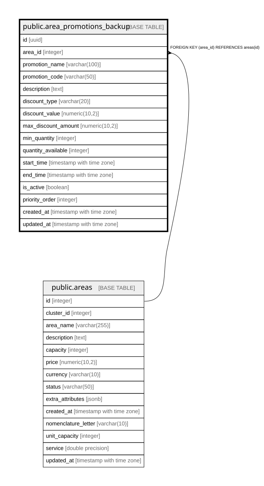

# public.area_promotions_backup

## Columns

| Name | Type | Default | Nullable | Children | Parents | Comment |
| ---- | ---- | ------- | -------- | -------- | ------- | ------- |
| id | uuid | gen_random_uuid() | false |  |  |  |
| area_id | integer |  | false |  | [public.areas](public.areas.md) |  |
| promotion_name | varchar(100) |  | false |  |  |  |
| promotion_code | varchar(50) |  | true |  |  |  |
| description | text |  | true |  |  |  |
| discount_type | varchar(20) |  | false |  |  |  |
| discount_value | numeric(10,2) |  | false |  |  |  |
| max_discount_amount | numeric(10,2) |  | true |  |  |  |
| min_quantity | integer | 1 | true |  |  |  |
| quantity_available | integer |  | true |  |  |  |
| start_time | timestamp with time zone |  | false |  |  |  |
| end_time | timestamp with time zone |  | true |  |  |  |
| is_active | boolean | true | true |  |  |  |
| priority_order | integer | 0 | true |  |  |  |
| created_at | timestamp with time zone | now() | true |  |  |  |
| updated_at | timestamp with time zone | now() | true |  |  |  |

## Constraints

| Name | Type | Definition |
| ---- | ---- | ---------- |
| area_promotions_pkey | PRIMARY KEY | PRIMARY KEY (id) |
| area_promotions_area_id_fkey | FOREIGN KEY | FOREIGN KEY (area_id) REFERENCES areas(id) |

## Indexes

| Name | Definition |
| ---- | ---------- |
| area_promotions_pkey | CREATE UNIQUE INDEX area_promotions_pkey ON public.area_promotions_backup USING btree (id) |
| idx_area_promotions_area_id | CREATE INDEX idx_area_promotions_area_id ON public.area_promotions_backup USING btree (area_id) |
| idx_area_promotions_code | CREATE UNIQUE INDEX idx_area_promotions_code ON public.area_promotions_backup USING btree (promotion_code) WHERE (promotion_code IS NOT NULL) |

## Relations

---

> Generated by [tbls](https://github.com/k1LoW/tbls)
