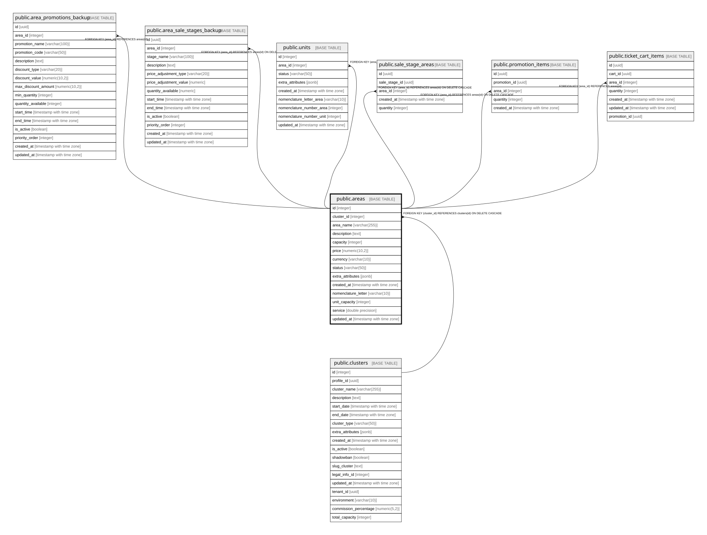

# public.areas

## Columns

| Name | Type | Default | Nullable | Children | Parents | Comment |
| ---- | ---- | ------- | -------- | -------- | ------- | ------- |
| id | integer | nextval('areas_id_seq'::regclass) | false | [public.area_promotions_backup](public.area_promotions_backup.md) [public.area_sale_stages_backup](public.area_sale_stages_backup.md) [public.units](public.units.md) [public.sale_stage_areas](public.sale_stage_areas.md) [public.promotion_items](public.promotion_items.md) [public.ticket_cart_items](public.ticket_cart_items.md) |  |  |
| cluster_id | integer |  | false |  | [public.clusters](public.clusters.md) |  |
| area_name | varchar(255) |  | false |  |  |  |
| description | text |  | true |  |  |  |
| capacity | integer |  | false |  |  |  |
| price | numeric(10,2) | 0.00 | false |  |  |  |
| currency | varchar(10) | 'USD'::character varying | true |  |  |  |
| status | varchar(50) | 'available'::character varying | true |  |  |  |
| extra_attributes | jsonb |  | true |  |  |  |
| created_at | timestamp with time zone | CURRENT_TIMESTAMP | true |  |  |  |
| nomenclature_letter | varchar(10) |  | true |  |  |  |
| unit_capacity | integer |  | true |  |  |  |
| service | double precision |  | true |  |  |  |
| updated_at | timestamp with time zone | now() | true |  |  |  |

## Constraints

| Name | Type | Definition |
| ---- | ---- | ---------- |
| areas_pkey | PRIMARY KEY | PRIMARY KEY (id) |
| fk_cluster | FOREIGN KEY | FOREIGN KEY (cluster_id) REFERENCES clusters(id) ON DELETE CASCADE |

## Indexes

| Name | Definition |
| ---- | ---------- |
| areas_pkey | CREATE UNIQUE INDEX areas_pkey ON public.areas USING btree (id) |

## Relations

---

> Generated by [tbls](https://github.com/k1LoW/tbls)
