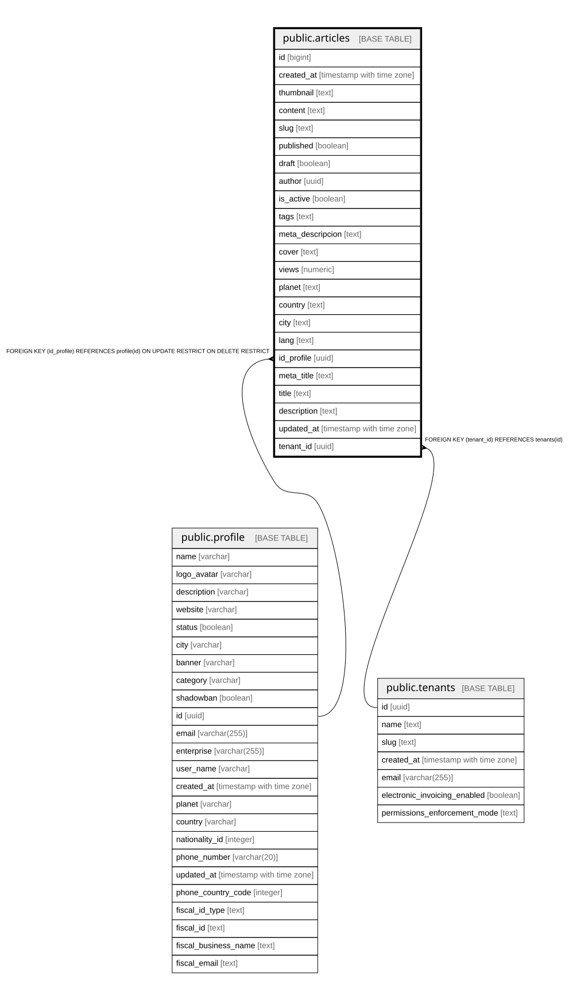

# public.articles

## Columns

| Name | Type | Default | Nullable | Children | Parents | Comment |
| ---- | ---- | ------- | -------- | -------- | ------- | ------- |
| id | bigint |  | false |  |  |  |
| created_at | timestamp with time zone | now() | false |  |  |  |
| thumbnail | text |  | false |  |  |  |
| content | text |  | false |  |  |  |
| slug | text |  | false |  |  |  |
| published | boolean |  | false |  |  |  |
| draft | boolean |  | false |  |  |  |
| author | uuid |  | false |  |  |  |
| is_active | boolean |  | false |  |  |  |
| tags | text |  | false |  |  |  |
| meta_descripcion | text |  | false |  |  |  |
| cover | text |  | false |  |  |  |
| views | numeric |  | true |  |  |  |
| planet | text |  | false |  |  |  |
| country | text |  | false |  |  |  |
| city | text |  | false |  |  |  |
| lang | text |  | false |  |  |  |
| id_profile | uuid |  | false |  | [public.profile](public.profile.md) |  |
| meta_title | text |  | false |  |  |  |
| title | text |  | false |  |  |  |
| description | text |  | false |  |  |  |
| updated_at | timestamp with time zone | now() | true |  |  |  |
| tenant_id | uuid |  | true |  | [public.tenants](public.tenants.md) |  |
| pillar | text |  | true |  |  | Editorial pillar id from content graph (e.g. software-para-restaurantes) |

## Constraints

| Name | Type | Definition |
| ---- | ---- | ---------- |
| articles_description_seo_key | UNIQUE | UNIQUE (meta_descripcion) |
| articles_pkey | PRIMARY KEY | PRIMARY KEY (id) |
| articles_slug_key | UNIQUE | UNIQUE (slug) |
| articles_id_profile_fkey | FOREIGN KEY | FOREIGN KEY (id_profile) REFERENCES profile(id) ON UPDATE RESTRICT ON DELETE RESTRICT |
| articles_tenant_id_fkey | FOREIGN KEY | FOREIGN KEY (tenant_id) REFERENCES tenants(id) |

## Indexes

| Name | Definition |
| ---- | ---------- |
| articles_description_seo_key | CREATE UNIQUE INDEX articles_description_seo_key ON public.articles USING btree (meta_descripcion) |
| articles_pkey | CREATE UNIQUE INDEX articles_pkey ON public.articles USING btree (id) |
| articles_slug_key | CREATE UNIQUE INDEX articles_slug_key ON public.articles USING btree (slug) |
| idx_articles_tenant_id | CREATE INDEX idx_articles_tenant_id ON public.articles USING btree (tenant_id) |
| idx_articles_tenant_pillar | CREATE INDEX idx_articles_tenant_pillar ON public.articles USING btree (tenant_id, pillar) WHERE ((published = true) AND (is_active = true)) |

## Relations

---

> Generated by [tbls](https://github.com/k1LoW/tbls)
