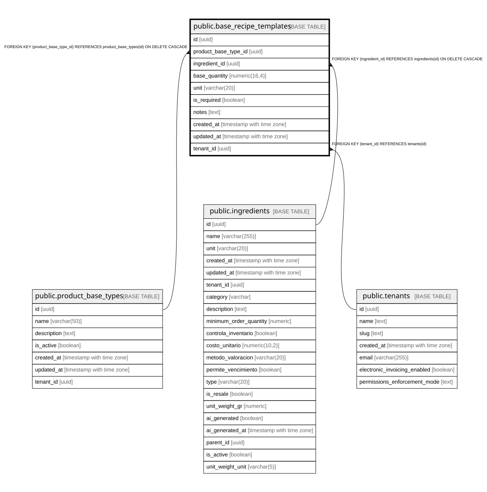

# public.base_recipe_templates

## Description

Recetas base/plantillas para cada tipo de producto (ingredientes y cantidades estándar)

## Columns

| Name | Type | Default | Nullable | Children | Parents | Comment |
| ---- | ---- | ------- | -------- | -------- | ------- | ------- |
| id | uuid | gen_random_uuid() | false |  |  |  |
| product_base_type_id | uuid |  | false |  | [public.product_base_types](public.product_base_types.md) |  |
| ingredient_id | uuid |  | false |  | [public.ingredients](public.ingredients.md) |  |
| base_quantity | numeric(16,4) |  | false |  |  | Base quantity of ingredient needed for recipe template. NUMERIC(10,4) allows up to 999,999.9999 units with 4 decimal precision. |
| unit | varchar(20) | 'gr'::character varying | true |  |  |  |
| is_required | boolean | true | true |  |  | Si el ingrediente es obligatorio (true) u opcional (false) |
| notes | text |  | true |  |  |  |
| created_at | timestamp with time zone | now() | true |  |  |  |
| updated_at | timestamp with time zone | now() | true |  |  |  |
| tenant_id | uuid |  | true |  | [public.tenants](public.tenants.md) | Permite que cada tenant tenga sus propias recetas base |

## Constraints

| Name | Type | Definition |
| ---- | ---- | ---------- |
| base_recipe_templates_base_quantity_check | CHECK | CHECK ((base_quantity >= (0)::numeric)) |
| base_recipe_templates_pkey | PRIMARY KEY | PRIMARY KEY (id) |
| base_recipe_templates_product_base_type_id_ingredient_id_key | UNIQUE | UNIQUE (product_base_type_id, ingredient_id) |
| base_recipe_templates_ingredient_id_fkey | FOREIGN KEY | FOREIGN KEY (ingredient_id) REFERENCES ingredients(id) ON DELETE CASCADE |
| base_recipe_templates_product_base_type_id_fkey | FOREIGN KEY | FOREIGN KEY (product_base_type_id) REFERENCES product_base_types(id) ON DELETE CASCADE |
| base_recipe_templates_tenant_id_fkey | FOREIGN KEY | FOREIGN KEY (tenant_id) REFERENCES tenants(id) |

## Indexes

| Name | Definition |
| ---- | ---------- |
| base_recipe_templates_pkey | CREATE UNIQUE INDEX base_recipe_templates_pkey ON public.base_recipe_templates USING btree (id) |
| base_recipe_templates_product_base_type_id_ingredient_id_key | CREATE UNIQUE INDEX base_recipe_templates_product_base_type_id_ingredient_id_key ON public.base_recipe_templates USING btree (product_base_type_id, ingredient_id) |
| idx_base_recipe_templates_ingredient | CREATE INDEX idx_base_recipe_templates_ingredient ON public.base_recipe_templates USING btree (ingredient_id) |
| idx_base_recipe_templates_tenant_id | CREATE INDEX idx_base_recipe_templates_tenant_id ON public.base_recipe_templates USING btree (tenant_id) |
| idx_base_recipe_templates_tenant_type | CREATE INDEX idx_base_recipe_templates_tenant_type ON public.base_recipe_templates USING btree (tenant_id, product_base_type_id) |
| idx_base_recipe_templates_type | CREATE INDEX idx_base_recipe_templates_type ON public.base_recipe_templates USING btree (product_base_type_id) |

## Relations

---

> Generated by [tbls](https://github.com/k1LoW/tbls)
