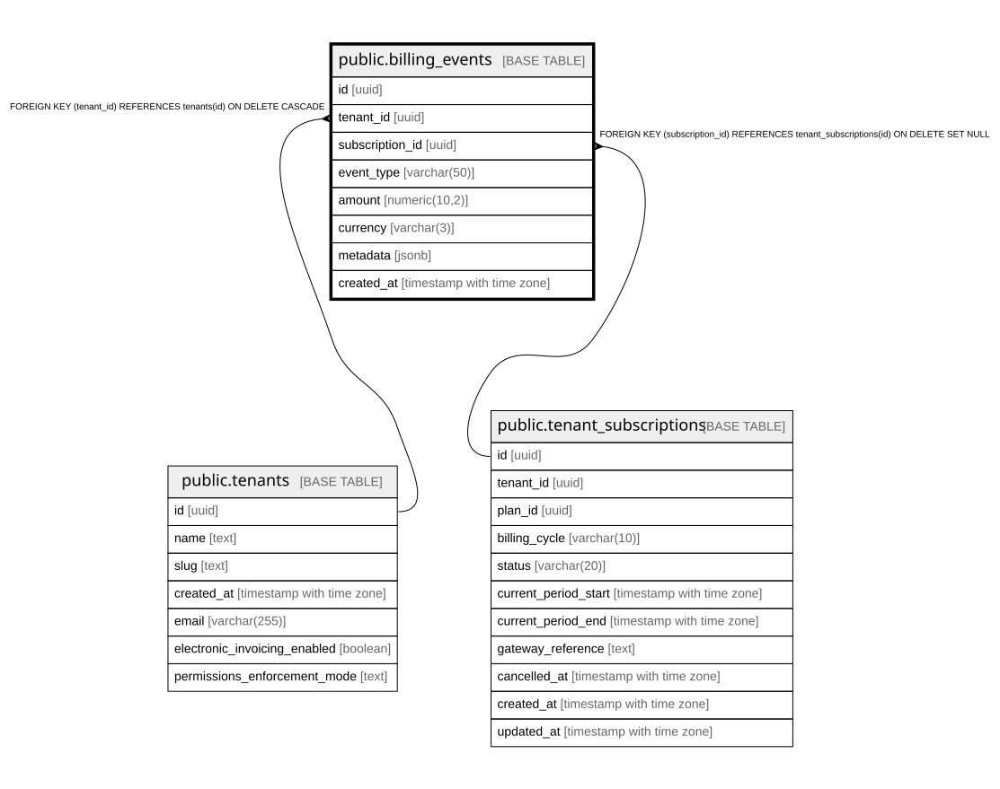

# public.billing_events

## Columns

| Name | Type | Default | Nullable | Children | Parents | Comment |
| ---- | ---- | ------- | -------- | -------- | ------- | ------- |
| id | uuid | gen_random_uuid() | false |  |  |  |
| tenant_id | uuid |  | false |  | [public.tenants](public.tenants.md) |  |
| subscription_id | uuid |  | true |  | [public.tenant_subscriptions](public.tenant_subscriptions.md) |  |
| event_type | varchar(50) |  | false |  |  |  |
| amount | numeric(10,2) |  | true |  |  |  |
| currency | varchar(3) | 'COP'::character varying | true |  |  |  |
| metadata | jsonb | '{}'::jsonb | true |  |  |  |
| created_at | timestamp with time zone | now() | true |  |  |  |

## Constraints

| Name | Type | Definition |
| ---- | ---- | ---------- |
| billing_events_tenant_id_fkey | FOREIGN KEY | FOREIGN KEY (tenant_id) REFERENCES tenants(id) ON DELETE CASCADE |
| billing_events_subscription_id_fkey | FOREIGN KEY | FOREIGN KEY (subscription_id) REFERENCES tenant_subscriptions(id) ON DELETE SET NULL |
| billing_events_pkey | PRIMARY KEY | PRIMARY KEY (id) |

## Indexes

| Name | Definition |
| ---- | ---------- |
| billing_events_pkey | CREATE UNIQUE INDEX billing_events_pkey ON public.billing_events USING btree (id) |
| idx_billing_events_tenant | CREATE INDEX idx_billing_events_tenant ON public.billing_events USING btree (tenant_id, created_at DESC) |
| idx_billing_events_subscription | CREATE INDEX idx_billing_events_subscription ON public.billing_events USING btree (subscription_id) |
| idx_billing_events_event_type | CREATE INDEX idx_billing_events_event_type ON public.billing_events USING btree (event_type) |

## Relations

---

> Generated by [tbls](https://github.com/k1LoW/tbls)
