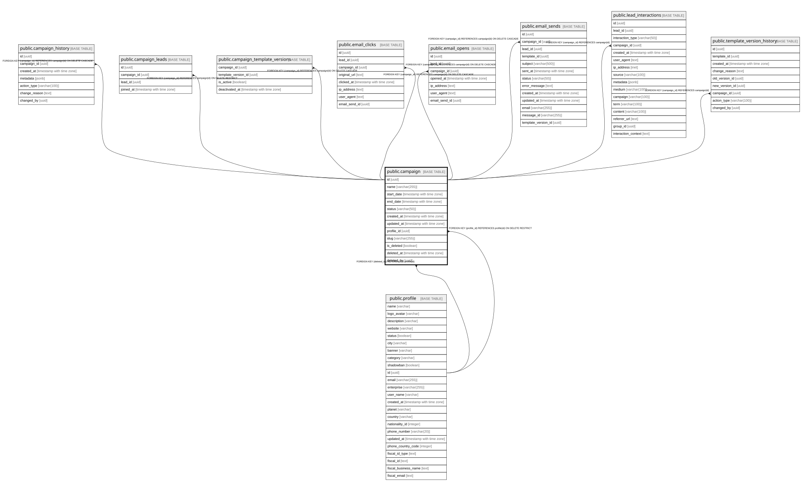

# public.campaign

## Columns

| Name | Type | Default | Nullable | Children | Parents | Comment |
| ---- | ---- | ------- | -------- | -------- | ------- | ------- |
| id | uuid | gen_random_uuid() | false | [public.campaign_history](public.campaign_history.md) [public.campaign_leads](public.campaign_leads.md) [public.campaign_template_versions](public.campaign_template_versions.md) [public.email_clicks](public.email_clicks.md) [public.email_opens](public.email_opens.md) [public.email_sends](public.email_sends.md) [public.lead_interactions](public.lead_interactions.md) [public.template_version_history](public.template_version_history.md) |  |  |
| name | varchar(255) |  | false |  |  |  |
| start_date | timestamp with time zone |  | true |  |  |  |
| end_date | timestamp with time zone |  | true |  |  |  |
| status | varchar(50) |  | false |  |  |  |
| created_at | timestamp with time zone | now() | false |  |  |  |
| updated_at | timestamp with time zone | now() | false |  |  |  |
| profile_id | uuid |  | false |  | [public.profile](public.profile.md) |  |
| slug | varchar(255) |  | true |  |  |  |
| is_deleted | boolean | false | true |  |  |  |
| deleted_at | timestamp with time zone |  | true |  |  |  |
| deleted_by | uuid |  | true |  | [public.profile](public.profile.md) |  |

## Constraints

| Name | Type | Definition |
| ---- | ---- | ---------- |
| campaign_pkey | PRIMARY KEY | PRIMARY KEY (id) |
| campaign_deleted_by_fkey | FOREIGN KEY | FOREIGN KEY (deleted_by) REFERENCES profile(id) |
| fk_profile | FOREIGN KEY | FOREIGN KEY (profile_id) REFERENCES profile(id) ON DELETE RESTRICT |

## Indexes

| Name | Definition |
| ---- | ---------- |
| campaign_pkey | CREATE UNIQUE INDEX campaign_pkey ON public.campaign USING btree (id) |

## Relations

---

> Generated by [tbls](https://github.com/k1LoW/tbls)
