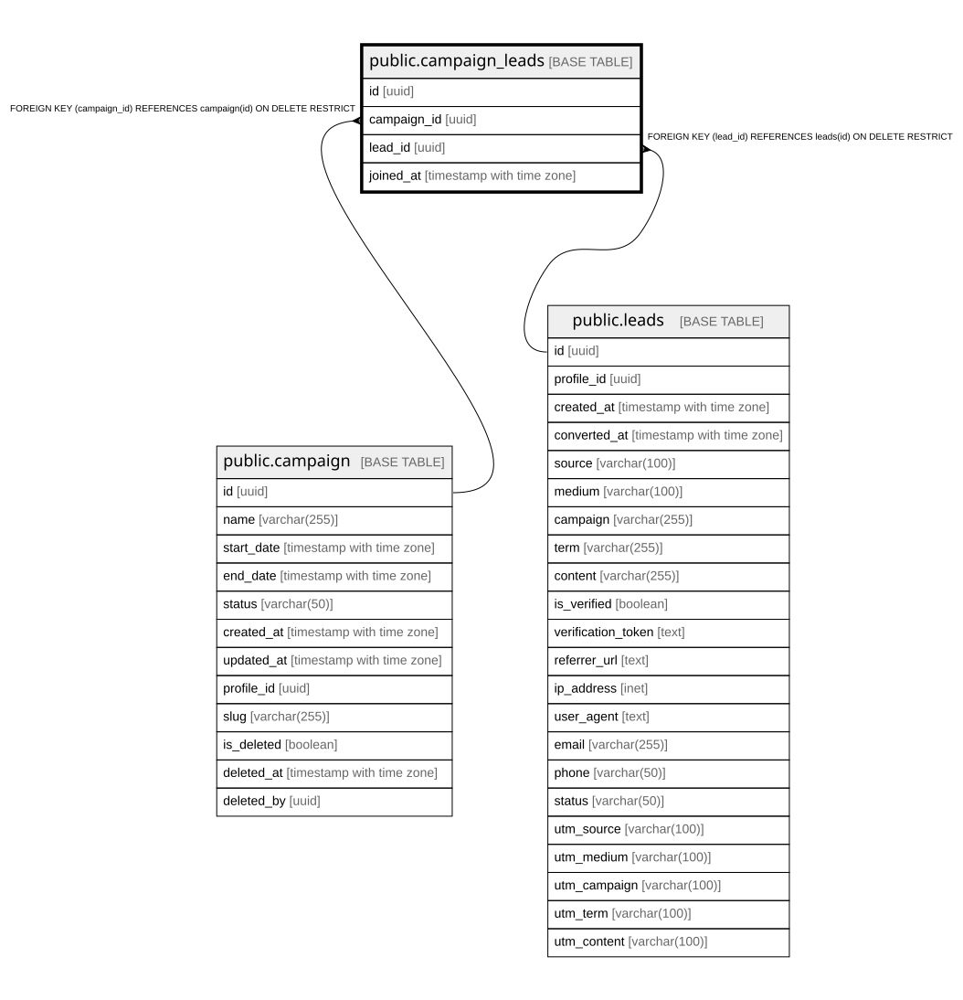

# public.campaign_leads

## Columns

| Name | Type | Default | Nullable | Children | Parents | Comment |
| ---- | ---- | ------- | -------- | -------- | ------- | ------- |
| id | uuid | gen_random_uuid() | false |  |  |  |
| campaign_id | uuid |  | false |  | [public.campaign](public.campaign.md) |  |
| lead_id | uuid |  | false |  | [public.leads](public.leads.md) |  |
| joined_at | timestamp with time zone | now() | false |  |  |  |

## Constraints

| Name | Type | Definition |
| ---- | ---- | ---------- |
| campaign_leads_pkey | PRIMARY KEY | PRIMARY KEY (id) |
| fk_campaign | FOREIGN KEY | FOREIGN KEY (campaign_id) REFERENCES campaign(id) ON DELETE RESTRICT |
| fk_lead | FOREIGN KEY | FOREIGN KEY (lead_id) REFERENCES leads(id) ON DELETE RESTRICT |
| uq_campaign_lead | UNIQUE | UNIQUE (campaign_id, lead_id) |

## Indexes

| Name | Definition |
| ---- | ---------- |
| campaign_leads_pkey | CREATE UNIQUE INDEX campaign_leads_pkey ON public.campaign_leads USING btree (id) |
| uq_campaign_lead | CREATE UNIQUE INDEX uq_campaign_lead ON public.campaign_leads USING btree (campaign_id, lead_id) |

## Relations

---

> Generated by [tbls](https://github.com/k1LoW/tbls)
