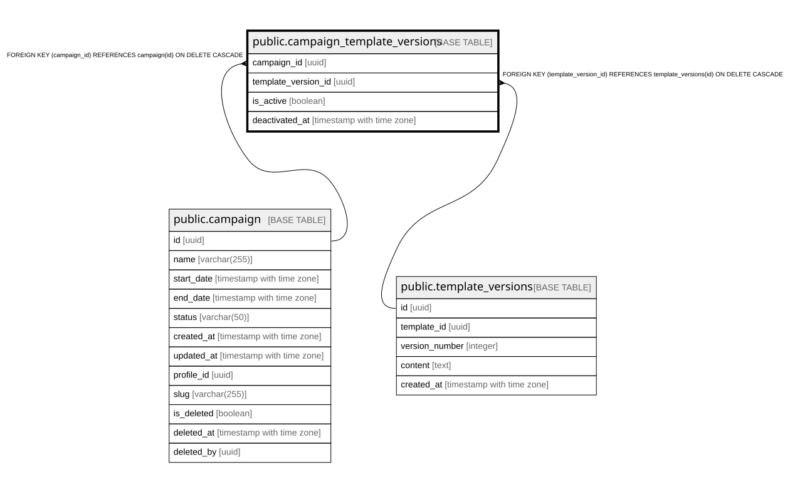

# public.campaign_template_versions

## Columns

| Name | Type | Default | Nullable | Children | Parents | Comment |
| ---- | ---- | ------- | -------- | -------- | ------- | ------- |
| campaign_id | uuid |  | false |  | [public.campaign](public.campaign.md) |  |
| template_version_id | uuid |  | false |  | [public.template_versions](public.template_versions.md) |  |
| is_active | boolean | true | true |  |  |  |
| deactivated_at | timestamp with time zone |  | true |  |  |  |

## Constraints

| Name | Type | Definition |
| ---- | ---- | ---------- |
| campaign_template_versions_campaign_id_fkey | FOREIGN KEY | FOREIGN KEY (campaign_id) REFERENCES campaign(id) ON DELETE CASCADE |
| campaign_template_versions_pkey | PRIMARY KEY | PRIMARY KEY (campaign_id, template_version_id) |
| campaign_template_versions_template_version_id_fkey | FOREIGN KEY | FOREIGN KEY (template_version_id) REFERENCES template_versions(id) ON DELETE CASCADE |

## Indexes

| Name | Definition |
| ---- | ---------- |
| campaign_template_versions_pkey | CREATE UNIQUE INDEX campaign_template_versions_pkey ON public.campaign_template_versions USING btree (campaign_id, template_version_id) |

## Relations

---

> Generated by [tbls](https://github.com/k1LoW/tbls)
