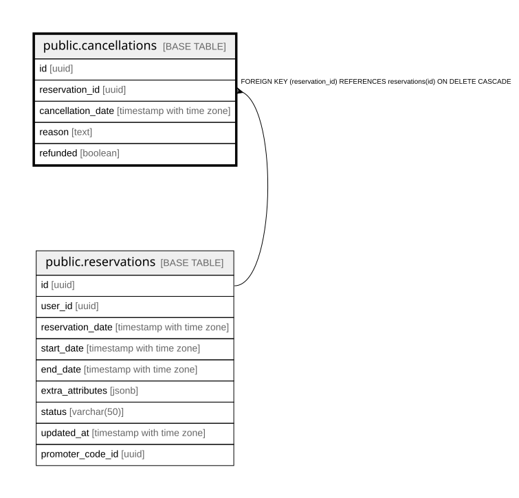

# public.cancellations

## Columns

| Name | Type | Default | Nullable | Children | Parents | Comment |
| ---- | ---- | ------- | -------- | -------- | ------- | ------- |
| id | uuid | gen_random_uuid() | false |  |  |  |
| reservation_id | uuid |  | false |  | [public.reservations](public.reservations.md) |  |
| cancellation_date | timestamp with time zone | CURRENT_TIMESTAMP | true |  |  |  |
| reason | text |  | true |  |  |  |
| refunded | boolean | false | true |  |  |  |

## Constraints

| Name | Type | Definition |
| ---- | ---- | ---------- |
| cancellations_pkey | PRIMARY KEY | PRIMARY KEY (id) |
| fk_reservation | FOREIGN KEY | FOREIGN KEY (reservation_id) REFERENCES reservations(id) ON DELETE CASCADE |

## Indexes

| Name | Definition |
| ---- | ---------- |
| cancellations_pkey | CREATE UNIQUE INDEX cancellations_pkey ON public.cancellations USING btree (id) |

## Relations

---

> Generated by [tbls](https://github.com/k1LoW/tbls)
