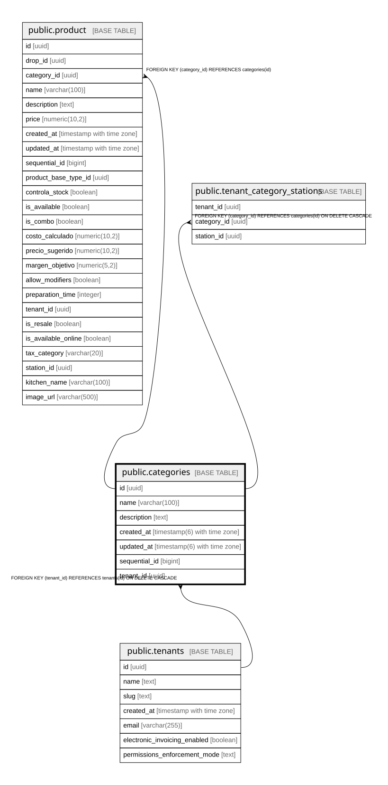

# public.categories

## Columns

| Name | Type | Default | Nullable | Children | Parents | Comment |
| ---- | ---- | ------- | -------- | -------- | ------- | ------- |
| id | uuid | gen_random_uuid() | false | [public.product](public.product.md) [public.tenant_category_stations](public.tenant_category_stations.md) |  |  |
| name | varchar(100) |  | false |  |  |  |
| description | text |  | true |  |  |  |
| created_at | timestamp(6) with time zone | CURRENT_TIMESTAMP | false |  |  |  |
| updated_at | timestamp(6) with time zone | CURRENT_TIMESTAMP | false |  |  |  |
| sequential_id | bigint | nextval('categories_sequential_id_seq'::regclass) | false |  |  |  |
| tenant_id | uuid |  | true |  | [public.tenants](public.tenants.md) |  |

## Constraints

| Name | Type | Definition |
| ---- | ---- | ---------- |
| categories_pkey | PRIMARY KEY | PRIMARY KEY (id) |
| categories_tenant_id_fkey | FOREIGN KEY | FOREIGN KEY (tenant_id) REFERENCES tenants(id) ON DELETE CASCADE |

## Indexes

| Name | Definition |
| ---- | ---------- |
| categories_pkey | CREATE UNIQUE INDEX categories_pkey ON public.categories USING btree (id) |
| idx_categories_tenant | CREATE INDEX idx_categories_tenant ON public.categories USING btree (tenant_id) WHERE (tenant_id IS NOT NULL) |
| idx_categories_name_tenant_unique | CREATE UNIQUE INDEX idx_categories_name_tenant_unique ON public.categories USING btree (lower((name)::text), COALESCE(tenant_id, '00000000-0000-0000-0000-000000000000'::uuid)) |

## Relations

---

> Generated by [tbls](https://github.com/k1LoW/tbls)
