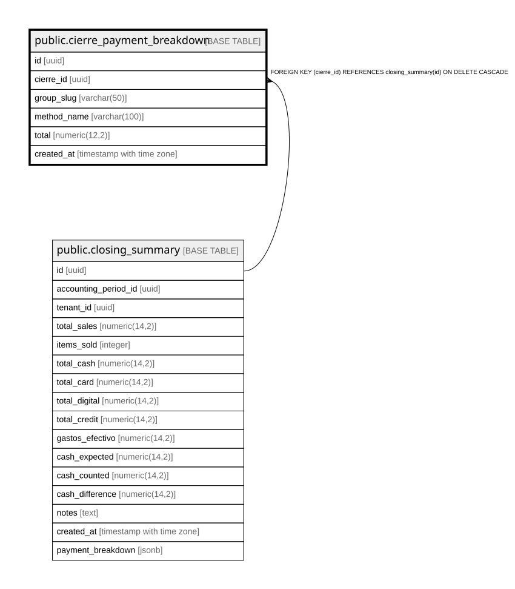

# public.cierre_payment_breakdown

## Columns

| Name | Type | Default | Nullable | Children | Parents | Comment |
| ---- | ---- | ------- | -------- | -------- | ------- | ------- |
| id | uuid | gen_random_uuid() | false |  |  |  |
| cierre_id | uuid |  | false |  | [public.closing_summary](public.closing_summary.md) |  |
| group_slug | varchar(50) |  | false |  |  |  |
| method_name | varchar(100) |  | false |  |  |  |
| total | numeric(12,2) | 0 | false |  |  |  |
| created_at | timestamp with time zone | now() | true |  |  |  |

## Constraints

| Name | Type | Definition |
| ---- | ---- | ---------- |
| cierre_payment_breakdown_cierre_id_fkey | FOREIGN KEY | FOREIGN KEY (cierre_id) REFERENCES closing_summary(id) ON DELETE CASCADE |
| cierre_payment_breakdown_pkey | PRIMARY KEY | PRIMARY KEY (id) |

## Indexes

| Name | Definition |
| ---- | ---------- |
| cierre_payment_breakdown_pkey | CREATE UNIQUE INDEX cierre_payment_breakdown_pkey ON public.cierre_payment_breakdown USING btree (id) |
| cierre_payment_breakdown_cierre_id_idx | CREATE INDEX cierre_payment_breakdown_cierre_id_idx ON public.cierre_payment_breakdown USING btree (cierre_id) |

## Relations

---

> Generated by [tbls](https://github.com/k1LoW/tbls)
