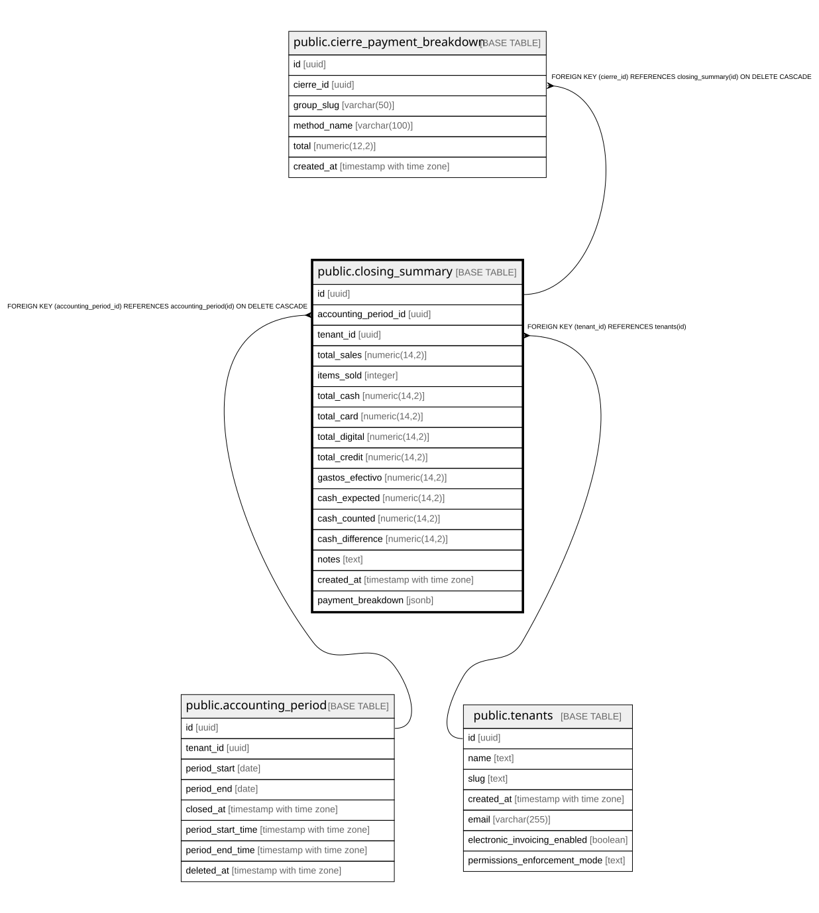

# public.closing_summary

## Columns

| Name | Type | Default | Nullable | Children | Parents | Comment |
| ---- | ---- | ------- | -------- | -------- | ------- | ------- |
| id | uuid | gen_random_uuid() | false | [public.cierre_payment_breakdown](public.cierre_payment_breakdown.md) |  |  |
| accounting_period_id | uuid |  | false |  | [public.accounting_period](public.accounting_period.md) |  |
| tenant_id | uuid |  | false |  | [public.tenants](public.tenants.md) |  |
| total_sales | numeric(14,2) | 0 | false |  |  |  |
| items_sold | integer | 0 | false |  |  |  |
| total_cash | numeric(14,2) | 0 | false |  |  |  |
| total_card | numeric(14,2) | 0 | false |  |  |  |
| total_digital | numeric(14,2) | 0 | false |  |  |  |
| total_credit | numeric(14,2) | 0 | false |  |  |  |
| gastos_efectivo | numeric(14,2) | 0 | false |  |  |  |
| cash_expected | numeric(14,2) | 0 | false |  |  |  |
| cash_counted | numeric(14,2) | 0 | false |  |  |  |
| cash_difference | numeric(14,2) | 0 | false |  |  |  |
| notes | text |  | true |  |  |  |
| created_at | timestamp with time zone | now() | false |  |  |  |
| payment_breakdown | jsonb |  | true |  |  |  |

## Constraints

| Name | Type | Definition |
| ---- | ---- | ---------- |
| closing_summary_tenant_id_fkey | FOREIGN KEY | FOREIGN KEY (tenant_id) REFERENCES tenants(id) |
| closing_summary_accounting_period_id_fkey | FOREIGN KEY | FOREIGN KEY (accounting_period_id) REFERENCES accounting_period(id) ON DELETE CASCADE |
| closing_summary_pkey | PRIMARY KEY | PRIMARY KEY (id) |

## Indexes

| Name | Definition |
| ---- | ---------- |
| closing_summary_pkey | CREATE UNIQUE INDEX closing_summary_pkey ON public.closing_summary USING btree (id) |
| idx_closing_summary_period | CREATE INDEX idx_closing_summary_period ON public.closing_summary USING btree (accounting_period_id) |
| idx_closing_summary_tenant | CREATE INDEX idx_closing_summary_tenant ON public.closing_summary USING btree (tenant_id, created_at DESC) |

## Relations

---

> Generated by [tbls](https://github.com/k1LoW/tbls)
