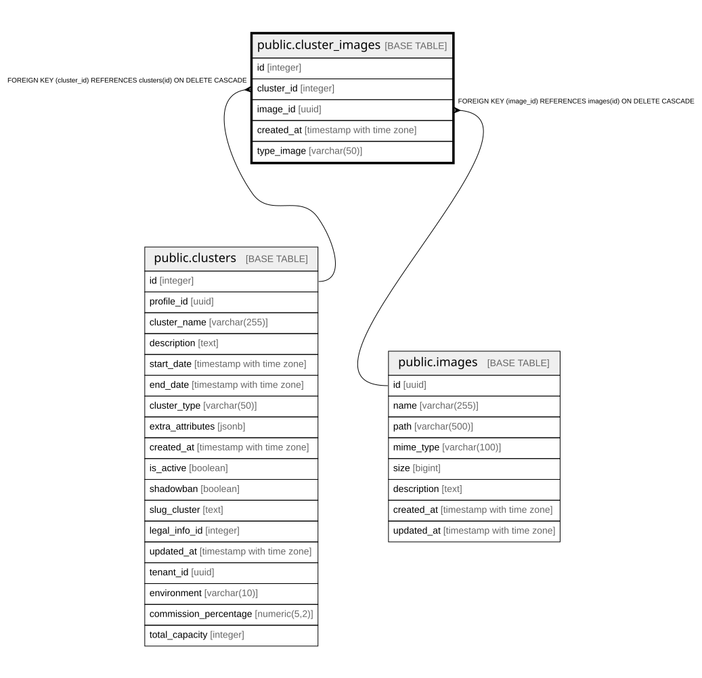

# public.cluster_images

## Columns

| Name | Type | Default | Nullable | Children | Parents | Comment |
| ---- | ---- | ------- | -------- | -------- | ------- | ------- |
| id | integer | nextval('cluster_images_id_seq'::regclass) | false |  |  |  |
| cluster_id | integer |  | false |  | [public.clusters](public.clusters.md) |  |
| image_id | uuid |  | false |  | [public.images](public.images.md) |  |
| created_at | timestamp with time zone | CURRENT_TIMESTAMP | false |  |  |  |
| type_image | varchar(50) |  | true |  |  |  |

## Constraints

| Name | Type | Definition |
| ---- | ---- | ---------- |
| cluster_images_pkey | PRIMARY KEY | PRIMARY KEY (id) |
| fk_cluster | FOREIGN KEY | FOREIGN KEY (cluster_id) REFERENCES clusters(id) ON DELETE CASCADE |
| fk_image | FOREIGN KEY | FOREIGN KEY (image_id) REFERENCES images(id) ON DELETE CASCADE |

## Indexes

| Name | Definition |
| ---- | ---------- |
| cluster_images_pkey | CREATE UNIQUE INDEX cluster_images_pkey ON public.cluster_images USING btree (id) |

## Relations

---

> Generated by [tbls](https://github.com/k1LoW/tbls)
