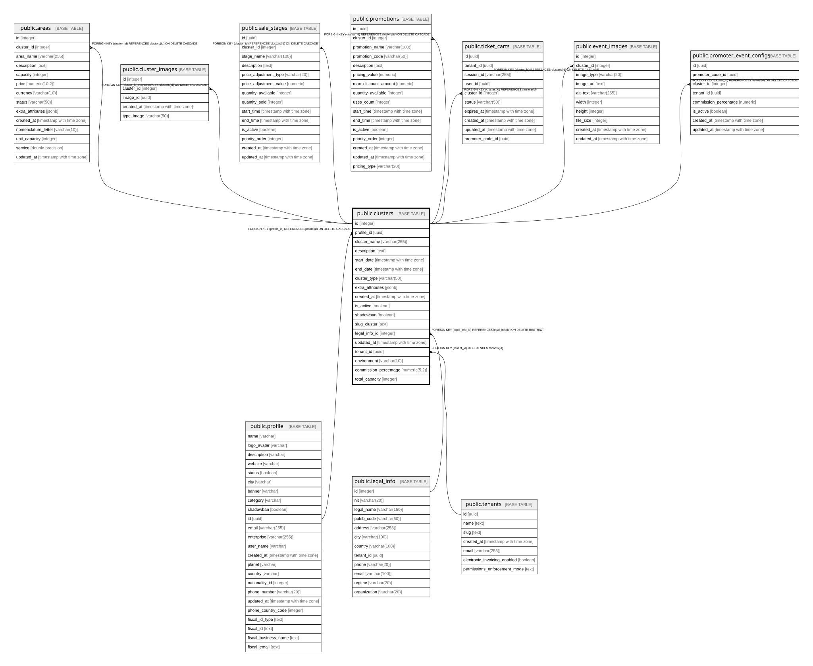

# public.clusters

## Columns

| Name | Type | Default | Nullable | Children | Parents | Comment |
| ---- | ---- | ------- | -------- | -------- | ------- | ------- |
| id | integer | nextval('clusters_id_seq'::regclass) | false | [public.areas](public.areas.md) [public.cluster_images](public.cluster_images.md) [public.sale_stages](public.sale_stages.md) [public.promotions](public.promotions.md) [public.ticket_carts](public.ticket_carts.md) [public.event_images](public.event_images.md) [public.promoter_event_configs](public.promoter_event_configs.md) |  |  |
| profile_id | uuid |  | false |  | [public.profile](public.profile.md) |  |
| cluster_name | varchar(255) |  | false |  |  |  |
| description | text |  | true |  |  |  |
| start_date | timestamp with time zone |  | true |  |  |  |
| end_date | timestamp with time zone |  | true |  |  |  |
| cluster_type | varchar(50) |  | true |  |  |  |
| extra_attributes | jsonb |  | true |  |  |  |
| created_at | timestamp with time zone | CURRENT_TIMESTAMP | true |  |  |  |
| is_active | boolean | true | true |  |  |  |
| shadowban | boolean | false | true |  |  |  |
| slug_cluster | text |  | false |  |  |  |
| legal_info_id | integer |  | true |  | [public.legal_info](public.legal_info.md) |  |
| updated_at | timestamp with time zone | now() | true |  |  |  |
| tenant_id | uuid |  | true |  | [public.tenants](public.tenants.md) |  |
| environment | varchar(10) | 'prod'::character varying | false |  |  |  |
| commission_percentage | numeric(5,2) | 10.00 | false |  |  |  |
| total_capacity | integer | 0 | true |  |  |  |

## Constraints

| Name | Type | Definition |
| ---- | ---- | ---------- |
| chk_clusters_environment | CHECK | CHECK (((environment)::text = ANY ((ARRAY['dev'::character varying, 'prod'::character varying])::text[]))) |
| clusters_pkey | PRIMARY KEY | PRIMARY KEY (id) |
| fk_legal_info | FOREIGN KEY | FOREIGN KEY (legal_info_id) REFERENCES legal_info(id) ON DELETE RESTRICT |
| fk_profile | FOREIGN KEY | FOREIGN KEY (profile_id) REFERENCES profile(id) ON DELETE CASCADE |
| clusters_tenant_id_fkey | FOREIGN KEY | FOREIGN KEY (tenant_id) REFERENCES tenants(id) |

## Indexes

| Name | Definition |
| ---- | ---------- |
| clusters_pkey | CREATE UNIQUE INDEX clusters_pkey ON public.clusters USING btree (id) |
| idx_clusters_environment | CREATE INDEX idx_clusters_environment ON public.clusters USING btree (environment) |
| idx_clusters_public_env | CREATE INDEX idx_clusters_public_env ON public.clusters USING btree (is_active, shadowban, environment) WHERE ((is_active = true) AND (shadowban = false)) |
| idx_clusters_commission_pct | CREATE INDEX idx_clusters_commission_pct ON public.clusters USING btree (commission_percentage) |

## Relations

---

> Generated by [tbls](https://github.com/k1LoW/tbls)
