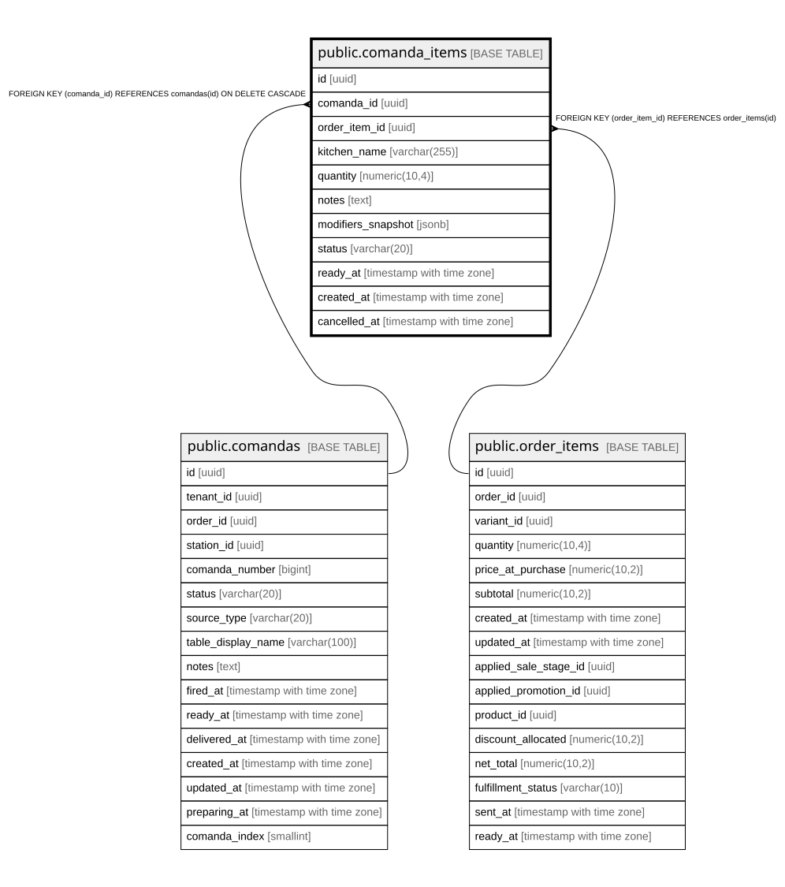

# public.comanda_items

## Columns

| Name | Type | Default | Nullable | Children | Parents | Comment |
| ---- | ---- | ------- | -------- | -------- | ------- | ------- |
| id | uuid | gen_random_uuid() | false |  |  |  |
| comanda_id | uuid |  | false |  | [public.comandas](public.comandas.md) |  |
| order_item_id | uuid |  | true |  | [public.order_items](public.order_items.md) |  |
| kitchen_name | varchar(255) |  | false |  |  |  |
| quantity | numeric(10,4) |  | false |  |  |  |
| notes | text |  | true |  |  |  |
| modifiers_snapshot | jsonb |  | true |  |  |  |
| status | varchar(20) | 'pending'::character varying | false |  |  |  |
| ready_at | timestamp with time zone |  | true |  |  |  |
| created_at | timestamp with time zone | now() | false |  |  |  |
| cancelled_at | timestamp with time zone |  | true |  |  |  |

## Constraints

| Name | Type | Definition |
| ---- | ---- | ---------- |
| chk_comanda_item_status | CHECK | CHECK (((status)::text = ANY ((ARRAY['pending'::character varying, 'preparing'::character varying, 'ready'::character varying, 'cancelled'::character varying])::text[]))) |
| comanda_items_order_item_id_fkey | FOREIGN KEY | FOREIGN KEY (order_item_id) REFERENCES order_items(id) |
| comanda_items_comanda_id_fkey | FOREIGN KEY | FOREIGN KEY (comanda_id) REFERENCES comandas(id) ON DELETE CASCADE |
| comanda_items_pkey | PRIMARY KEY | PRIMARY KEY (id) |

## Indexes

| Name | Definition |
| ---- | ---------- |
| comanda_items_pkey | CREATE UNIQUE INDEX comanda_items_pkey ON public.comanda_items USING btree (id) |
| idx_comanda_items_comanda | CREATE INDEX idx_comanda_items_comanda ON public.comanda_items USING btree (comanda_id) |

## Relations

---

> Generated by [tbls](https://github.com/k1LoW/tbls)
