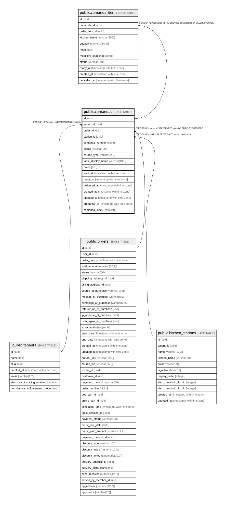

# public.comandas

## Columns

| Name | Type | Default | Nullable | Children | Parents | Comment |
| ---- | ---- | ------- | -------- | -------- | ------- | ------- |
| id | uuid | gen_random_uuid() | false | [public.comanda_items](public.comanda_items.md) |  |  |
| tenant_id | uuid |  | false |  | [public.tenants](public.tenants.md) |  |
| order_id | uuid |  | false |  | [public.orders](public.orders.md) |  |
| station_id | uuid |  | false |  | [public.kitchen_stations](public.kitchen_stations.md) |  |
| comanda_number | bigint |  | false |  |  |  |
| status | varchar(20) | 'pending'::character varying | false |  |  |  |
| source_type | varchar(20) |  | false |  |  |  |
| table_display_name | varchar(100) |  | true |  |  |  |
| notes | text |  | true |  |  |  |
| fired_at | timestamp with time zone | now() | false |  |  |  |
| ready_at | timestamp with time zone |  | true |  |  |  |
| delivered_at | timestamp with time zone |  | true |  |  |  |
| created_at | timestamp with time zone | now() | false |  |  |  |
| updated_at | timestamp with time zone | now() | false |  |  |  |
| preparing_at | timestamp with time zone |  | true |  |  |  |
| comanda_index | smallint | 1 | false |  |  |  |

## Constraints

| Name | Type | Definition |
| ---- | ---- | ---------- |
| chk_comanda_source | CHECK | CHECK (((source_type)::text = ANY ((ARRAY['table'::character varying, 'pos'::character varying, 'delivery'::character varying, 'pickup'::character varying])::text[]))) |
| chk_comanda_status | CHECK | CHECK (((status)::text = ANY ((ARRAY['pending'::character varying, 'preparing'::character varying, 'ready'::character varying, 'delivered'::character varying, 'cancelled'::character varying])::text[]))) |
| comandas_order_id_fkey | FOREIGN KEY | FOREIGN KEY (order_id) REFERENCES orders(id) ON DELETE CASCADE |
| comandas_tenant_id_fkey | FOREIGN KEY | FOREIGN KEY (tenant_id) REFERENCES tenants(id) |
| comandas_station_id_fkey | FOREIGN KEY | FOREIGN KEY (station_id) REFERENCES kitchen_stations(id) |
| comandas_pkey | PRIMARY KEY | PRIMARY KEY (id) |

## Indexes

| Name | Definition |
| ---- | ---------- |
| comandas_pkey | CREATE UNIQUE INDEX comandas_pkey ON public.comandas USING btree (id) |
| idx_comandas_order | CREATE INDEX idx_comandas_order ON public.comandas USING btree (order_id) |
| idx_comandas_station_active | CREATE INDEX idx_comandas_station_active ON public.comandas USING btree (station_id, status) WHERE ((status)::text = ANY ((ARRAY['pending'::character varying, 'preparing'::character varying, 'ready'::character varying])::text[])) |
| idx_comandas_tenant_date | CREATE INDEX idx_comandas_tenant_date ON public.comandas USING btree (tenant_id, fired_at) |

## Relations

---

> Generated by [tbls](https://github.com/k1LoW/tbls)
