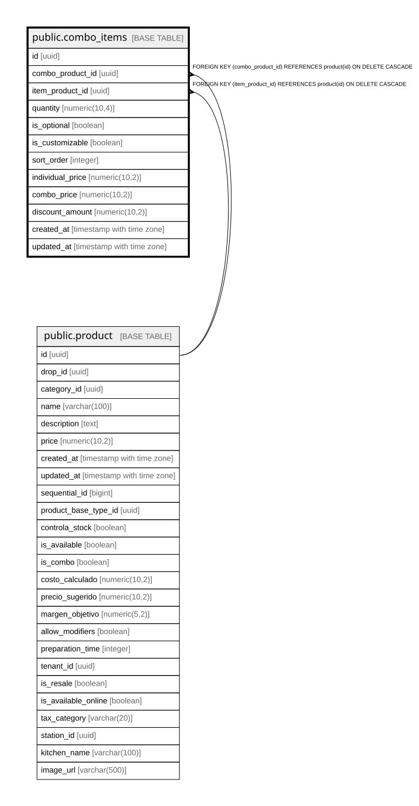

# public.combo_items

## Description

Composición de combos (qué productos incluye cada combo y en qué cantidad)

## Columns

| Name | Type | Default | Nullable | Children | Parents | Comment |
| ---- | ---- | ------- | -------- | -------- | ------- | ------- |
| id | uuid | gen_random_uuid() | false |  |  |  |
| combo_product_id | uuid |  | false |  | [public.product](public.product.md) |  |
| item_product_id | uuid |  | false |  | [public.product](public.product.md) |  |
| quantity | numeric(10,4) | 1 | false |  |  | Quantity of this product in the combo. NUMERIC(10,4) supports fractional quantities like 0.5 portions. |
| is_optional | boolean | false | true |  |  | true = cliente puede elegir entre varias opciones (ej: elige tu bebida) |
| is_customizable | boolean | false | true |  |  | true = cliente puede personalizar este item del combo con modificadores |
| sort_order | integer | 0 | true |  |  |  |
| individual_price | numeric(10,2) |  | true |  |  |  |
| combo_price | numeric(10,2) |  | true |  |  | Precio del producto dentro del combo (con descuento aplicado) |
| discount_amount | numeric(10,2) |  | true |  |  | Descuento aplicado: individual_price - combo_price |
| created_at | timestamp with time zone | now() | true |  |  |  |
| updated_at | timestamp with time zone | now() | true |  |  |  |

## Constraints

| Name | Type | Definition |
| ---- | ---- | ---------- |
| check_combo_not_self | CHECK | CHECK ((combo_product_id <> item_product_id)) |
| check_combo_prices | CHECK | CHECK ((((individual_price IS NULL) AND (combo_price IS NULL) AND (discount_amount IS NULL)) OR ((individual_price IS NOT NULL) AND (combo_price IS NOT NULL)))) |
| check_combo_quantity_positive | CHECK | CHECK ((quantity > (0)::numeric)) |
| combo_items_pkey | PRIMARY KEY | PRIMARY KEY (id) |
| combo_items_combo_product_id_fkey | FOREIGN KEY | FOREIGN KEY (combo_product_id) REFERENCES product(id) ON DELETE CASCADE |
| combo_items_item_product_id_fkey | FOREIGN KEY | FOREIGN KEY (item_product_id) REFERENCES product(id) ON DELETE CASCADE |

## Indexes

| Name | Definition |
| ---- | ---------- |
| combo_items_pkey | CREATE UNIQUE INDEX combo_items_pkey ON public.combo_items USING btree (id) |
| idx_combo_items_combo | CREATE INDEX idx_combo_items_combo ON public.combo_items USING btree (combo_product_id) |
| idx_combo_items_product | CREATE INDEX idx_combo_items_product ON public.combo_items USING btree (item_product_id) |
| idx_combo_items_sort | CREATE INDEX idx_combo_items_sort ON public.combo_items USING btree (combo_product_id, sort_order) |

## Triggers

| Name | Definition |
| ---- | ---------- |
| trigger_update_combo_items_timestamp | CREATE TRIGGER trigger_update_combo_items_timestamp BEFORE UPDATE ON public.combo_items FOR EACH ROW EXECUTE FUNCTION update_updated_at_column() |

## Relations

---

> Generated by [tbls](https://github.com/k1LoW/tbls)
