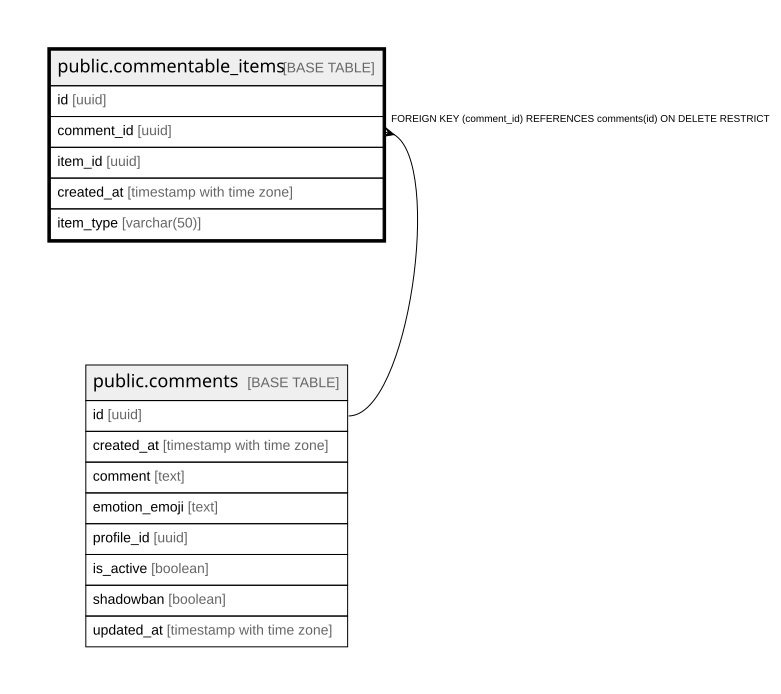

# public.commentable_items

## Columns

| Name | Type | Default | Nullable | Children | Parents | Comment |
| ---- | ---- | ------- | -------- | -------- | ------- | ------- |
| id | uuid | gen_random_uuid() | false |  |  |  |
| comment_id | uuid |  | false |  | [public.comments](public.comments.md) |  |
| item_id | uuid |  | false |  |  |  |
| created_at | timestamp with time zone | now() | false |  |  |  |
| item_type | varchar(50) |  | true |  |  |  |

## Constraints

| Name | Type | Definition |
| ---- | ---- | ---------- |
| commentable_items_pkey | PRIMARY KEY | PRIMARY KEY (id) |
| fk_comment | FOREIGN KEY | FOREIGN KEY (comment_id) REFERENCES comments(id) ON DELETE RESTRICT |

## Indexes

| Name | Definition |
| ---- | ---------- |
| commentable_items_pkey | CREATE UNIQUE INDEX commentable_items_pkey ON public.commentable_items USING btree (id) |

## Relations

---

> Generated by [tbls](https://github.com/k1LoW/tbls)
