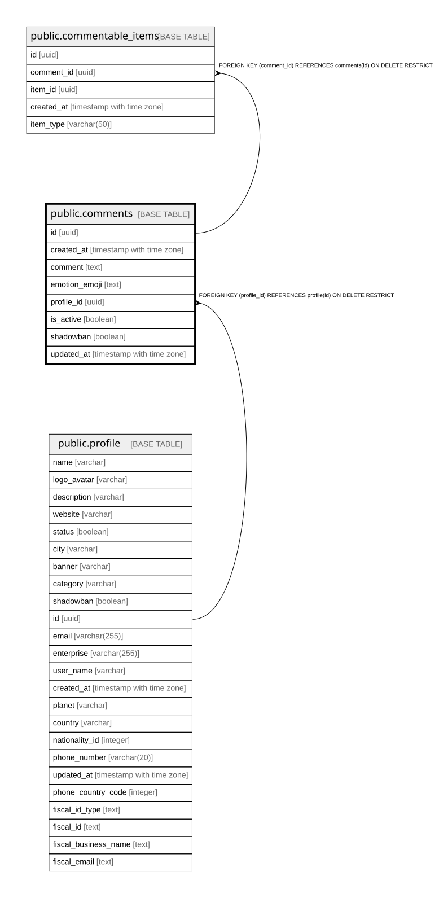

# public.comments

## Columns

| Name | Type | Default | Nullable | Children | Parents | Comment |
| ---- | ---- | ------- | -------- | -------- | ------- | ------- |
| id | uuid | gen_random_uuid() | false | [public.commentable_items](public.commentable_items.md) |  |  |
| created_at | timestamp with time zone | now() | false |  |  |  |
| comment | text |  | false |  |  |  |
| emotion_emoji | text |  | true |  |  |  |
| profile_id | uuid |  | false |  | [public.profile](public.profile.md) |  |
| is_active | boolean | true | false |  |  |  |
| shadowban | boolean | false | false |  |  |  |
| updated_at | timestamp with time zone |  | true |  |  |  |

## Constraints

| Name | Type | Definition |
| ---- | ---- | ---------- |
| check_timestamps | CHECK | CHECK (((updated_at IS NULL) OR (updated_at > created_at))) |
| comments_comment_check | CHECK | CHECK ((length(TRIM(BOTH FROM comment)) > 0)) |
| comments_emotion_emoji_check | CHECK | CHECK ((emotion_emoji ~ '^[\x{1F300}-\x{1F6FF}]$'::text)) |
| comments_pkey | PRIMARY KEY | PRIMARY KEY (id) |
| fk_profile | FOREIGN KEY | FOREIGN KEY (profile_id) REFERENCES profile(id) ON DELETE RESTRICT |

## Indexes

| Name | Definition |
| ---- | ---------- |
| comments_pkey | CREATE UNIQUE INDEX comments_pkey ON public.comments USING btree (id) |

## Relations

---

> Generated by [tbls](https://github.com/k1LoW/tbls)
