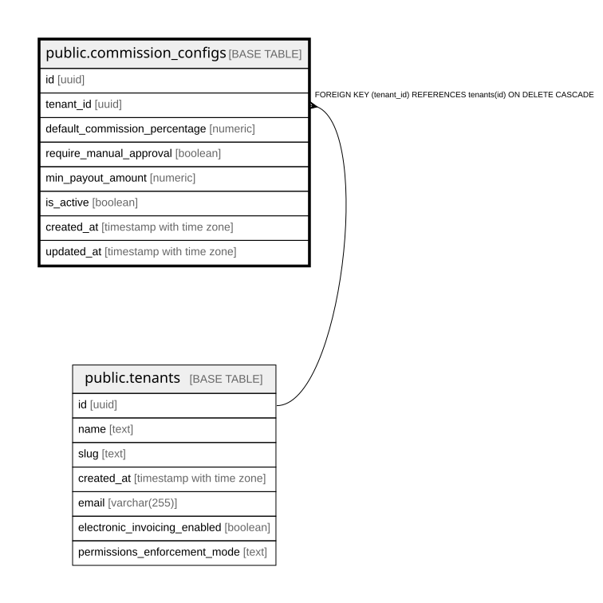

# public.commission_configs

## Columns

| Name | Type | Default | Nullable | Children | Parents | Comment |
| ---- | ---- | ------- | -------- | -------- | ------- | ------- |
| id | uuid | gen_random_uuid() | false |  |  |  |
| tenant_id | uuid |  | false |  | [public.tenants](public.tenants.md) |  |
| default_commission_percentage | numeric | 10.0 | true |  |  |  |
| require_manual_approval | boolean | true | true |  |  |  |
| min_payout_amount | numeric | 50000 | true |  |  |  |
| is_active | boolean | true | true |  |  |  |
| created_at | timestamp with time zone | now() | true |  |  |  |
| updated_at | timestamp with time zone | now() | true |  |  |  |

## Constraints

| Name | Type | Definition |
| ---- | ---- | ---------- |
| commission_configs_tenant_fkey | FOREIGN KEY | FOREIGN KEY (tenant_id) REFERENCES tenants(id) ON DELETE CASCADE |
| commission_configs_pkey | PRIMARY KEY | PRIMARY KEY (id) |
| unique_config_per_tenant | UNIQUE | UNIQUE (tenant_id) |

## Indexes

| Name | Definition |
| ---- | ---------- |
| commission_configs_pkey | CREATE UNIQUE INDEX commission_configs_pkey ON public.commission_configs USING btree (id) |
| unique_config_per_tenant | CREATE UNIQUE INDEX unique_config_per_tenant ON public.commission_configs USING btree (tenant_id) |

## Relations

---

> Generated by [tbls](https://github.com/k1LoW/tbls)
