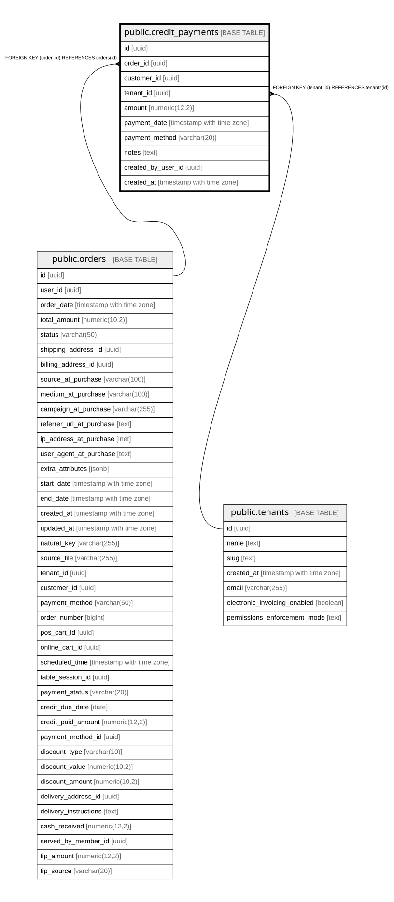

# public.credit_payments

## Columns

| Name | Type | Default | Nullable | Children | Parents | Comment |
| ---- | ---- | ------- | -------- | -------- | ------- | ------- |
| id | uuid | gen_random_uuid() | false |  |  |  |
| order_id | uuid |  | false |  | [public.orders](public.orders.md) |  |
| customer_id | uuid |  | false |  |  |  |
| tenant_id | uuid |  | false |  | [public.tenants](public.tenants.md) |  |
| amount | numeric(12,2) |  | false |  |  |  |
| payment_date | timestamp with time zone | now() | false |  |  |  |
| payment_method | varchar(20) |  | false |  |  |  |
| notes | text |  | true |  |  |  |
| created_by_user_id | uuid |  | true |  |  |  |
| created_at | timestamp with time zone | now() | false |  |  |  |

## Constraints

| Name | Type | Definition |
| ---- | ---- | ---------- |
| credit_payments_amount_check | CHECK | CHECK ((amount > (0)::numeric)) |
| credit_payments_order_id_fkey | FOREIGN KEY | FOREIGN KEY (order_id) REFERENCES orders(id) |
| credit_payments_tenant_id_fkey | FOREIGN KEY | FOREIGN KEY (tenant_id) REFERENCES tenants(id) |
| credit_payments_pkey | PRIMARY KEY | PRIMARY KEY (id) |

## Indexes

| Name | Definition |
| ---- | ---------- |
| credit_payments_pkey | CREATE UNIQUE INDEX credit_payments_pkey ON public.credit_payments USING btree (id) |
| idx_credit_payments_order | CREATE INDEX idx_credit_payments_order ON public.credit_payments USING btree (order_id) |
| idx_credit_payments_tenant | CREATE INDEX idx_credit_payments_tenant ON public.credit_payments USING btree (tenant_id) |
| idx_credit_payments_customer | CREATE INDEX idx_credit_payments_customer ON public.credit_payments USING btree (customer_id, tenant_id) |

## Relations

---

> Generated by [tbls](https://github.com/k1LoW/tbls)
