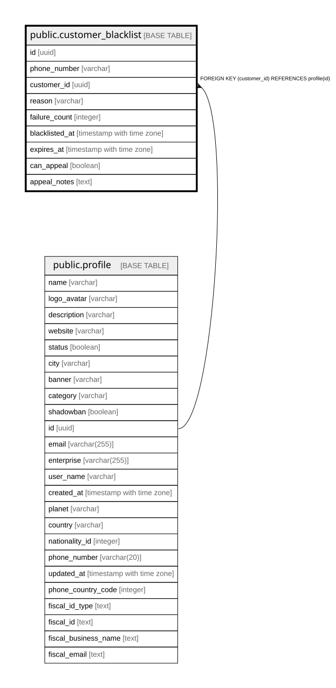

# public.customer_blacklist

## Columns

| Name | Type | Default | Nullable | Children | Parents | Comment |
| ---- | ---- | ------- | -------- | -------- | ------- | ------- |
| id | uuid | gen_random_uuid() | false |  |  |  |
| phone_number | varchar |  | false |  |  |  |
| customer_id | uuid |  | true |  | [public.profile](public.profile.md) |  |
| reason | varchar |  | false |  |  |  |
| failure_count | integer | 0 | true |  |  |  |
| blacklisted_at | timestamp with time zone | now() | true |  |  |  |
| expires_at | timestamp with time zone |  | true |  |  |  |
| can_appeal | boolean | true | true |  |  |  |
| appeal_notes | text |  | true |  |  |  |

## Constraints

| Name | Type | Definition |
| ---- | ---- | ---------- |
| customer_blacklist_customer_id_fkey | FOREIGN KEY | FOREIGN KEY (customer_id) REFERENCES profile(id) |
| customer_blacklist_pkey | PRIMARY KEY | PRIMARY KEY (id) |
| customer_blacklist_phone_number_key | UNIQUE | UNIQUE (phone_number) |

## Indexes

| Name | Definition |
| ---- | ---------- |
| customer_blacklist_pkey | CREATE UNIQUE INDEX customer_blacklist_pkey ON public.customer_blacklist USING btree (id) |
| customer_blacklist_phone_number_key | CREATE UNIQUE INDEX customer_blacklist_phone_number_key ON public.customer_blacklist USING btree (phone_number) |
| idx_blacklist_phone | CREATE INDEX idx_blacklist_phone ON public.customer_blacklist USING btree (phone_number) |
| idx_blacklist_expires | CREATE INDEX idx_blacklist_expires ON public.customer_blacklist USING btree (expires_at) |

## Relations

---

> Generated by [tbls](https://github.com/k1LoW/tbls)
