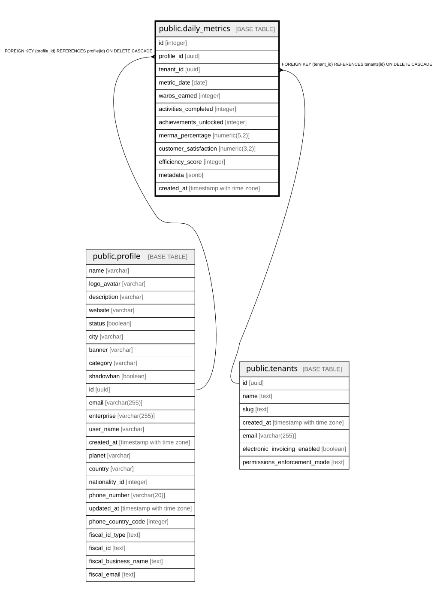

# public.daily_metrics

## Columns

| Name | Type | Default | Nullable | Children | Parents | Comment |
| ---- | ---- | ------- | -------- | -------- | ------- | ------- |
| id | integer | nextval('daily_metrics_id_seq'::regclass) | false |  |  |  |
| profile_id | uuid |  | false |  | [public.profile](public.profile.md) |  |
| tenant_id | uuid |  | false |  | [public.tenants](public.tenants.md) |  |
| metric_date | date |  | false |  |  |  |
| waros_earned | integer | 0 | true |  |  |  |
| activities_completed | integer | 0 | true |  |  |  |
| achievements_unlocked | integer | 0 | true |  |  |  |
| merma_percentage | numeric(5,2) |  | true |  |  |  |
| customer_satisfaction | numeric(3,2) |  | true |  |  |  |
| efficiency_score | integer |  | true |  |  |  |
| metadata | jsonb | '{}'::jsonb | true |  |  |  |
| created_at | timestamp with time zone | now() | true |  |  |  |

## Constraints

| Name | Type | Definition |
| ---- | ---- | ---------- |
| daily_metrics_pkey | PRIMARY KEY | PRIMARY KEY (id) |
| daily_metrics_profile_id_tenant_id_metric_date_key | UNIQUE | UNIQUE (profile_id, tenant_id, metric_date) |
| daily_metrics_profile_id_fkey | FOREIGN KEY | FOREIGN KEY (profile_id) REFERENCES profile(id) ON DELETE CASCADE |
| daily_metrics_tenant_id_fkey | FOREIGN KEY | FOREIGN KEY (tenant_id) REFERENCES tenants(id) ON DELETE CASCADE |

## Indexes

| Name | Definition |
| ---- | ---------- |
| daily_metrics_pkey | CREATE UNIQUE INDEX daily_metrics_pkey ON public.daily_metrics USING btree (id) |
| daily_metrics_profile_id_tenant_id_metric_date_key | CREATE UNIQUE INDEX daily_metrics_profile_id_tenant_id_metric_date_key ON public.daily_metrics USING btree (profile_id, tenant_id, metric_date) |
| idx_daily_metrics_tenant_date | CREATE INDEX idx_daily_metrics_tenant_date ON public.daily_metrics USING btree (tenant_id, metric_date DESC) |

## Relations

---

> Generated by [tbls](https://github.com/k1LoW/tbls)
