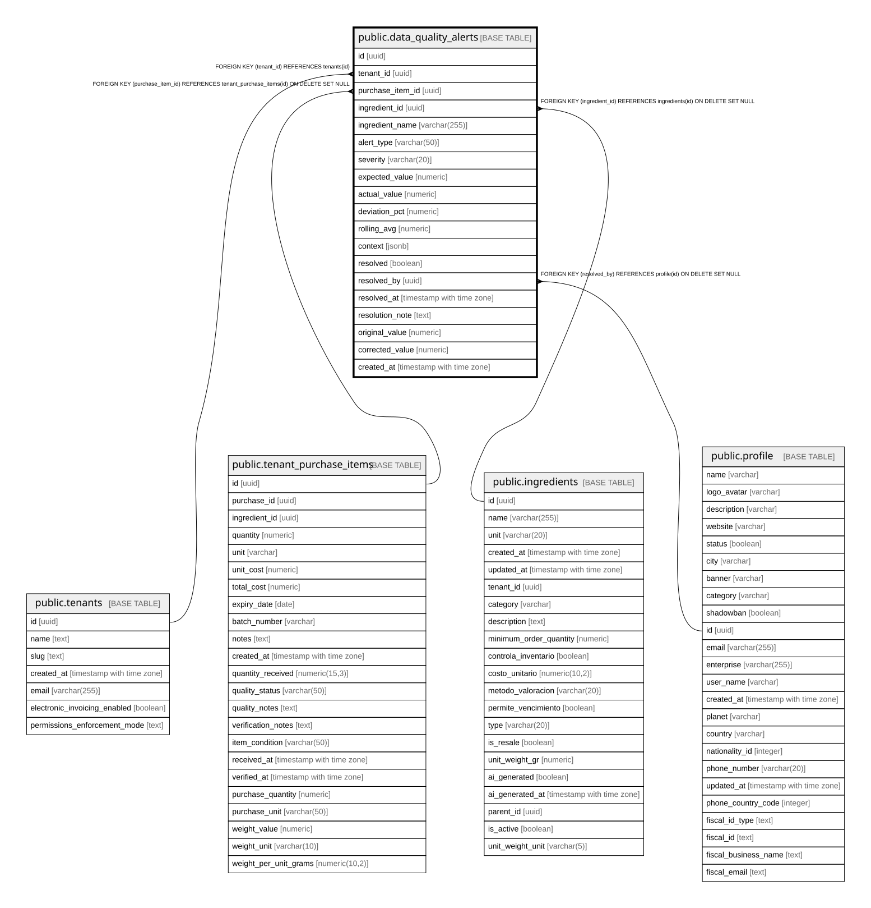

# public.data_quality_alerts

## Columns

| Name | Type | Default | Nullable | Children | Parents | Comment |
| ---- | ---- | ------- | -------- | -------- | ------- | ------- |
| id | uuid | gen_random_uuid() | false |  |  |  |
| tenant_id | uuid |  | false |  | [public.tenants](public.tenants.md) |  |
| purchase_item_id | uuid |  | true |  | [public.tenant_purchase_items](public.tenant_purchase_items.md) |  |
| ingredient_id | uuid |  | true |  | [public.ingredients](public.ingredients.md) |  |
| ingredient_name | varchar(255) |  | false |  |  |  |
| alert_type | varchar(50) |  | false |  |  |  |
| severity | varchar(20) |  | false |  |  |  |
| expected_value | numeric |  | true |  |  |  |
| actual_value | numeric |  | true |  |  |  |
| deviation_pct | numeric |  | true |  |  |  |
| rolling_avg | numeric |  | true |  |  |  |
| context | jsonb |  | true |  |  |  |
| resolved | boolean | false | false |  |  |  |
| resolved_by | uuid |  | true |  | [public.profile](public.profile.md) |  |
| resolved_at | timestamp with time zone |  | true |  |  |  |
| resolution_note | text |  | true |  |  |  |
| original_value | numeric |  | true |  |  |  |
| corrected_value | numeric |  | true |  |  |  |
| created_at | timestamp with time zone | now() | false |  |  |  |

## Constraints

| Name | Type | Definition |
| ---- | ---- | ---------- |
| data_quality_alerts_ingredient_id_fkey | FOREIGN KEY | FOREIGN KEY (ingredient_id) REFERENCES ingredients(id) ON DELETE SET NULL |
| data_quality_alerts_resolved_by_fkey | FOREIGN KEY | FOREIGN KEY (resolved_by) REFERENCES profile(id) ON DELETE SET NULL |
| data_quality_alerts_purchase_item_id_fkey | FOREIGN KEY | FOREIGN KEY (purchase_item_id) REFERENCES tenant_purchase_items(id) ON DELETE SET NULL |
| data_quality_alerts_tenant_id_fkey | FOREIGN KEY | FOREIGN KEY (tenant_id) REFERENCES tenants(id) |
| data_quality_alerts_pkey | PRIMARY KEY | PRIMARY KEY (id) |
| uq_dqa_item_tenant | UNIQUE | UNIQUE (purchase_item_id, tenant_id) |

## Indexes

| Name | Definition |
| ---- | ---------- |
| data_quality_alerts_pkey | CREATE UNIQUE INDEX data_quality_alerts_pkey ON public.data_quality_alerts USING btree (id) |
| idx_dqa_tenant_resolved | CREATE INDEX idx_dqa_tenant_resolved ON public.data_quality_alerts USING btree (tenant_id, resolved) |
| idx_dqa_severity | CREATE INDEX idx_dqa_severity ON public.data_quality_alerts USING btree (severity, resolved) |
| idx_dqa_purchase_item | CREATE INDEX idx_dqa_purchase_item ON public.data_quality_alerts USING btree (purchase_item_id) WHERE (purchase_item_id IS NOT NULL) |
| uq_dqa_item_tenant | CREATE UNIQUE INDEX uq_dqa_item_tenant ON public.data_quality_alerts USING btree (purchase_item_id, tenant_id) |

## Relations

---

> Generated by [tbls](https://github.com/k1LoW/tbls)
