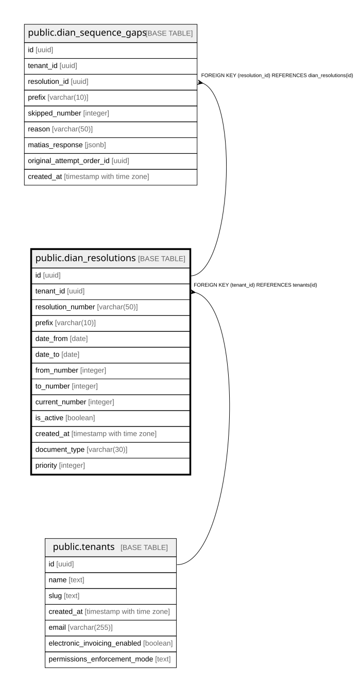

# public.dian_resolutions

## Columns

| Name | Type | Default | Nullable | Children | Parents | Comment |
| ---- | ---- | ------- | -------- | -------- | ------- | ------- |
| id | uuid | gen_random_uuid() | false | [public.dian_sequence_gaps](public.dian_sequence_gaps.md) |  |  |
| tenant_id | uuid |  | false |  | [public.tenants](public.tenants.md) |  |
| resolution_number | varchar(50) |  | false |  |  |  |
| prefix | varchar(10) |  | false |  |  |  |
| date_from | date |  | false |  |  |  |
| date_to | date |  | false |  |  |  |
| from_number | integer |  | false |  |  |  |
| to_number | integer |  | false |  |  |  |
| current_number | integer | 0 | false |  |  |  |
| is_active | boolean | true | false |  |  |  |
| created_at | timestamp with time zone | now() | false |  |  |  |
| document_type | varchar(30) | 'invoice'::character varying | false |  |  |  |
| priority | integer | 100 | false |  |  |  |

## Constraints

| Name | Type | Definition |
| ---- | ---- | ---------- |
| dian_resolutions_counter_within_range | CHECK | CHECK (((current_number >= (from_number - 1)) AND (current_number <= to_number))) |
| dian_resolutions_tenant_id_fkey | FOREIGN KEY | FOREIGN KEY (tenant_id) REFERENCES tenants(id) |
| dian_resolutions_pkey | PRIMARY KEY | PRIMARY KEY (id) |

## Indexes

| Name | Definition |
| ---- | ---------- |
| dian_resolutions_pkey | CREATE UNIQUE INDEX dian_resolutions_pkey ON public.dian_resolutions USING btree (id) |
| idx_dian_resolutions_tenant_active | CREATE INDEX idx_dian_resolutions_tenant_active ON public.dian_resolutions USING btree (tenant_id) WHERE (is_active = true) |
| idx_dian_resolutions_active_priority | CREATE INDEX idx_dian_resolutions_active_priority ON public.dian_resolutions USING btree (tenant_id, prefix, priority DESC, from_number) WHERE (is_active = true) |

## Triggers

| Name | Definition |
| ---- | ---------- |
| dian_resolutions_no_rewind_trigger | CREATE TRIGGER dian_resolutions_no_rewind_trigger BEFORE UPDATE OF current_number ON public.dian_resolutions FOR EACH ROW EXECUTE FUNCTION dian_resolutions_no_rewind() |

## Relations

---

> Generated by [tbls](https://github.com/k1LoW/tbls)
