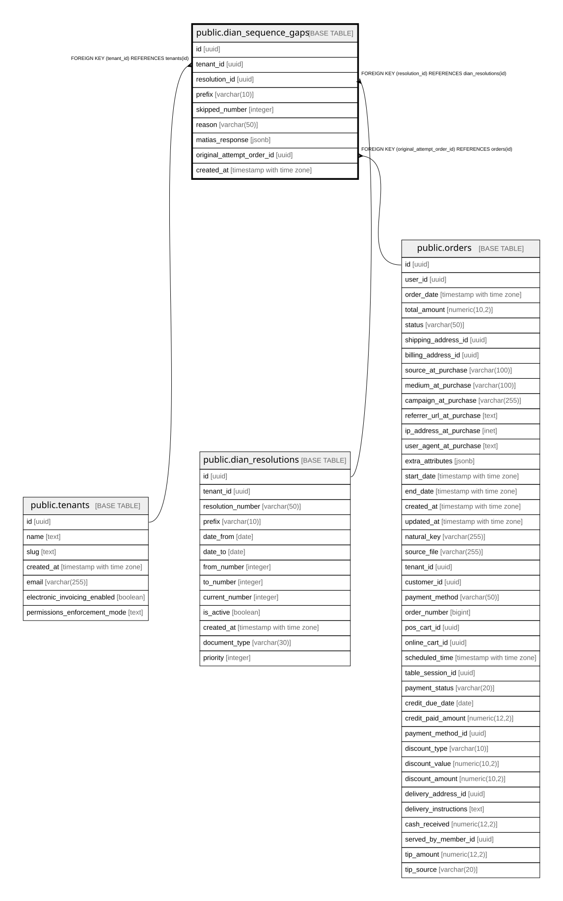

# public.dian_sequence_gaps

## Description

Audit trail of DIAN invoice numbers that were allocated but never accepted by Matias/DIAN. Each row represents a number permanently retired from the sequence — DIAN forbids reuse so this table is the legal justification for any gap an auditor finds. See warocol.com#592.

## Columns

| Name | Type | Default | Nullable | Children | Parents | Comment |
| ---- | ---- | ------- | -------- | -------- | ------- | ------- |
| id | uuid | gen_random_uuid() | false |  |  |  |
| tenant_id | uuid |  | false |  | [public.tenants](public.tenants.md) |  |
| resolution_id | uuid |  | false |  | [public.dian_resolutions](public.dian_resolutions.md) |  |
| prefix | varchar(10) |  | false |  |  |  |
| skipped_number | integer |  | false |  |  |  |
| reason | varchar(50) |  | false |  |  | Why the number was skipped: matias_ya_validado, matias_500, network_timeout, etc. |
| matias_response | jsonb |  | true |  |  | Full Matias error payload at the time of skip — DIAN audit-grade evidence. |
| original_attempt_order_id | uuid |  | true |  | [public.orders](public.orders.md) |  |
| created_at | timestamp with time zone | now() | false |  |  |  |

## Constraints

| Name | Type | Definition |
| ---- | ---- | ---------- |
| dian_sequence_gaps_original_attempt_order_id_fkey | FOREIGN KEY | FOREIGN KEY (original_attempt_order_id) REFERENCES orders(id) |
| dian_sequence_gaps_tenant_id_fkey | FOREIGN KEY | FOREIGN KEY (tenant_id) REFERENCES tenants(id) |
| dian_sequence_gaps_resolution_id_fkey | FOREIGN KEY | FOREIGN KEY (resolution_id) REFERENCES dian_resolutions(id) |
| dian_sequence_gaps_pkey | PRIMARY KEY | PRIMARY KEY (id) |
| dian_gaps_no_reuse | UNIQUE | UNIQUE (tenant_id, prefix, skipped_number) |

## Indexes

| Name | Definition |
| ---- | ---------- |
| dian_sequence_gaps_pkey | CREATE UNIQUE INDEX dian_sequence_gaps_pkey ON public.dian_sequence_gaps USING btree (id) |
| dian_gaps_no_reuse | CREATE UNIQUE INDEX dian_gaps_no_reuse ON public.dian_sequence_gaps USING btree (tenant_id, prefix, skipped_number) |
| idx_dian_gaps_tenant_created | CREATE INDEX idx_dian_gaps_tenant_created ON public.dian_sequence_gaps USING btree (tenant_id, created_at DESC) |
| idx_dian_gaps_resolution | CREATE INDEX idx_dian_gaps_resolution ON public.dian_sequence_gaps USING btree (resolution_id) |

## Relations

---

> Generated by [tbls](https://github.com/k1LoW/tbls)
