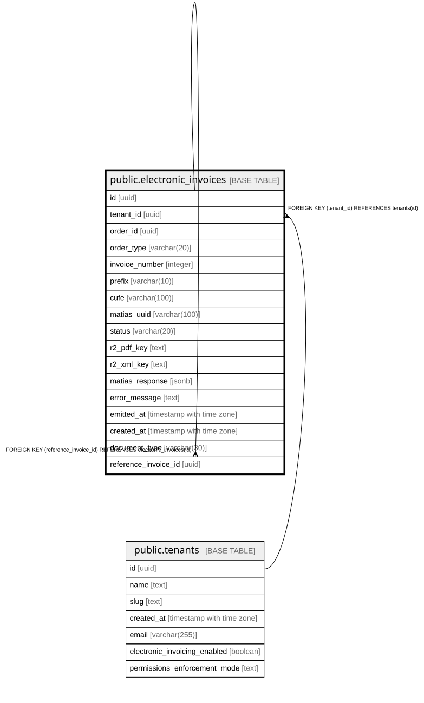

# public.electronic_invoices

## Columns

| Name | Type | Default | Nullable | Children | Parents | Comment |
| ---- | ---- | ------- | -------- | -------- | ------- | ------- |
| id | uuid | gen_random_uuid() | false | [public.electronic_invoices](public.electronic_invoices.md) |  |  |
| tenant_id | uuid |  | false |  | [public.tenants](public.tenants.md) |  |
| order_id | uuid |  | false |  |  |  |
| order_type | varchar(20) |  | false |  |  |  |
| invoice_number | integer |  | false |  |  |  |
| prefix | varchar(10) |  | false |  |  |  |
| cufe | varchar(100) |  | true |  |  |  |
| matias_uuid | varchar(100) |  | true |  |  |  |
| status | varchar(20) | 'pending'::character varying | false |  |  |  |
| r2_pdf_key | text |  | true |  |  |  |
| r2_xml_key | text |  | true |  |  |  |
| matias_response | jsonb |  | true |  |  |  |
| error_message | text |  | true |  |  |  |
| emitted_at | timestamp with time zone |  | true |  |  |  |
| created_at | timestamp with time zone | now() | false |  |  |  |
| document_type | varchar(30) | 'invoice'::character varying | false |  |  |  |
| reference_invoice_id | uuid |  | true |  | [public.electronic_invoices](public.electronic_invoices.md) |  |

## Constraints

| Name | Type | Definition |
| ---- | ---- | ---------- |
| electronic_invoices_tenant_id_fkey | FOREIGN KEY | FOREIGN KEY (tenant_id) REFERENCES tenants(id) |
| electronic_invoices_pkey | PRIMARY KEY | PRIMARY KEY (id) |
| electronic_invoices_reference_invoice_id_fkey | FOREIGN KEY | FOREIGN KEY (reference_invoice_id) REFERENCES electronic_invoices(id) |
| uq_electronic_invoices_number | UNIQUE | UNIQUE (tenant_id, prefix, invoice_number) |

## Indexes

| Name | Definition |
| ---- | ---------- |
| electronic_invoices_pkey | CREATE UNIQUE INDEX electronic_invoices_pkey ON public.electronic_invoices USING btree (id) |
| uq_electronic_invoices_number | CREATE UNIQUE INDEX uq_electronic_invoices_number ON public.electronic_invoices USING btree (tenant_id, prefix, invoice_number) |
| idx_electronic_invoices_order_id | CREATE INDEX idx_electronic_invoices_order_id ON public.electronic_invoices USING btree (order_id) |
| idx_electronic_invoices_tenant_emitted | CREATE INDEX idx_electronic_invoices_tenant_emitted ON public.electronic_invoices USING btree (tenant_id, emitted_at DESC NULLS LAST) |
| idx_ei_reference_invoice | CREATE INDEX idx_ei_reference_invoice ON public.electronic_invoices USING btree (reference_invoice_id) WHERE (reference_invoice_id IS NOT NULL) |

## Relations

---

> Generated by [tbls](https://github.com/k1LoW/tbls)
