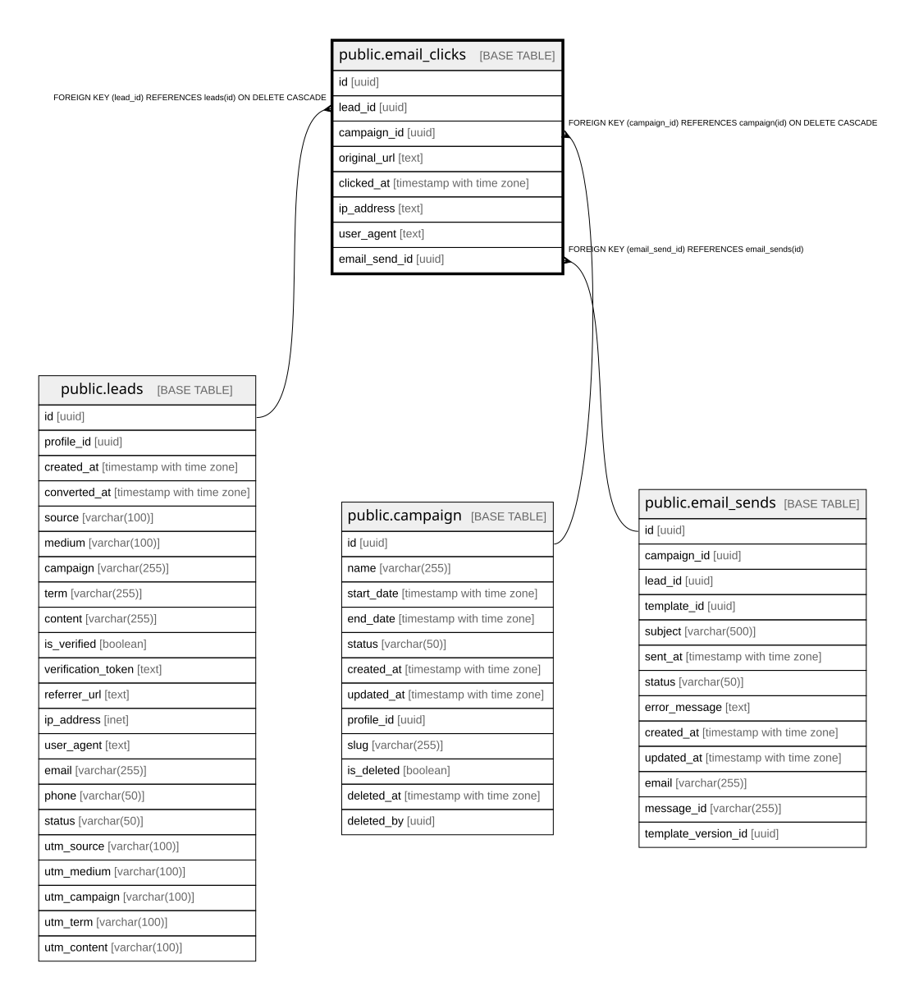

# public.email_clicks

## Columns

| Name | Type | Default | Nullable | Children | Parents | Comment |
| ---- | ---- | ------- | -------- | -------- | ------- | ------- |
| id | uuid | uuid_generate_v4() | false |  |  |  |
| lead_id | uuid |  | false |  | [public.leads](public.leads.md) |  |
| campaign_id | uuid |  | false |  | [public.campaign](public.campaign.md) |  |
| original_url | text |  | false |  |  |  |
| clicked_at | timestamp with time zone | now() | true |  |  |  |
| ip_address | text |  | true |  |  |  |
| user_agent | text |  | true |  |  |  |
| email_send_id | uuid |  | true |  | [public.email_sends](public.email_sends.md) |  |

## Constraints

| Name | Type | Definition |
| ---- | ---- | ---------- |
| fk_email_clicks_campaign_id | FOREIGN KEY | FOREIGN KEY (campaign_id) REFERENCES campaign(id) ON DELETE CASCADE |
| email_clicks_pkey | PRIMARY KEY | PRIMARY KEY (id) |
| email_clicks_email_send_id_fkey | FOREIGN KEY | FOREIGN KEY (email_send_id) REFERENCES email_sends(id) |
| fk_email_clicks_lead_id | FOREIGN KEY | FOREIGN KEY (lead_id) REFERENCES leads(id) ON DELETE CASCADE |

## Indexes

| Name | Definition |
| ---- | ---------- |
| email_clicks_pkey | CREATE UNIQUE INDEX email_clicks_pkey ON public.email_clicks USING btree (id) |

## Relations

---

> Generated by [tbls](https://github.com/k1LoW/tbls)
