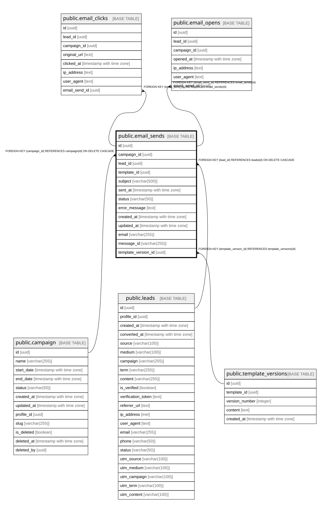

# public.email_sends

## Columns

| Name | Type | Default | Nullable | Children | Parents | Comment |
| ---- | ---- | ------- | -------- | -------- | ------- | ------- |
| id | uuid | gen_random_uuid() | false | [public.email_clicks](public.email_clicks.md) [public.email_opens](public.email_opens.md) |  |  |
| campaign_id | uuid |  | true |  | [public.campaign](public.campaign.md) |  |
| lead_id | uuid |  | true |  | [public.leads](public.leads.md) |  |
| template_id | uuid |  | true |  |  |  |
| subject | varchar(500) |  | true |  |  |  |
| sent_at | timestamp with time zone | now() | true |  |  |  |
| status | varchar(50) | 'sent'::character varying | true |  |  |  |
| error_message | text |  | true |  |  |  |
| created_at | timestamp with time zone | now() | true |  |  |  |
| updated_at | timestamp with time zone | now() | true |  |  |  |
| email | varchar(255) |  | true |  |  |  |
| message_id | varchar(255) |  | true |  |  |  |
| template_version_id | uuid |  | true |  | [public.template_versions](public.template_versions.md) |  |

## Constraints

| Name | Type | Definition |
| ---- | ---- | ---------- |
| email_sends_campaign_id_fkey | FOREIGN KEY | FOREIGN KEY (campaign_id) REFERENCES campaign(id) ON DELETE CASCADE |
| email_sends_pkey | PRIMARY KEY | PRIMARY KEY (id) |
| email_sends_lead_id_fkey | FOREIGN KEY | FOREIGN KEY (lead_id) REFERENCES leads(id) ON DELETE CASCADE |
| email_sends_template_version_id_fkey | FOREIGN KEY | FOREIGN KEY (template_version_id) REFERENCES template_versions(id) |

## Indexes

| Name | Definition |
| ---- | ---------- |
| email_sends_pkey | CREATE UNIQUE INDEX email_sends_pkey ON public.email_sends USING btree (id) |
| idx_email_sends_campaign | CREATE INDEX idx_email_sends_campaign ON public.email_sends USING btree (campaign_id) |
| idx_email_sends_lead | CREATE INDEX idx_email_sends_lead ON public.email_sends USING btree (lead_id) |
| idx_email_sends_sent_at | CREATE INDEX idx_email_sends_sent_at ON public.email_sends USING btree (sent_at) |
| idx_email_sends_status | CREATE INDEX idx_email_sends_status ON public.email_sends USING btree (status) |

## Relations

---

> Generated by [tbls](https://github.com/k1LoW/tbls)
