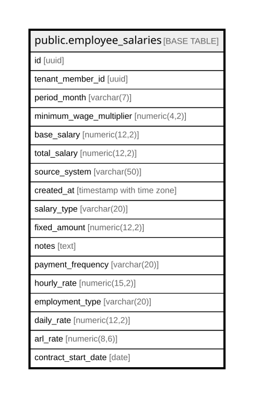

# public.employee_salaries

## Columns

| Name | Type | Default | Nullable | Children | Parents | Comment |
| ---- | ---- | ------- | -------- | -------- | ------- | ------- |
| id | uuid | gen_random_uuid() | false |  |  |  |
| tenant_member_id | uuid |  | false |  |  |  |
| period_month | varchar(7) |  | false |  |  |  |
| minimum_wage_multiplier | numeric(4,2) |  | true |  |  |  |
| base_salary | numeric(12,2) |  | false |  |  |  |
| total_salary | numeric(12,2) |  | false |  |  |  |
| source_system | varchar(50) | 'manual'::character varying | true |  |  |  |
| created_at | timestamp with time zone | now() | true |  |  |  |
| salary_type | varchar(20) | 'smmlv'::character varying | true |  |  | Type of salary: smmlv (based on minimum wage multiplier) or fixed (fixed monthly amount) |
| fixed_amount | numeric(12,2) |  | true |  |  |  |
| notes | text |  | true |  |  |  |
| payment_frequency | varchar(20) | 'monthly'::character varying | true |  |  |  |
| hourly_rate | numeric(15,2) |  | true |  |  |  |
| employment_type | varchar(20) | 'employee'::character varying | true |  |  |  |
| daily_rate | numeric(12,2) |  | true |  |  |  |
| arl_rate | numeric(8,6) | 0.005220 | true |  |  |  |
| contract_start_date | date |  | true |  |  |  |

## Constraints

| Name | Type | Definition |
| ---- | ---- | ---------- |
| employee_salaries_employment_type_check | CHECK | CHECK (((employment_type)::text = ANY ((ARRAY['employee'::character varying, 'contractor'::character varying, 'daily'::character varying])::text[]))) |
| employee_salaries_pkey | PRIMARY KEY | PRIMARY KEY (id) |

## Indexes

| Name | Definition |
| ---- | ---------- |
| employee_salaries_pkey | CREATE UNIQUE INDEX employee_salaries_pkey ON public.employee_salaries USING btree (id) |
| idx_employee_salaries_unique | CREATE UNIQUE INDEX idx_employee_salaries_unique ON public.employee_salaries USING btree (tenant_member_id, period_month) |

## Relations

---

> Generated by [tbls](https://github.com/k1LoW/tbls)
