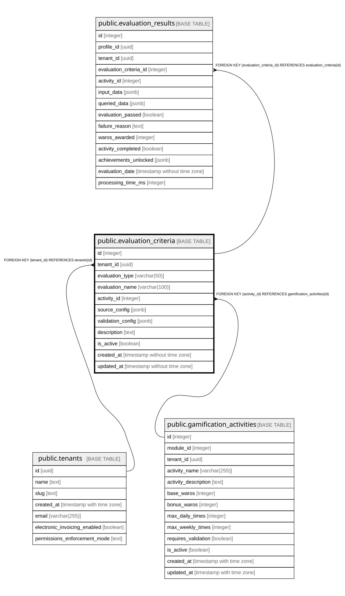

# public.evaluation_criteria

## Columns

| Name | Type | Default | Nullable | Children | Parents | Comment |
| ---- | ---- | ------- | -------- | -------- | ------- | ------- |
| id | integer | nextval('evaluation_criteria_id_seq'::regclass) | false | [public.evaluation_results](public.evaluation_results.md) |  |  |
| tenant_id | uuid |  | false |  | [public.tenants](public.tenants.md) |  |
| evaluation_type | varchar(50) |  | false |  |  |  |
| evaluation_name | varchar(100) |  | false |  |  |  |
| activity_id | integer |  | false |  | [public.gamification_activities](public.gamification_activities.md) |  |
| source_config | jsonb |  | false |  |  |  |
| validation_config | jsonb |  | false |  |  |  |
| description | text |  | true |  |  |  |
| is_active | boolean | true | true |  |  |  |
| created_at | timestamp without time zone | now() | true |  |  |  |
| updated_at | timestamp without time zone | now() | true |  |  |  |

## Constraints

| Name | Type | Definition |
| ---- | ---- | ---------- |
| evaluation_criteria_pkey | PRIMARY KEY | PRIMARY KEY (id) |
| evaluation_criteria_tenant_id_evaluation_type_key | UNIQUE | UNIQUE (tenant_id, evaluation_type) |
| evaluation_criteria_activity_id_fkey | FOREIGN KEY | FOREIGN KEY (activity_id) REFERENCES gamification_activities(id) |
| evaluation_criteria_tenant_id_fkey | FOREIGN KEY | FOREIGN KEY (tenant_id) REFERENCES tenants(id) |

## Indexes

| Name | Definition |
| ---- | ---------- |
| evaluation_criteria_pkey | CREATE UNIQUE INDEX evaluation_criteria_pkey ON public.evaluation_criteria USING btree (id) |
| evaluation_criteria_tenant_id_evaluation_type_key | CREATE UNIQUE INDEX evaluation_criteria_tenant_id_evaluation_type_key ON public.evaluation_criteria USING btree (tenant_id, evaluation_type) |
| idx_evaluation_criteria_activity | CREATE INDEX idx_evaluation_criteria_activity ON public.evaluation_criteria USING btree (activity_id) |
| idx_evaluation_criteria_tenant | CREATE INDEX idx_evaluation_criteria_tenant ON public.evaluation_criteria USING btree (tenant_id, is_active) |

## Relations

---

> Generated by [tbls](https://github.com/k1LoW/tbls)
