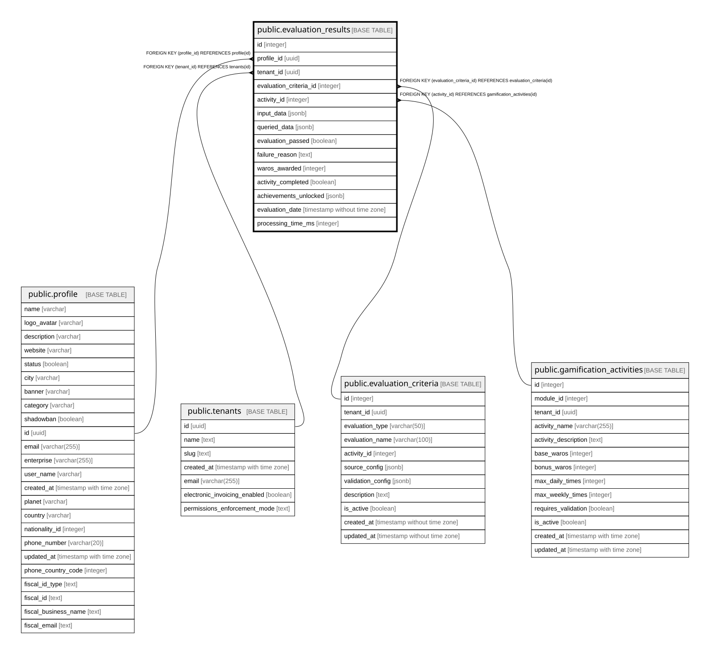

# public.evaluation_results

## Columns

| Name | Type | Default | Nullable | Children | Parents | Comment |
| ---- | ---- | ------- | -------- | -------- | ------- | ------- |
| id | integer | nextval('evaluation_results_id_seq'::regclass) | false |  |  |  |
| profile_id | uuid |  | false |  | [public.profile](public.profile.md) |  |
| tenant_id | uuid |  | false |  | [public.tenants](public.tenants.md) |  |
| evaluation_criteria_id | integer |  | false |  | [public.evaluation_criteria](public.evaluation_criteria.md) |  |
| activity_id | integer |  | false |  | [public.gamification_activities](public.gamification_activities.md) |  |
| input_data | jsonb |  | false |  |  |  |
| queried_data | jsonb |  | true |  |  |  |
| evaluation_passed | boolean |  | false |  |  |  |
| failure_reason | text |  | true |  |  |  |
| waros_awarded | integer | 0 | true |  |  |  |
| activity_completed | boolean | false | true |  |  |  |
| achievements_unlocked | jsonb |  | true |  |  |  |
| evaluation_date | timestamp without time zone | now() | true |  |  |  |
| processing_time_ms | integer |  | true |  |  |  |

## Constraints

| Name | Type | Definition |
| ---- | ---- | ---------- |
| evaluation_results_evaluation_criteria_id_fkey | FOREIGN KEY | FOREIGN KEY (evaluation_criteria_id) REFERENCES evaluation_criteria(id) |
| evaluation_results_pkey | PRIMARY KEY | PRIMARY KEY (id) |
| evaluation_results_activity_id_fkey | FOREIGN KEY | FOREIGN KEY (activity_id) REFERENCES gamification_activities(id) |
| evaluation_results_profile_id_fkey | FOREIGN KEY | FOREIGN KEY (profile_id) REFERENCES profile(id) |
| evaluation_results_tenant_id_fkey | FOREIGN KEY | FOREIGN KEY (tenant_id) REFERENCES tenants(id) |

## Indexes

| Name | Definition |
| ---- | ---------- |
| evaluation_results_pkey | CREATE UNIQUE INDEX evaluation_results_pkey ON public.evaluation_results USING btree (id) |
| idx_evaluation_results_activity | CREATE INDEX idx_evaluation_results_activity ON public.evaluation_results USING btree (activity_id) |
| idx_evaluation_results_criteria | CREATE INDEX idx_evaluation_results_criteria ON public.evaluation_results USING btree (evaluation_criteria_id) |
| idx_evaluation_results_profile_date | CREATE INDEX idx_evaluation_results_profile_date ON public.evaluation_results USING btree (profile_id, evaluation_date) |
| idx_evaluation_results_tenant | CREATE INDEX idx_evaluation_results_tenant ON public.evaluation_results USING btree (tenant_id) |

## Relations

---

> Generated by [tbls](https://github.com/k1LoW/tbls)
