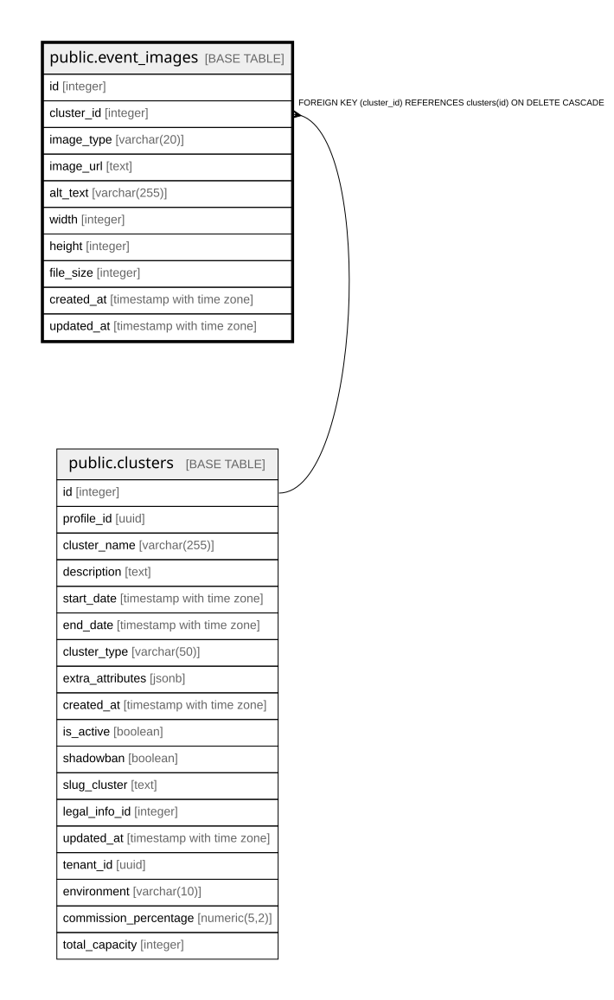

# public.event_images

## Columns

| Name | Type | Default | Nullable | Children | Parents | Comment |
| ---- | ---- | ------- | -------- | -------- | ------- | ------- |
| id | integer | nextval('event_images_id_seq'::regclass) | false |  |  |  |
| cluster_id | integer |  | false |  | [public.clusters](public.clusters.md) |  |
| image_type | varchar(20) |  | false |  |  |  |
| image_url | text |  | false |  |  |  |
| alt_text | varchar(255) |  | true |  |  |  |
| width | integer |  | true |  |  |  |
| height | integer |  | true |  |  |  |
| file_size | integer |  | true |  |  |  |
| created_at | timestamp with time zone | now() | true |  |  |  |
| updated_at | timestamp with time zone | now() | true |  |  |  |

## Constraints

| Name | Type | Definition |
| ---- | ---- | ---------- |
| chk_event_image_type | CHECK | CHECK (((image_type)::text = ANY ((ARRAY['banner'::character varying, 'flyer'::character varying, 'cover'::character varying, 'gallery'::character varying])::text[]))) |
| event_images_cluster_id_fkey | FOREIGN KEY | FOREIGN KEY (cluster_id) REFERENCES clusters(id) ON DELETE CASCADE |
| event_images_pkey | PRIMARY KEY | PRIMARY KEY (id) |

## Indexes

| Name | Definition |
| ---- | ---------- |
| event_images_pkey | CREATE UNIQUE INDEX event_images_pkey ON public.event_images USING btree (id) |
| idx_event_images_unique_type | CREATE UNIQUE INDEX idx_event_images_unique_type ON public.event_images USING btree (cluster_id, image_type) WHERE ((image_type)::text <> 'gallery'::text) |
| idx_event_images_cluster | CREATE INDEX idx_event_images_cluster ON public.event_images USING btree (cluster_id) |
| idx_event_images_type | CREATE INDEX idx_event_images_type ON public.event_images USING btree (image_type) |

## Triggers

| Name | Definition |
| ---- | ---------- |
| trigger_event_images_updated_at | CREATE TRIGGER trigger_event_images_updated_at BEFORE UPDATE ON public.event_images FOR EACH ROW EXECUTE FUNCTION update_event_images_updated_at() |

## Relations

---

> Generated by [tbls](https://github.com/k1LoW/tbls)
