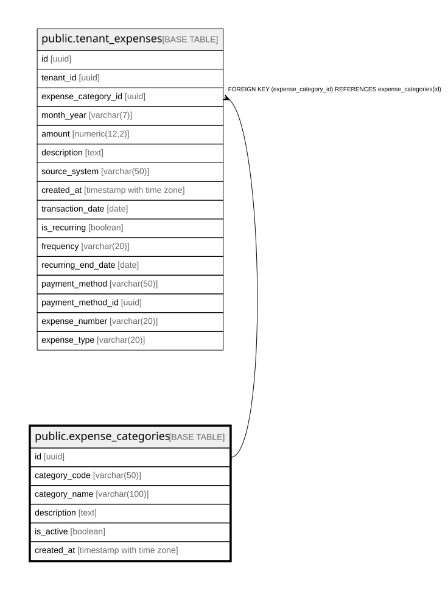

# public.expense_categories

## Columns

| Name | Type | Default | Nullable | Children | Parents | Comment |
| ---- | ---- | ------- | -------- | -------- | ------- | ------- |
| id | uuid | gen_random_uuid() | false | [public.tenant_expenses](public.tenant_expenses.md) |  |  |
| category_code | varchar(50) |  | false |  |  |  |
| category_name | varchar(100) |  | false |  |  |  |
| description | text |  | true |  |  |  |
| is_active | boolean | true | true |  |  |  |
| created_at | timestamp with time zone | now() | true |  |  |  |

## Constraints

| Name | Type | Definition |
| ---- | ---- | ---------- |
| expense_categories_category_code_key | UNIQUE | UNIQUE (category_code) |
| expense_categories_pkey | PRIMARY KEY | PRIMARY KEY (id) |

## Indexes

| Name | Definition |
| ---- | ---------- |
| expense_categories_category_code_key | CREATE UNIQUE INDEX expense_categories_category_code_key ON public.expense_categories USING btree (category_code) |
| expense_categories_pkey | CREATE UNIQUE INDEX expense_categories_pkey ON public.expense_categories USING btree (id) |

## Relations

---

> Generated by [tbls](https://github.com/k1LoW/tbls)
