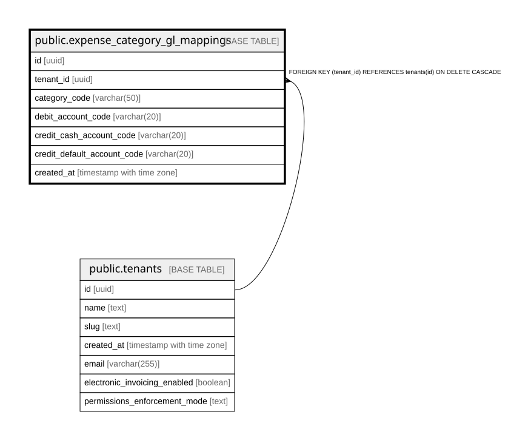

# public.expense_category_gl_mappings

## Columns

| Name | Type | Default | Nullable | Children | Parents | Comment |
| ---- | ---- | ------- | -------- | -------- | ------- | ------- |
| id | uuid | gen_random_uuid() | false |  |  |  |
| tenant_id | uuid |  | false |  | [public.tenants](public.tenants.md) |  |
| category_code | varchar(50) |  | false |  |  |  |
| debit_account_code | varchar(20) |  | false |  |  |  |
| credit_cash_account_code | varchar(20) |  | false |  |  |  |
| credit_default_account_code | varchar(20) |  | false |  |  |  |
| created_at | timestamp with time zone | now() | false |  |  |  |

## Constraints

| Name | Type | Definition |
| ---- | ---- | ---------- |
| expense_category_gl_mappings_tenant_id_fkey | FOREIGN KEY | FOREIGN KEY (tenant_id) REFERENCES tenants(id) ON DELETE CASCADE |
| expense_category_gl_mappings_pkey | PRIMARY KEY | PRIMARY KEY (id) |
| expense_category_gl_mappings_tenant_id_category_code_key | UNIQUE | UNIQUE (tenant_id, category_code) |

## Indexes

| Name | Definition |
| ---- | ---------- |
| expense_category_gl_mappings_pkey | CREATE UNIQUE INDEX expense_category_gl_mappings_pkey ON public.expense_category_gl_mappings USING btree (id) |
| expense_category_gl_mappings_tenant_id_category_code_key | CREATE UNIQUE INDEX expense_category_gl_mappings_tenant_id_category_code_key ON public.expense_category_gl_mappings USING btree (tenant_id, category_code) |

## Relations

---

> Generated by [tbls](https://github.com/k1LoW/tbls)
