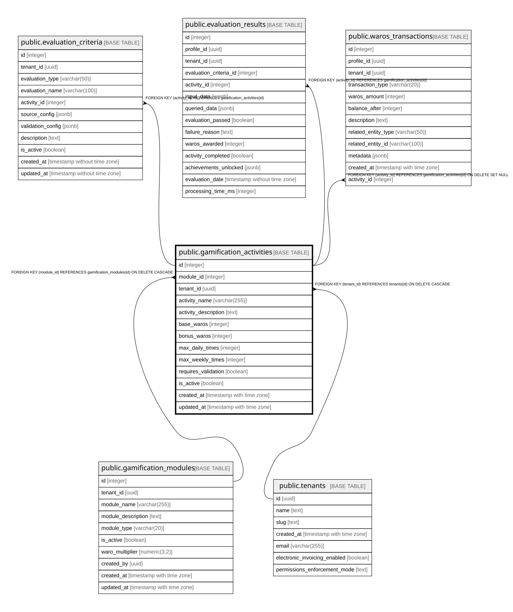

# public.gamification_activities

## Columns

| Name | Type | Default | Nullable | Children | Parents | Comment |
| ---- | ---- | ------- | -------- | -------- | ------- | ------- |
| id | integer | nextval('gamification_activities_id_seq'::regclass) | false | [public.evaluation_criteria](public.evaluation_criteria.md) [public.evaluation_results](public.evaluation_results.md) [public.waros_transactions](public.waros_transactions.md) |  |  |
| module_id | integer |  | false |  | [public.gamification_modules](public.gamification_modules.md) |  |
| tenant_id | uuid |  | false |  | [public.tenants](public.tenants.md) |  |
| activity_name | varchar(255) |  | false |  |  |  |
| activity_description | text |  | true |  |  |  |
| base_waros | integer | 10 | false |  |  |  |
| bonus_waros | integer | 0 | true |  |  |  |
| max_daily_times | integer |  | true |  |  |  |
| max_weekly_times | integer |  | true |  |  |  |
| requires_validation | boolean | false | true |  |  |  |
| is_active | boolean | true | true |  |  |  |
| created_at | timestamp with time zone | now() | true |  |  |  |
| updated_at | timestamp with time zone | now() | true |  |  |  |

## Constraints

| Name | Type | Definition |
| ---- | ---- | ---------- |
| gamification_activities_module_id_name_unique | UNIQUE | UNIQUE (module_id, activity_name) |
| gamification_activities_pkey | PRIMARY KEY | PRIMARY KEY (id) |
| gamification_activities_module_id_fkey | FOREIGN KEY | FOREIGN KEY (module_id) REFERENCES gamification_modules(id) ON DELETE CASCADE |
| gamification_activities_tenant_id_fkey | FOREIGN KEY | FOREIGN KEY (tenant_id) REFERENCES tenants(id) ON DELETE CASCADE |

## Indexes

| Name | Definition |
| ---- | ---------- |
| gamification_activities_module_id_name_unique | CREATE UNIQUE INDEX gamification_activities_module_id_name_unique ON public.gamification_activities USING btree (module_id, activity_name) |
| gamification_activities_pkey | CREATE UNIQUE INDEX gamification_activities_pkey ON public.gamification_activities USING btree (id) |
| idx_gamification_activities_module | CREATE INDEX idx_gamification_activities_module ON public.gamification_activities USING btree (module_id, is_active) |

## Relations

---

> Generated by [tbls](https://github.com/k1LoW/tbls)
