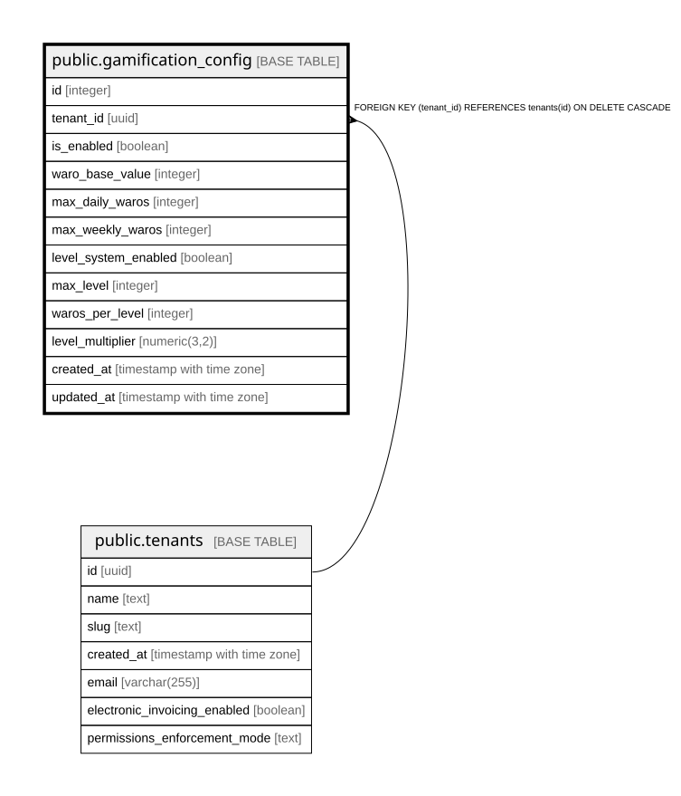

# public.gamification_config

## Columns

| Name | Type | Default | Nullable | Children | Parents | Comment |
| ---- | ---- | ------- | -------- | -------- | ------- | ------- |
| id | integer | nextval('gamification_config_id_seq'::regclass) | false |  |  |  |
| tenant_id | uuid |  | false |  | [public.tenants](public.tenants.md) |  |
| is_enabled | boolean | true | true |  |  |  |
| waro_base_value | integer | 1 | true |  |  |  |
| max_daily_waros | integer | 1000 | true |  |  |  |
| max_weekly_waros | integer | 5000 | true |  |  |  |
| level_system_enabled | boolean | true | true |  |  |  |
| max_level | integer | 50 | true |  |  |  |
| waros_per_level | integer | 100 | true |  |  |  |
| level_multiplier | numeric(3,2) | 1.5 | true |  |  |  |
| created_at | timestamp with time zone | now() | true |  |  |  |
| updated_at | timestamp with time zone | now() | true |  |  |  |

## Constraints

| Name | Type | Definition |
| ---- | ---- | ---------- |
| gamification_config_pkey | PRIMARY KEY | PRIMARY KEY (id) |
| gamification_config_tenant_id_key | UNIQUE | UNIQUE (tenant_id) |
| gamification_config_tenant_id_fkey | FOREIGN KEY | FOREIGN KEY (tenant_id) REFERENCES tenants(id) ON DELETE CASCADE |

## Indexes

| Name | Definition |
| ---- | ---------- |
| gamification_config_pkey | CREATE UNIQUE INDEX gamification_config_pkey ON public.gamification_config USING btree (id) |
| gamification_config_tenant_id_key | CREATE UNIQUE INDEX gamification_config_tenant_id_key ON public.gamification_config USING btree (tenant_id) |

## Relations

---

> Generated by [tbls](https://github.com/k1LoW/tbls)
