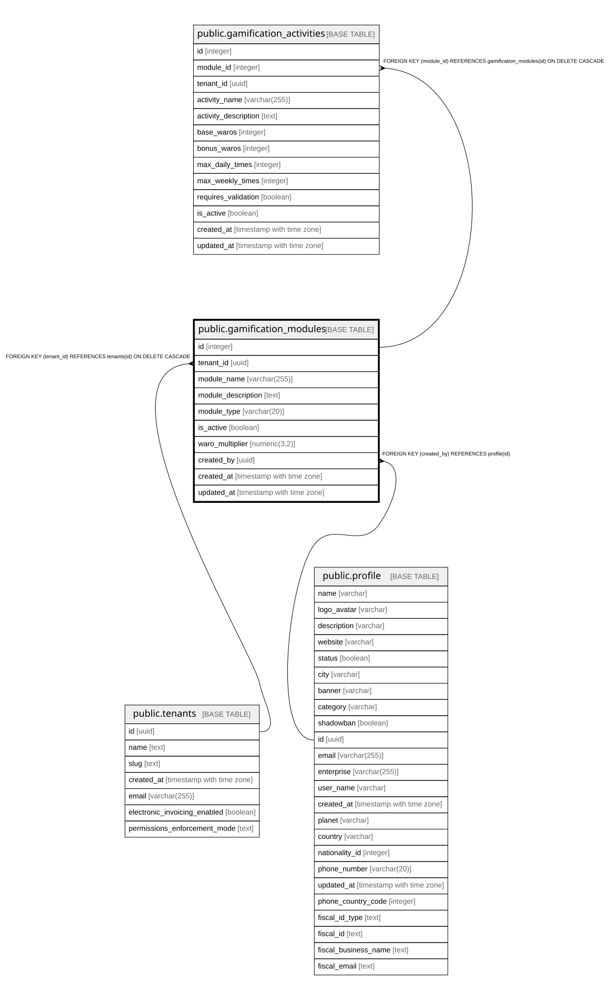

# public.gamification_modules

## Columns

| Name | Type | Default | Nullable | Children | Parents | Comment |
| ---- | ---- | ------- | -------- | -------- | ------- | ------- |
| id | integer | nextval('gamification_modules_id_seq'::regclass) | false | [public.gamification_activities](public.gamification_activities.md) |  |  |
| tenant_id | uuid |  | false |  | [public.tenants](public.tenants.md) |  |
| module_name | varchar(255) |  | false |  |  |  |
| module_description | text |  | true |  |  |  |
| module_type | varchar(20) | 'base'::character varying | true |  |  |  |
| is_active | boolean | true | true |  |  |  |
| waro_multiplier | numeric(3,2) | 1.0 | true |  |  |  |
| created_by | uuid |  | true |  | [public.profile](public.profile.md) |  |
| created_at | timestamp with time zone | now() | true |  |  |  |
| updated_at | timestamp with time zone | now() | true |  |  |  |

## Constraints

| Name | Type | Definition |
| ---- | ---- | ---------- |
| gamification_modules_pkey | PRIMARY KEY | PRIMARY KEY (id) |
| gamification_modules_tenant_id_name_unique | UNIQUE | UNIQUE (tenant_id, module_name) |
| gamification_modules_created_by_fkey | FOREIGN KEY | FOREIGN KEY (created_by) REFERENCES profile(id) |
| gamification_modules_tenant_id_fkey | FOREIGN KEY | FOREIGN KEY (tenant_id) REFERENCES tenants(id) ON DELETE CASCADE |

## Indexes

| Name | Definition |
| ---- | ---------- |
| gamification_modules_pkey | CREATE UNIQUE INDEX gamification_modules_pkey ON public.gamification_modules USING btree (id) |
| gamification_modules_tenant_id_name_unique | CREATE UNIQUE INDEX gamification_modules_tenant_id_name_unique ON public.gamification_modules USING btree (tenant_id, module_name) |

## Relations

---

> Generated by [tbls](https://github.com/k1LoW/tbls)
