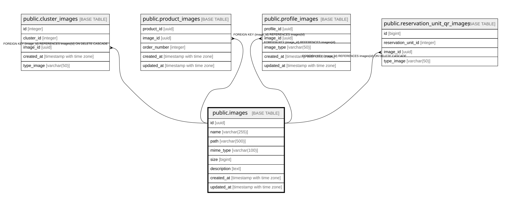

# public.images

## Columns

| Name | Type | Default | Nullable | Children | Parents | Comment |
| ---- | ---- | ------- | -------- | -------- | ------- | ------- |
| id | uuid | gen_random_uuid() | false | [public.cluster_images](public.cluster_images.md) [public.product_images](public.product_images.md) [public.profile_images](public.profile_images.md) [public.reservation_unit_qr_images](public.reservation_unit_qr_images.md) |  |  |
| name | varchar(255) |  | false |  |  |  |
| path | varchar(500) |  | false |  |  |  |
| mime_type | varchar(100) |  | true |  |  |  |
| size | bigint |  | true |  |  |  |
| description | text |  | true |  |  |  |
| created_at | timestamp with time zone | now() | false |  |  |  |
| updated_at | timestamp with time zone | now() | false |  |  |  |

## Constraints

| Name | Type | Definition |
| ---- | ---- | ---------- |
| images_pkey | PRIMARY KEY | PRIMARY KEY (id) |
| unique_path | UNIQUE | UNIQUE (path) |

## Indexes

| Name | Definition |
| ---- | ---------- |
| images_pkey | CREATE UNIQUE INDEX images_pkey ON public.images USING btree (id) |
| unique_path | CREATE UNIQUE INDEX unique_path ON public.images USING btree (path) |

## Relations

---

> Generated by [tbls](https://github.com/k1LoW/tbls)
