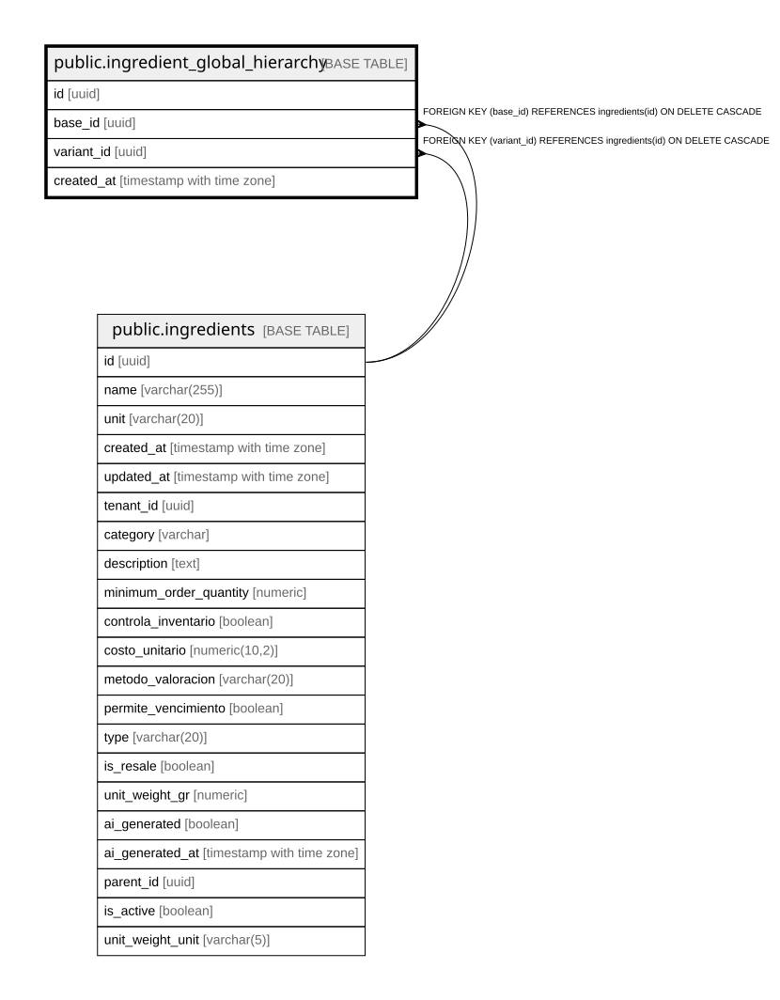

# public.ingredient_global_hierarchy

## Columns

| Name | Type | Default | Nullable | Children | Parents | Comment |
| ---- | ---- | ------- | -------- | -------- | ------- | ------- |
| id | uuid | gen_random_uuid() | false |  |  |  |
| base_id | uuid |  | false |  | [public.ingredients](public.ingredients.md) |  |
| variant_id | uuid |  | false |  | [public.ingredients](public.ingredients.md) |  |
| created_at | timestamp with time zone | now() | true |  |  |  |

## Constraints

| Name | Type | Definition |
| ---- | ---- | ---------- |
| ingredient_global_hierarchy_base_id_fkey | FOREIGN KEY | FOREIGN KEY (base_id) REFERENCES ingredients(id) ON DELETE CASCADE |
| ingredient_global_hierarchy_variant_id_fkey | FOREIGN KEY | FOREIGN KEY (variant_id) REFERENCES ingredients(id) ON DELETE CASCADE |
| ingredient_global_hierarchy_pkey | PRIMARY KEY | PRIMARY KEY (id) |
| ingredient_global_hierarchy_variant_id_key | UNIQUE | UNIQUE (variant_id) |

## Indexes

| Name | Definition |
| ---- | ---------- |
| ingredient_global_hierarchy_pkey | CREATE UNIQUE INDEX ingredient_global_hierarchy_pkey ON public.ingredient_global_hierarchy USING btree (id) |
| ingredient_global_hierarchy_variant_id_key | CREATE UNIQUE INDEX ingredient_global_hierarchy_variant_id_key ON public.ingredient_global_hierarchy USING btree (variant_id) |
| idx_igh_base_id | CREATE INDEX idx_igh_base_id ON public.ingredient_global_hierarchy USING btree (base_id) |
| idx_igh_variant_id | CREATE INDEX idx_igh_variant_id ON public.ingredient_global_hierarchy USING btree (variant_id) |

## Relations

---

> Generated by [tbls](https://github.com/k1LoW/tbls)
