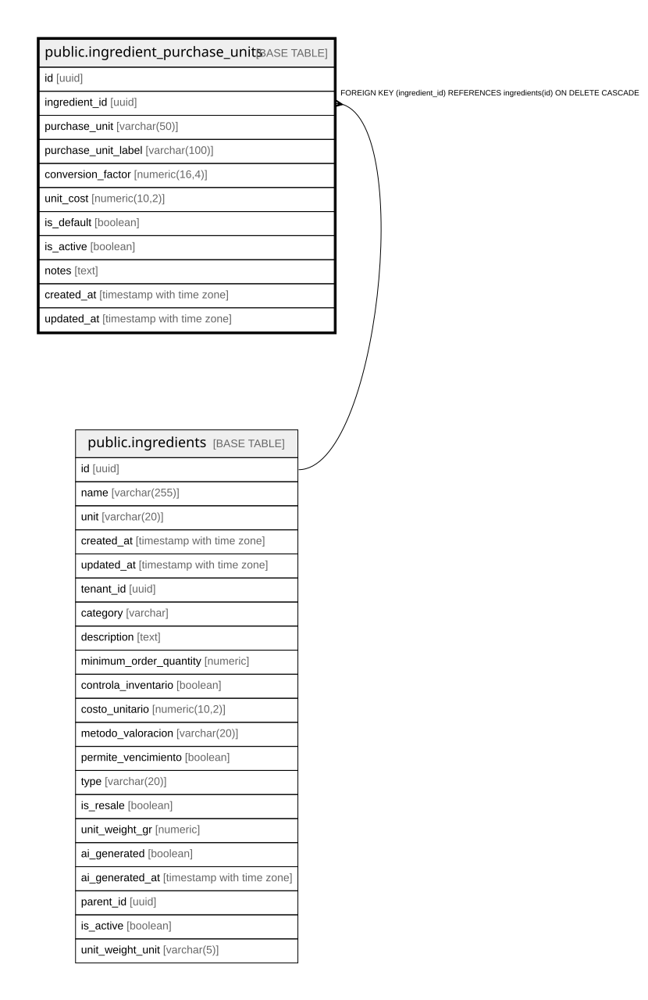

# public.ingredient_purchase_units

## Description

Defines purchase unit configurations for ingredients. Allows multiple purchase options (e.g., package, box, dozen) with automatic conversion to base units.

## Columns

| Name | Type | Default | Nullable | Children | Parents | Comment |
| ---- | ---- | ------- | -------- | -------- | ------- | ------- |
| id | uuid | gen_random_uuid() | false |  |  |  |
| ingredient_id | uuid |  | false |  | [public.ingredients](public.ingredients.md) |  |
| purchase_unit | varchar(50) |  | false |  |  | Type of purchase unit (paquete, caja, bulto, docena, etc.) |
| purchase_unit_label | varchar(100) |  | false |  |  | Display label for the purchase unit (e.g., "Paquete x18", "Caja x144") |
| conversion_factor | numeric(16,4) |  | false |  |  | Number of base units contained in 1 purchase unit. Example: If purchase_unit="paquete" and factor=18, then 1 paquete = 18 base units. |
| unit_cost | numeric(10,2) |  | true |  |  |  |
| is_default | boolean | false | true |  |  | If true, this will be the default purchase unit shown when creating purchase orders for this ingredient. |
| is_active | boolean | true | true |  |  |  |
| notes | text |  | true |  |  |  |
| created_at | timestamp with time zone | now() | true |  |  |  |
| updated_at | timestamp with time zone | now() | true |  |  |  |

## Constraints

| Name | Type | Definition |
| ---- | ---- | ---------- |
| positive_conversion_factor | CHECK | CHECK ((conversion_factor > (0)::numeric)) |
| ingredient_purchase_units_pkey | PRIMARY KEY | PRIMARY KEY (id) |
| ingredient_purchase_units_ingredient_id_fkey | FOREIGN KEY | FOREIGN KEY (ingredient_id) REFERENCES ingredients(id) ON DELETE CASCADE |
| unique_ingredient_purchase_unit | UNIQUE | UNIQUE (ingredient_id, purchase_unit, purchase_unit_label) |

## Indexes

| Name | Definition |
| ---- | ---------- |
| ingredient_purchase_units_pkey | CREATE UNIQUE INDEX ingredient_purchase_units_pkey ON public.ingredient_purchase_units USING btree (id) |
| unique_ingredient_purchase_unit | CREATE UNIQUE INDEX unique_ingredient_purchase_unit ON public.ingredient_purchase_units USING btree (ingredient_id, purchase_unit, purchase_unit_label) |
| idx_ingredient_purchase_units_active | CREATE INDEX idx_ingredient_purchase_units_active ON public.ingredient_purchase_units USING btree (is_active) WHERE (is_active = true) |
| idx_ingredient_purchase_units_default | CREATE INDEX idx_ingredient_purchase_units_default ON public.ingredient_purchase_units USING btree (ingredient_id, is_default) WHERE (is_default = true) |
| idx_ingredient_purchase_units_ingredient | CREATE INDEX idx_ingredient_purchase_units_ingredient ON public.ingredient_purchase_units USING btree (ingredient_id) |

## Triggers

| Name | Definition |
| ---- | ---------- |
| trigger_ensure_single_default_purchase_unit | CREATE TRIGGER trigger_ensure_single_default_purchase_unit BEFORE INSERT OR UPDATE ON public.ingredient_purchase_units FOR EACH ROW WHEN ((new.is_default = true)) EXECUTE FUNCTION ensure_single_default_purchase_unit() |
| trigger_update_ingredient_purchase_units_updated_at | CREATE TRIGGER trigger_update_ingredient_purchase_units_updated_at BEFORE UPDATE ON public.ingredient_purchase_units FOR EACH ROW EXECUTE FUNCTION update_ingredient_purchase_units_updated_at() |

## Relations

---

> Generated by [tbls](https://github.com/k1LoW/tbls)
