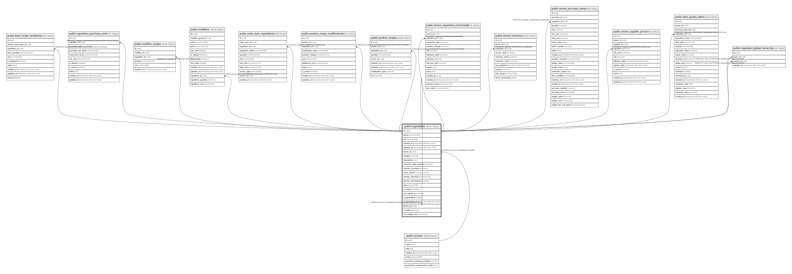

# public.ingredients

## Columns

| Name | Type | Default | Nullable | Children | Parents | Comment |
| ---- | ---- | ------- | -------- | -------- | ------- | ------- |
| id | uuid | gen_random_uuid() | false | [public.base_recipe_templates](public.base_recipe_templates.md) [public.ingredient_purchase_units](public.ingredient_purchase_units.md) [public.ingredients](public.ingredients.md) [public.modifier_recipes](public.modifier_recipes.md) [public.modifiers](public.modifiers.md) [public.order_item_ingredients](public.order_item_ingredients.md) [public.product_recipe_modifications](public.product_recipe_modifications.md) [public.product_recipes](public.product_recipes.md) [public.tenant_ingredient_movements](public.tenant_ingredient_movements.md) [public.tenant_inventory](public.tenant_inventory.md) [public.tenant_purchase_items](public.tenant_purchase_items.md) [public.tenant_supplier_prices](public.tenant_supplier_prices.md) [public.data_quality_alerts](public.data_quality_alerts.md) [public.ingredient_global_hierarchy](public.ingredient_global_hierarchy.md) |  |  |
| name | varchar(255) |  | false |  |  |  |
| unit | varchar(20) |  | false |  |  |  |
| created_at | timestamp with time zone | now() | true |  |  |  |
| updated_at | timestamp with time zone | now() | true |  |  |  |
| tenant_id | uuid |  | true |  | [public.tenants](public.tenants.md) |  |
| category | varchar |  | true |  |  |  |
| description | text |  | true |  |  |  |
| minimum_order_quantity | numeric | 1 | true |  |  |  |
| controla_inventario | boolean | true | true |  |  | true = controla stock (valida y descuenta), false = solo para cálculo de costos |
| costo_unitario | numeric(10,2) |  | true |  |  | Costo actual por unidad del ingrediente (se actualiza con compras) |
| metodo_valoracion | varchar(20) | 'PROMEDIO'::character varying | true |  |  | Método de valoración de inventario: PROMEDIO, FIFO, ULTIMO |
| permite_vencimiento | boolean | false | true |  |  | true si el ingrediente puede vencer y necesita fecha de vencimiento |
| type | varchar(20) | 'food'::character varying | true |  |  |  |
| is_resale | boolean | false | true |  |  |  |
| unit_weight_gr | numeric |  | true |  |  |  |
| ai_generated | boolean | false | true |  |  |  |
| ai_generated_at | timestamp with time zone |  | true |  |  |  |
| parent_id | uuid |  | true |  | [public.ingredients](public.ingredients.md) |  |
| is_active | boolean | true | false |  |  |  |
| unit_weight_unit | varchar(5) | 'gr'::character varying | true |  |  |  |

## Constraints

| Name | Type | Definition |
| ---- | ---- | ---------- |
| ingredients_metodo_valoracion_check | CHECK | CHECK (((metodo_valoracion)::text = ANY (ARRAY[('PROMEDIO'::character varying)::text, ('FIFO'::character varying)::text, ('ULTIMO'::character varying)::text]))) |
| ingredients_unit_check | CHECK | CHECK (((unit)::text = ANY (ARRAY[('gr'::character varying)::text, ('ml'::character varying)::text, ('kg'::character varying)::text, ('und'::character varying)::text, ('lt'::character varying)::text]))) |
| ingredients_parent_id_fkey | FOREIGN KEY | FOREIGN KEY (parent_id) REFERENCES ingredients(id) ON DELETE SET NULL |
| ingredients_pkey | PRIMARY KEY | PRIMARY KEY (id) |
| ingredients_tenant_id_fkey | FOREIGN KEY | FOREIGN KEY (tenant_id) REFERENCES tenants(id) |

## Indexes

| Name | Definition |
| ---- | ---------- |
| ingredients_pkey | CREATE UNIQUE INDEX ingredients_pkey ON public.ingredients USING btree (id) |
| idx_ingredients_controla_inventario | CREATE INDEX idx_ingredients_controla_inventario ON public.ingredients USING btree (controla_inventario) |
| idx_ingredients_name | CREATE INDEX idx_ingredients_name ON public.ingredients USING btree (name) |
| idx_ingredients_tenant_id | CREATE INDEX idx_ingredients_tenant_id ON public.ingredients USING btree (tenant_id) |
| idx_ingredients_parent_id | CREATE INDEX idx_ingredients_parent_id ON public.ingredients USING btree (parent_id) |
| uq_ingredient_tenant_name_active | CREATE UNIQUE INDEX uq_ingredient_tenant_name_active ON public.ingredients USING btree (tenant_id, lower((name)::text)) WHERE ((tenant_id IS NOT NULL) AND (is_active = true)) |

## Triggers

| Name | Definition |
| ---- | ---------- |
| trigger_update_product_cost_on_ingredient_change | CREATE TRIGGER trigger_update_product_cost_on_ingredient_change AFTER UPDATE OF costo_unitario ON public.ingredients FOR EACH ROW WHEN ((old.costo_unitario IS DISTINCT FROM new.costo_unitario)) EXECUTE FUNCTION update_product_cost() |
| update_ingredients_updated_at | CREATE TRIGGER update_ingredients_updated_at BEFORE UPDATE ON public.ingredients FOR EACH ROW EXECUTE FUNCTION update_updated_at_column() |

## Relations

---

> Generated by [tbls](https://github.com/k1LoW/tbls)
